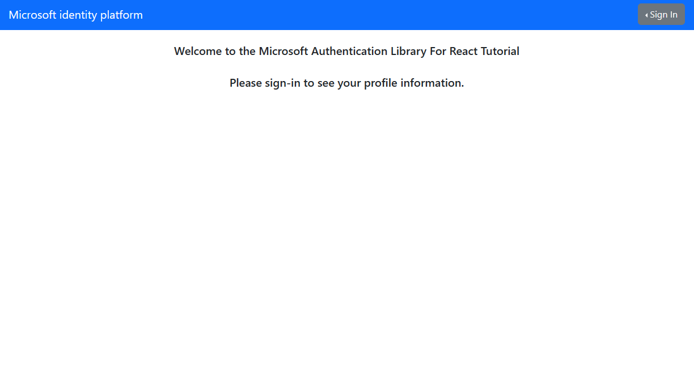

# React single-page application (SPA) using MSAL React to sign-in users and call Microsoft Graph

 1. [Overview](#overview)
 1. [Scenario](#scenario)
 1. [Contents](#contents)
 1. [Prerequisites](#prerequisites)
 1. [Setup](#setup)
 1. [Registration](#registration)
 1. [Running the sample](#running-the-sample)
 1. [Explore the sample](#explore-the-sample)
 1. [About the code](#about-the-code)
 1. [More information](#more-information)
 1. [Community Help and Support](#community-help-and-support)
 1. [Contributing](#contributing)

## Overview

This sample demonstrates a React single-page application (SPA) calling [Microsoft Graph](https://docs.microsoft.com/graph/overview) using the [Microsoft Authentication Library for React (Preview)](https://github.com/AzureAD/microsoft-authentication-library-for-js/tree/dev/lib/msal-react) (MSAL React).

MSAL React is a wrapper around the [Microsoft Authentication Library for JavaScript](https://github.com/AzureAD/microsoft-authentication-library-for-js/tree/dev/lib/msal-browser) (MSAL.js). As such, it exposes the same public APIs that MSAL.js offers, while adding many new features customized for modern React applications.

Here you'll learn how to [sign-in](https://docs.microsoft.com/azure/active-directory/develop/scenario-spa-sign-in), [acquire a token](https://docs.microsoft.com/azure/active-directory/develop/scenario-spa-acquire-token) and [call a protected web API](https://docs.microsoft.com/azure/active-directory/develop/scenario-spa-call-api), as well as how to work with different [audiences and account types](https://docs.microsoft.com/azure/active-directory/develop/v2-supported-account-types).

## Scenario

1. The client React SPA uses the Microsoft Authentication Library (MSAL) to sign-in a user and obtain a JWT [access token](https://docs.microsoft.com/azure/active-directory/develop/access-tokens) from **Azure AD**.
2. The access token is used as a *bearer token* to authorize the user to call the **Microsoft Graph API**.


## Contents

| File/folder         | Description                                      |
|---------------------|--------------------------------------------------|
| `App/App.jsx`       | Main application logic resides here.             |
| `App/authConfig.js` | Contains authentication parameters.              |
| `App/ui.jsx`        | UI update logic resides here.                    |
| `App/fetch.jsx`     | Provides a helper method for making fetch calls. |

## Prerequisites

- [Node.js](https://nodejs.org/en/download/) must be installed to run this sample.
- [Visual Studio Code](https://code.visualstudio.com/download) is recommended for running and editing this sample.
- A modern web browser. This sample uses **ES6** conventions and will not run on **Internet Explorer**.
- An **Azure AD** tenant. For more information see: [How to get an Azure AD tenant](https://docs.microsoft.com/azure/active-directory/develop/quickstart-create-new-tenant)
- A user account in your **Azure AD** tenant. This sample will not work with a **personal Microsoft account**. Therefore, if you signed in to the [Azure portal](https://portal.azure.com) with a personal account and have never created a user account in your directory before, you need to do that now.

## Setup

### Install project dependencies

```console
    cd ms-identity-javascript-react-tutorial
    cd ms-identity-react-c1s1
    npm install
```

## Registration

There is one project in this sample. To register it, you can:

- follow the steps below for manually register your apps
- or use PowerShell scripts that:
  - **automatically** creates the Azure AD applications and related objects (passwords, permissions, dependencies) for you.
  - modify the projects' configuration files.

<details>
  <summary>Expand this section if you want to use this automation:</summary>

> :warning: If you have never used **Azure AD Powershell** before, we recommend you go through the [App Creation Scripts](./AppCreationScripts/AppCreationScripts.md) once to ensure that your environment is prepared correctly for this step.

1. On Windows, run PowerShell as **Administrator** and navigate to the root of the cloned directory
1. If you have never used Azure AD Powershell before, we recommend you go through the [App Creation Scripts](./AppCreationScripts/AppCreationScripts.md) once to ensure that your environment is prepared correctly for this step.
1. In PowerShell run:

   ```PowerShell
   Set-ExecutionPolicy -ExecutionPolicy RemoteSigned -Scope Process -Force
   ```

1. Run the script to create your Azure AD application and configure the code of the sample application accordingly.
1. In PowerShell run:

   ```PowerShell
   cd .\AppCreationScripts\
   .\Configure.ps1
   ```

   > Other ways of running the scripts are described in [App Creation Scripts](./AppCreationScripts/AppCreationScripts.md)
   > The scripts also provide a guide to automated application registration, configuration and removal which can help in your CI/CD scenarios.

</details>

### Choose the Azure AD tenant where you want to create your applications

As a first step you'll need to:

1. Sign in to the [Azure portal](https://portal.azure.com).
1. If your account is present in more than one Azure AD tenant, select your profile at the top right corner in the menu on top of the page, and then **switch directory** to change your portal session to the desired Azure AD tenant.

### Register the app (ms-identity-react-c1s1)

1. Navigate to the [Azure portal](https://portal.azure.com) and select the **Azure AD** service.
1. Select the **App Registrations** blade on the left, then select **New registration**.
1. In the **Register an application page** that appears, enter your application's registration information:
   - In the **Name** section, enter a meaningful application name that will be displayed to users of the app, for example `ms-identity-react-c1s1`.
   - Under **Supported account types**, select **Accounts in this organizational directory only**.
   - In the **Redirect URI (optional)** section, select **Single-page application** in the combo-box and enter the following redirect URI: `http://localhost:3000/`.
1. Select **Register** to create the application.
1. In the app's registration screen, find and note the **Application (client) ID**. You use this value in your app's configuration file(s) later in your code.
1. Select **Save** to save your changes.
1. In the app's registration screen, select the **API permissions** blade in the left to open the page where we add access to the APIs that your application needs.
   - Select the **Add a permission** button and then,
   - Ensure that the **Microsoft APIs** tab is selected.
   - In the *Commonly used Microsoft APIs* section, select **Microsoft Graph**
   - In the **Delegated permissions** section, select the **User.Read** in the list. Use the search box if necessary.
   - Select the **Add permissions** button at the bottom.

#### Configure the app (ms-identity-react-c1s1) to use your app registration

Open the project in your IDE (like Visual Studio or Visual Studio Code) to configure the code.

> In the steps below, "ClientID" is the same as "Application ID" or "AppId".

1. Open the `App\authConfig.js` file.
1. Find the key `Enter_the_Application_Id_Here` and replace the existing value with the application ID (clientId) of `ms-identity-react-c1s1` app copied from the Azure portal.
1. Find the key `Enter_the_Tenant_Info_Here` and replace the existing value with your Azure AD tenant name.

## Running the sample

Locate the folder where `package.json` resides in your terminal. Then:

```console
    npm start
```

## Explore the sample

1. Open your browser and navigate to `http://localhost:3000`.
1. Select the **Sign In** button on the top right corner. Choose either **Popup** or **Redirect** flows.
1. Select the **View ID Token Claims** button at the center. This will display some of the important claims in your ID token.
1. Select the **Request Profile Data** button at the center. This will make a call to Microsoft Graph using a bearer token.



> :information_source: Did the sample not work for you as expected? Then please reach out to us using the [GitHub Issues](../../../issues) page.

## We'd love your feedback!

Were we successful in addressing your learning objective? Consider taking a moment to [share your experience with us](https://forms.office.com/Pages/ResponsePage.aspx?id=v4j5cvGGr0GRqy180BHbR73pcsbpbxNJuZCMKN0lURpUMlRHSkc5U1NLUkxFNEtVN0dEOTFNQkdTWiQlQCN0PWcu).

## About the code

### Sign-in

MSAL.js exposes 3 login APIs: `loginPopup()`, `loginRedirect()` and `ssoSilent()`. These APIs are usable in MSAL React as well:

```javascript
    export function App() {
        const { instance, accounts, inProgress } = useMsal();
    
        if (accounts.length > 0) {
            return <span>There are currently {accounts.length} users signed in!</span>
        } else if (inProgress === "login") {
            return <span>Login is currently in progress!</span>
        } else {
            return (
                <>
                    <span>There are currently no users signed in!</span>
                    <button onClick={() => instance.loginPopup()}>Login</button>
                </>
            );
        }
    }
```

You may also use MSAL React's [useMsalAuthentication](https://github.com/AzureAD/microsoft-authentication-library-for-js/blob/dev/lib/msal-react/docs/hooks.md#usemsalauthentication-hook) hook. Below is an example in which the `ssoSilent()` API is used. When using `ssoSilent()`, the recommended pattern is that you fallback to an **interactive method** should the silent SSO attempt fails:

```javascript
function App() {
    const request = {
        loginHint: "name@example.com",
        scopes: ["User.Read"]
    }

    const { login, result, error } = useMsalAuthentication(InteractionType.Silent, request);

    useEffect(() => {
        if (error) {
            login(InteractionType.Popup, request);
        }
    }, [error]);

    const { accounts } = useMsal();

    return (
        <React.Fragment>
            <p>Anyone can see this paragraph.</p>
            <AuthenticatedTemplate>
                <p>Signed in as: {accounts[0]?.username}</p>
            </AuthenticatedTemplate>
            <UnauthenticatedTemplate>
                <p>No users are signed in!</p>
            </UnauthenticatedTemplate>
        </React.Fragment>
    );
}
```

As shown above, the components that depend on whether the user is authenticated should be wrapped inside React's `AuthenticatedTemplate` and `UnauthenticatedTemplate` components. Alternatively, you may use the [useIsAuthenticated](https://github.com/AzureAD/microsoft-authentication-library-for-js/blob/dev/lib/msal-react/docs/getting-started.md#useisauthenticated-hook) hook to conditionally render components.

### Sign-out

The application redirects the user to the **Microsoft identity platform** logout endpoint to sign out. This endpoint clears the user's session from the browser. If your app does not go to the logout endpoint, the user may re-authenticate to your app without entering their credentials again, because they would have a valid single sign-on session with the **Microsoft identity platform** endpoint. For more, see: [Send a sign-out request](https://docs.microsoft.com/azure/active-directory/develop/v2-protocols-oidc#send-a-sign-out-request)

### ID token validation

A single-page application does not benefit from validating [ID tokens](https://docs.microsoft.com/azure/active-directory/develop/id-tokens), since the application runs without a back-end and as such, attackers can intercept and edit the keys used for validation of the token.

### Sign-in audience and account types

This sample is meant to work with accounts in your organization (aka *single-tenant*). If you would like to allow sign-ins from other organizations and/or with other types of accounts, you have to configure your `authority` string in `authConfig.js` accordingly. For example:

```javascript
const msalConfig = {
    auth: {
      clientId: "<YOUR_CLIENT_ID>",
      authority: "https://login.microsoftonline.com/consumers", // allows sign-ins with personal Microsoft accounts.
      redirectUri: "<YOUR_REDIRECT_URI>",
    },
```

For more information about audiences and account types, please see: [Validation differences by supported account types (signInAudience)](https://docs.microsoft.com/azure/active-directory/develop/supported-accounts-validation)

> :warning: Be aware that making an application multi-tenant entails more than just modifying the `authority` string. For more information, please see [How to: Sign in any Azure Active Directory user using the multi-tenant application pattern](https://docs.microsoft.com/azure/active-directory/develop/howto-convert-app-to-be-multi-tenant).

### Authentication in national clouds

National clouds (aka sovereign clouds) are physically isolated instances of Azure. These regions of Azure are designed to make sure that data residency, sovereignty, and compliance requirements are honored within geographical boundaries. Enabling your application for sovereign clouds requires you to:

- register your application in a specific portal, depending on the cloud.
- use a specific authority, depending on the cloud in the configuration file for your application.
- in case you want to call the MS Graph, this requires a specific Graph endpoint URL, depending on the cloud.

For instance, to configure this sample for **Azure AD Germany** national cloud:

1. Open the `App\authConfig.js` file.
1. Find the key `Enter_the_Application_Id_Here` and replace the existing value with the application ID (clientId) of the `ms-identity-javascript-tutorial-c1s1` application copied from the Azure portal.
1. Find the key `Enter_the_Cloud_Instance_Id_Here/Enter_the_Tenant_Info_Here` and replace the existing value with `https://portal.microsoftazure.de/<your-tenant-id>`.

See [National Clouds](https://docs.microsoft.com/azure/active-directory/develop/authentication-national-cloud#app-registration-endpoints) for more information.

### Protected resources and scopes

In order to access a protected resource on behalf of a signed-in user, the app needs to present a valid **Access Token** to that resource owner (in this case, Microsoft Graph). The intended recipient of an **Access Token** is represented by the `aud` claim (in this case, it should be the Microsoft Graph API's App ID); in case the value for the `aud` claim does not mach the resource **APP ID URI**, the token should be considered invalid. Likewise, the permissions that an **Access Token** grants is represented by the `scp` claim. See [Access Token claims](https://docs.microsoft.com/azure/active-directory/develop/access-tokens#payload-claims) for more information.

### Dynamic scopes and incremental consent

In **Azure AD**, the scopes (permissions) set directly on the application registration are called static scopes. Other scopes that are only defined within the code are called dynamic scopes. This has implications on the **login** (i.e. loginPopup, loginRedirect) and **acquireToken** (i.e. `acquireTokenPopup`, `acquireTokenRedirect`, `acquireTokenSilent`) methods of **MSAL.js**. Consider:

```javascript
     const loginRequest = {
          scopes: [ "openid", "profile", "User.Read" ]
     };

     const tokenRequest = {
          scopes: [ "Mail.Read" ]
     };

     // will return an ID Token and an Access Token with scopes: "openid", "profile" and "User.Read"
     instance.loginPopup(loginRequest);

     // will fail and fallback to an interactive method prompting a consent screen
     // after consent, the received token will be issued for "openid", "profile" ,"User.Read" and "Mail.Read" combined
     instance.acquireTokenPopup(tokenRequest);
```

In the code snippet above, the user will be prompted for consent once they authenticate and receive an **ID Token** and an **Access Token** with scope `User.Read`. Later, if they request an **Access Token** for `User.Read`, they will not be asked for consent again (in other words, they can acquire a token *silently*). On the other hand, the user did not consented to `Mail.Read` at the authentication stage. As such, they will be asked for consent when requesting an **Access Token** for that scope. The token received will contain all the previously consented scopes, hence the term *incremental consent*.

### Acquire a Token

**MSAL.js** exposes 3 APIs for acquiring a token: `acquireTokenPopup()`, `acquireTokenRedirect()` and `acquireTokenSilent()`. The `acquireTokenSilent()` API is meant to retrieve a non-expired access token from cache *silently*.

```javascript
export function App() {
    const { instance, accounts, inProgress } = useMsal();
    const account = useAccount(accounts[0]);
    const [apiData, setApiData] = useState(null);

    useEffect(() => {
        if (account) {
            instance.acquireTokenSilent({
                scopes: ["User.Read"],
                account: account
            }).then((response) => {
                if(response) {
                    callMsGraph(response.accessToken).then((result) => setApiData(result));
                }
            });
        }
    }, [account, instance]);

    if (accounts.length > 0) {
        return (
            <>
                <span>There are currently {accounts.length} users signed in!</span>
                {apiData && (<span>Data retrieved from API: {JSON.stringify(apiData)}</span>)}
            </>
        );
    } else if (inProgress === "login") {
        return <span>Login is currently in progress!</span>
    } else {
        return <span>There are currently no users signed in!</span>
    }
}
```

If `acquireTokenSilent()` fails, the recommended pattern is to fallback to one of the interactive methods i.e. `acquireTokenPopup()` or `acquireTokenRedirect()`.

### Access Token validation

Clients should treat access tokens as opaque strings, as the contents of the token are intended for the **resource only** (such as a web API or Microsoft Graph). For validation and debugging purposes, developers can decode **JWT**s (*JSON Web Tokens*) using a site like [jwt.ms](https://jwt.ms).

## More information

- [Microsoft identity platform (Azure Active Directory for developers)](https://docs.microsoft.com/azure/active-directory/develop/)
- [Overview of Microsoft Authentication Library (MSAL)](https://docs.microsoft.com/azure/active-directory/develop/msal-overview)
- [Quickstart: Register an application with the Microsoft identity platform](https://docs.microsoft.com/azure/active-directory/develop/quickstart-register-app)
- [Quickstart: Configure a client application to access web APIs](https://docs.microsoft.com/azure/active-directory/develop/quickstart-configure-app-access-web-apis)
- [Initialize client applications using MSAL.js](https://docs.microsoft.com/azure/active-directory/develop/msal-js-initializing-client-applications)
- [Single sign-on with MSAL.js](https://docs.microsoft.com/azure/active-directory/develop/msal-js-sso)
- [Handle MSAL.js exceptions and errors](https://docs.microsoft.com/azure/active-directory/develop/msal-handling-exceptions?tabs=javascript)
- [Logging in MSAL.js applications](https://docs.microsoft.com/azure/active-directory/develop/msal-logging?tabs=javascript)
- [Pass custom state in authentication requests using MSAL.js](https://docs.microsoft.com/azure/active-directory/develop/msal-js-pass-custom-state-authentication-request)
- [Prompt behavior in MSAL.js interactive requests](https://docs.microsoft.com/azure/active-directory/develop/msal-js-prompt-behavior)
- [National Clouds](https://docs.microsoft.com/azure/active-directory/develop/authentication-national-cloud#app-registration-endpoints)

For more information about how OAuth 2.0 protocols work in this scenario and other scenarios, see [Authentication Scenarios for Azure AD](https://docs.microsoft.com/azure/active-directory/develop/authentication-flows-app-scenarios).

## Community Help and Support

Use [Stack Overflow](http://stackoverflow.com/questions/tagged/msal) to get support from the community.
Ask your questions on Stack Overflow first and browse existing issues to see if someone has asked your question before.
Make sure that your questions or comments are tagged with [`azure-active-directory` `azure-ad-b2c` `ms-identity` `adal` `msal`].

If you find a bug in the sample, raise the issue on [GitHub Issues](../../../issues).

To provide feedback on or suggest features for Azure Active Directory, visit [User Voice page](https://feedback.azure.com/forums/169401-azure-active-directory).

## Contributing

If you'd like to contribute to this sample, see [CONTRIBUTING.MD](/CONTRIBUTING.md).

This project has adopted the [Microsoft Open Source Code of Conduct](https://opensource.microsoft.com/codeofconduct/). For more information, see the [Code of Conduct FAQ](https://opensource.microsoft.com/codeofconduct/faq/) or contact [opencode@microsoft.com](mailto:opencode@microsoft.com) with any additional questions or comments.