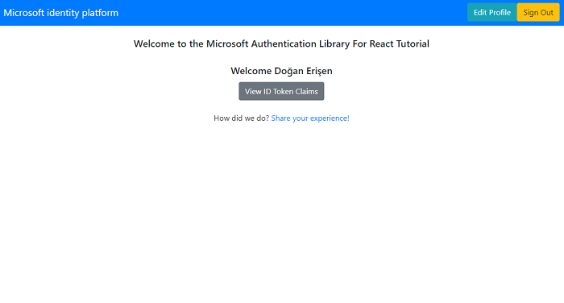

# React single-page application using MSAL React to sign-in users against Azure AD B2C

 1. [Overview](#overview)
 1. [Scenario](#scenario)
 1. [Contents](#contents)
 1. [Prerequisites](#prerequisites)
 1. [Setup](#setup)
 1. [Registration](#registration)
 1. [Running the sample](#running-the-sample)
 1. [Explore the sample](#explore-the-sample)
 1. [About the code](#about-the-code)
 1. [More information](#more-information)
 1. [Community Help and Support](#community-help-and-support)
 1. [Contributing](#contributing)

## Overview

This sample demonstrates a React single-page application (SPA) authenticating users against [Azure AD B2C](https://docs.microsoft.com/azure/active-directory/fundamentals/active-directory-whatis) (Azure AD), using the [Microsoft Authentication Library for React](https://github.com/AzureAD/microsoft-authentication-library-for-js/tree/dev/lib/msal-react) (MSAL React).

MSAL React is a wrapper around the [Microsoft Authentication Library for JavaScript](https://github.com/AzureAD/microsoft-authentication-library-for-js/tree/dev/lib/msal-browser) (MSAL.js). As such, it exposes the same public APIs that MSAL.js offers, while adding many new features customized for modern React applications.

Here you'll learn about authentication and **B2C** concepts, such as [ID tokens](https://docs.microsoft.com/azure/active-directory-b2c/tokens-overview#token-types), [external identity providers](https://docs.microsoft.com/azure/active-directory-b2c/technical-overview#external-identity-providers), [consumer social accounts](https://docs.microsoft.com/azure/active-directory-b2c/technical-overview#consumer-accounts), [single-sign on (SSO)](https://docs.microsoft.com/azure/active-directory-b2c/session-overview) and more.

## Scenario

1. The client React SPA uses **MSAL React** to obtain an ID Token from **Azure AD B2C**.
2. The **ID Token** proves that the user has successfully authenticated against **Azure AD B2C**.


## Contents

| File/folder     | Description                                      |
|-----------------|--------------------------------------------------|
| `App.jsx`       | Main application logic resides here.             |
| `ui.jsx`        | UI components reside here.                       |
| `authConfig.js` | Contains authentication parameters.              |

## Prerequisites

- An **Azure AD B2C** tenant. For more information see: [How to get an Azure AD B2C tenant](https://docs.microsoft.com/azure/active-directory-b2c/tutorial-create-tenant)
- A user account in your **Azure AD B2C** tenant.

## Setup

```console
    cd ms-identity-javascript-react-tutorial
    cd 1-Authentication/2-sign-in-b2c/SPA
    npm install
```

### Registration

:warning: This sample comes with a pre-registered application for demo purposes. If you would like to use your own **Azure AD B2C** tenant and application, follow the steps below to register and configure the application on **Azure portal**. Otherwise, continue with the steps for [Running the sample](#running-the-sample).

### Choose the Azure AD tenant where you want to create your applications

As a first step you'll need to:

1. Sign in to the [Azure portal](https://portal.azure.com).
1. If your account is present in more than one Azure AD B2C tenant, select your profile at the top right corner in the menu on top of the page, and then **switch directory** to change your portal session to the desired Azure AD B2C tenant.

### Create User Flows and Custom Policies

Please refer to: [Tutorial: Create user flows in Azure Active Directory B2C](https://docs.microsoft.com/azure/active-directory-b2c/tutorial-create-user-flows)

### Add External Identity Providers

Please refer to: [Tutorial: Add identity providers to your applications in Azure Active Directory B2C](https://docs.microsoft.com/azure/active-directory-b2c/tutorial-add-identity-providers)

### Register the spa app (msal-react-spa)

1. Navigate to the [Azure portal](https://portal.azure.com) and select the **Azure AD B2C** service.
1. Select the **App Registrations** blade on the left, then select **New registration**.
1. In the **Register an application page** that appears, enter your application's registration information:
   - In the **Name** section, enter a meaningful application name that will be displayed to users of the app, for example `msal-react-spa`.
   - Under **Supported account types**, select **Accounts in any identity provider or organizational directory (for authenticating users with user flows)**.
   - In the **Redirect URI** section, select **Single-page application** in the combo-box and enter the following redirect URI: `http://localhost:3000`.
1. Select **Register** to create the application.
1. In the app's registration screen, find and note the **Application (client) ID**. You use this value in your app's configuration file(s) later in your code.
1. Select **Save** to save your changes.

#### Configure the spa app (msal-react-spa) to use your app registration

Open the project in your IDE (like Visual Studio or Visual Studio Code) to configure the code.

> In the steps below, "ClientID" is the same as "Application ID" or "AppId".

1. Open the `App\src\authConfig.js` file.
1. Find the key `Enter_the_Application_Id_Here` and replace the existing value with the application ID (clientId) of `msal-react-spa` app copied from the Azure portal.
1. Find the key `Enter_the_Tenant_Info_Here` and replace the existing value with your Azure AD tenant name.

To setup your B2C user-flows, do the following:

1. Find the key `names` and populate it with your policy names e.g. `signUpSignIn`.
1. Find the key `authorities` and populate it with your policy authority strings e.g. `https://<your-tenant-name>.b2clogin.com/<your-tenant-name>.onmicrosoft.com/b2c_1_susi`.
1. Find the key `authorityDomain` and populate it with the domain portion of your authority string e.g. `<your-tenant-name>.b2clogin.com`.

## Running the sample

Locate the folder where `package.json` resides in your terminal. Then:

```console
    npm start
```

## Explore the sample

1. Open your browser and navigate to `http://localhost:3000`.
1. Select the **Sign In** button on the top right corner. Choose either **Popup** or **Redirect** flows (see: [MSAL.js interaction types](https://github.com/AzureAD/microsoft-authentication-library-for-js/blob/dev/lib/msal-browser/docs/initialization.md#choosing-an-interaction-type)).
    1. During the sign-in screen, you may select **forgot my password**. This initiates the Azure AD B2C password reset user-flow.
1. Select the **Edit Profile** button on the top right corner. This initiates the Azure AD B2C edit profile user-flow using a popup window (hint: alternatively, you may use redirect flow here instead).
1. Select the **View ID Token Claims** button at the center. This will display some of the important claims in your ID token.



> :information_source: Did the sample not work for you as expected? Then please reach out to us using the [GitHub Issues](../../../issues) page.

> :information_source: if you believe your issue is with the B2C service itself rather than with the sample, please file a support ticket with the B2C team by following the instructions [here](https://docs.microsoft.com/azure/active-directory-b2c/support-options).

## We'd love your feedback!

Were we successful in addressing your learning objective? Consider taking a moment to [share your experience with us](https://forms.office.com/Pages/ResponsePage.aspx?id=v4j5cvGGr0GRqy180BHbR73pcsbpbxNJuZCMKN0lURpUMlRHSkc5U1NLUkxFNEtVN0dEOTFNQkdTWiQlQCN0PWcu).

## About the code

MSAL React should be instantiated outside of the component tree to prevent it from being re-instantiated on re-renders. After instantiation, pass it as props to your application.

```javascript
const msalInstance = new PublicClientApplication(msalConfig);

ReactDOM.render(
    <React.StrictMode>
        <App msalInstance={msalInstance}/>
    </React.StrictMode>,
    document.getElementById("root")
);

export default function App({msalInstance}) {

    return (
        <MsalProvider instance={msalInstance}>
            <PageLayout>
                <MainContent />
            </PageLayout>
        </MsalProvider>
    );
}
```

At the top of your component tree, wrap everything between **MsalProvider** component. All components underneath **MsalProvider** will have access to the *PublicClientApplication* instance via context as well as all hooks and components provided by msal-react.

```javascript
export default function App({msalInstance}) {

    return (
        <MsalProvider instance={msalInstance}>
            <PageLayout>
                <MainContent />
            </PageLayout>
        </MsalProvider>
    );
}
```

### Sign-in

MSAL.js exposes 3 login APIs: `loginPopup()`, `loginRedirect()` and `ssoSilent()`. These APIs are usable in MSAL React as well:

```javascript
    export function App() {
        const { instance, accounts, inProgress } = useMsal();
    
        if (accounts.length > 0) {
            return <span>There are currently {accounts.length} users signed in!</span>
        } else if (inProgress === "login") {
            return <span>Login is currently in progress!</span>
        } else {
            return (
                <>
                    <span>There are currently no users signed in!</span>
                    <button onClick={() => instance.loginPopup()}>Login</button>
                </>
            );
        }
    }
```

You may also use MSAL React's [useMsalAuthentication](https://github.com/AzureAD/microsoft-authentication-library-for-js/blob/dev/lib/msal-react/docs/hooks.md#usemsalauthentication-hook) hook. Below is an example in which the `ssoSilent()` API is used. When using `ssoSilent()`, the recommended pattern is that you fallback to an **interactive method** should the silent SSO attempt fails:

```javascript
function App() {
    const request = {
        loginHint: "name@example.com",
        scopes: ["User.Read"]
    }

    const { login, result, error } = useMsalAuthentication(InteractionType.Silent, request);

    useEffect(() => {
        if (error) {
            login(InteractionType.Popup, request);
        }
    }, [error]);

    const { accounts } = useMsal();

    return (
        <React.Fragment>
            <p>Anyone can see this paragraph.</p>
            <AuthenticatedTemplate>
                <p>Signed in as: {accounts[0]?.username}</p>
            </AuthenticatedTemplate>
            <UnauthenticatedTemplate>
                <p>No users are signed in!</p>
            </UnauthenticatedTemplate>
        </React.Fragment>
    );
}
```

As shown above, the components that depend on whether the user is authenticated should be wrapped inside React's `AuthenticatedTemplate` and `UnauthenticatedTemplate` components. Alternatively, you may use the [useIsAuthenticated](https://github.com/AzureAD/microsoft-authentication-library-for-js/blob/dev/lib/msal-react/docs/getting-started.md#useisauthenticated-hook) hook to conditionally render components.

### Sign-out

The application redirects the user to the **Microsoft identity platform** logout endpoint to sign out. This endpoint clears the user's session from the browser. If your app did not go to the logout endpoint, the user may re-authenticate to your app without entering their credentials again, because they would have a valid single sign-in session with the **Microsoft identity platform** endpoint. See for more: [Send a sign-out request](https://docs.microsoft.com/azure/active-directory/develop/v2-protocols-oidc#send-a-sign-out-request).

The sign-out clears the user's single sign-on session with **Azure AD B2C**, but it might not sign the user out of their **social identity provider** session. If the user selects the same identity provider during a subsequent sign-in, they might re-authenticate without entering their credentials. Here the assumption is that, if a user wants to sign out of the application, it doesn't necessarily mean they want to sign out of their social account (e.g. Facebook) itself.

### ID Token Validation

When you receive an [ID token](https://docs.microsoft.com/azure/active-directory/develop/id-tokens) directly from the IdP on a secure channel (e.g. HTTPS), such is the case with SPAs, there’s no need to validate it. If you were to do it, you would validate it by asking the same server that gave you the ID token to give you the keys needed to validate it, which renders it pointless, as if one is compromised so is the other.

### Events API

Using the event API, you can register an event callback that will do something when an event is emitted. When registering an event callback in a react component you will need to make sure you do 2 things.

1. The callback is registered only once
2. The callback is unregistered before the component unmounts.

Here, we use the event API when integrating the B2C user-flows (discussed below).

### Integrating user-flows

- **Sign-up/sign-in**

This user-flow allows your users to sign-in to your application if the user has an account already, or sign-up for an account if not. This is the default user-flow that we pass during the initialization of MSAL instance.

- **Password reset**

When a user clicks on the **forgot your password?** link during sign-in, **Azure AD B2C** will throw an error. To initiate the password reset user-flow, you need to catch this error and handle it by sending another login request with the corresponding password reset authority string.

```javascript
    if (event.eventType === EventType.LOGIN_FAILURE) {
        if (event.error && event.error.errorMessage.indexOf("AADB2C90118") > -1) {
            if (event.interactionType === InteractionType.Redirect) {
                instance.loginRedirect(b2cPolicies.authorities.forgotPassword);
            } else if (event.interactionType === InteractionType.Popup) {
                instance.loginPopup(b2cPolicies.authorities.forgotPassword)
                    .catch(e => {
                        return;
                    });
            }
        }
    }
```

We need to reject ID tokens that were not issued with the default sign-in policy. After the user resets her password and signs-in again, we will force a logout and prompt for login again (with the default sign-in policy).

```javascript
    if (event.eventType === EventType.LOGIN_SUCCESS) {
        if (event?.payload) {
            if (event.payload.idTokenClaims["acr"] !== b2cPolicies.names.forgotPassword) {
                window.alert("Password has been reset successfully. \nPlease sign-in with your new password");
                return instance.logout();
            }
        }
    }
```

- **Edit Profile**

When a user selects the **Edit Profile** button on the navigation bar, we simply initiate a sign-in flow. Like password reset, edit profile user-flow requires users to sign-out and sign-in again.

## Next Tutorial

Continue with the next tutorial: [Protect and call a web API](../../3-Authorization-II/2-call-api-b2c/README-incremental.md).

## More information

- [What is Azure Active Directory B2C?](https://docs.microsoft.com/azure/active-directory-b2c/overview)
- [Application types that can be used in Active Directory B2C](https://docs.microsoft.com/azure/active-directory-b2c/application-types)
- [Recommendations and best practices for Azure Active Directory B2C](https://docs.microsoft.com/azure/active-directory-b2c/best-practices)
- [Azure AD B2C session](https://docs.microsoft.com/azure/active-directory-b2c/session-overview)
- [Initialize client applications using MSAL.js](https://docs.microsoft.com/azure/active-directory/develop/msal-js-initializing-client-applications)
- [Single sign-on with MSAL.js](https://docs.microsoft.com/azure/active-directory/develop/msal-js-sso)
- [Handle MSAL.js exceptions and errors](https://docs.microsoft.com/azure/active-directory/develop/msal-handling-exceptions?tabs=javascript)
- [Logging in MSAL.js applications](https://docs.microsoft.com/azure/active-directory/develop/msal-logging?tabs=javascript)
- [Pass custom state in authentication requests using MSAL.js](https://docs.microsoft.com/azure/active-directory/develop/msal-js-pass-custom-state-authentication-request)
- [Prompt behavior in MSAL.js interactive requests](https://docs.microsoft.com/azure/active-directory/develop/msal-js-prompt-behavior)
- [Use MSAL.js to work with Azure AD B2C](https://docs.microsoft.com/azure/active-directory/develop/msal-b2c-overview)

For more information about how OAuth 2.0 protocols work in this scenario and other scenarios, see [Authentication Scenarios for Azure AD](https://docs.microsoft.com/azure/active-directory/develop/authentication-flows-app-scenarios).

## Community Help and Support

Use [Stack Overflow](http://stackoverflow.com/questions/tagged/msal) to get support from the community.
Ask your questions on Stack Overflow first and browse existing issues to see if someone has asked your question before.
Make sure that your questions or comments are tagged with [`azure-active-directory` `azure-ad-b2c` `ms-identity` `adal` `msal`].

If you find a bug in the sample, raise the issue on [GitHub Issues](../../../issues).

To provide feedback on or suggest features for Azure Active Directory, visit [User Voice page](https://feedback.azure.com/forums/169401-azure-active-directory).

## Contributing

If you'd like to contribute to this sample, see [CONTRIBUTING.MD](/CONTRIBUTING.md).

This project has adopted the [Microsoft Open Source Code of Conduct](https://opensource.microsoft.com/codeofconduct/). For more information, see the [Code of Conduct FAQ](https://opensource.microsoft.com/codeofconduct/faq/) or contact [opencode@microsoft.com](mailto:opencode@microsoft.com) with any additional questions or comments.