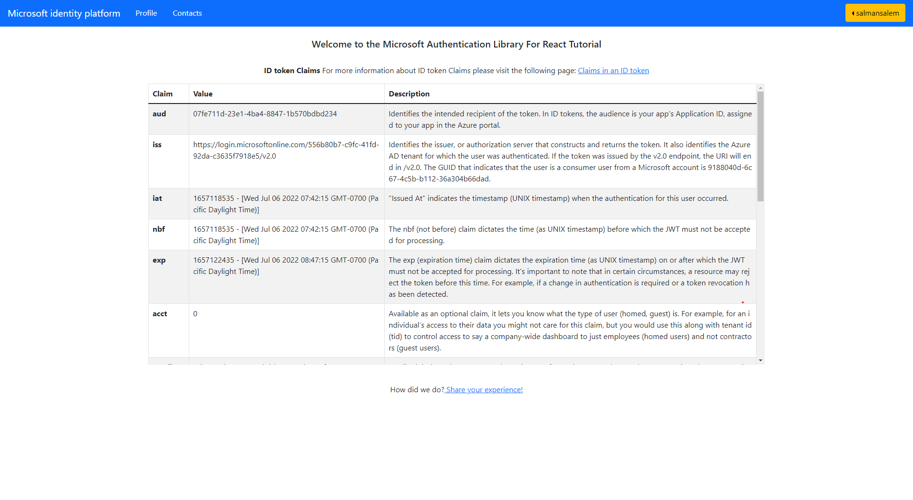

# React single-page application using MSAL React to sign-in users against Azure Active Directory

 1. [Overview](#overview)
 1. [Scenario](#scenario)
 1. [Contents](#contents)
 1. [Setup](#setup)
 1. [Registration](#registration)
 1. [Running the sample](#running-the-sample)
 1. [Explore the sample](#explore-the-sample)
 1. [Deploy the sample](#deploy-the-sample)
 1. [About the code](#about-the-code)
 1. [More information](#more-information)
 1. [Community Help and Support](#community-help-and-support)
 1. [Contributing](#contributing)

## Overview

In the [previous chapter](../../1-Authentication\1-sign-in\README-incremental.md), you learnt how a React single-page application (SPA) authenticating users against [Azure Active Directory](https://docs.microsoft.com/azure/active-directory/fundamentals/active-directory-whatis) (Azure AD), using the [Microsoft Authentication Library for React](https://github.com/AzureAD/microsoft-authentication-library-for-js/tree/dev/lib/msal-react) (MSAL React).

In this chapter we'd extend our React single-page application (SPA) by making it also call [Microsoft Graph](https://docs.microsoft.com/graph/overview). In addition, this sample also demonstrates how to user [Microsoft Graph JavaScript SDK](https://github.com/microsoftgraph/msgraph-sdk-javascript) client with MSAL as a custom authentication provider to call the Graph API.

> :information_source: Note that you are not required to implement a custom provider, as the v3.0 (preview) of the SDK offers a [default provider](https://github.com/microsoftgraph/msgraph-sdk-javascript/blob/dev/docs/AuthCodeMSALBrowserAuthenticationProvider.md) that implements MSAL.js.

## Scenario

1. The client React SPA uses **MSAL React** to sign-in a user and obtain a JWT [access token](https://docs.microsoft.com/azure/active-directory/develop/access-tokens) from **Azure AD**.
2. The access token is used as a *bearer token* to authorize the user to call the **Microsoft Graph API**.


## Contents

| File/folder                         | Description                                                                |
|-------------------------------------|----------------------------------------------------------------------------|
| `App.jsx`                           | Main application logic resides here.                                       |
| `fetch.jsx`                         | Provides a helper method for making fetch calls using bearer token scheme. |
| `authConfig.js`                     | Contains authentication configuration parameters.                          |
| `pages/Home.jsx`                    | Contains a table with ID token claims and description                      |
| `pages/Redirect.jsx`                | Blank page for redirect purposes. When using popup and silent APIs         |
| `pages/Profile.jsx`                 | Calls Microsoft Graph `/me` endpoint vith Graph SDK.                       |
| `pages/Contacts.jsx`                | Calls Microsoft Graph `/me/contacts` endpoint vith Graph SDK.              |
| `hooks/useTokenAcquisition.js`      | Custom hook to handle token acquisition with MSAL.js                       |
| `components/AccountPicker.jsx`      | Contains logic to handle multiple `account` selection with MSAL.js         |

## Setup

```console
    cd ms-identity-javascript-react-tutorial
    cd 2-Authorization-I/1-call-graph/SPA
    npm install
```

## Registration

We'd make the following changes to our app registration

</details>

### Update the app registration (msal-react-spa)

1. Navigate to the [Azure portal](https://portal.azure.com) and select the **Azure AD** service.
1. Select the **App Registrations** blade on the left, then find and select the application that you have registered in the previous tutorial (`msal-react-spa`).
1. In the app's registration screen, select the **API permissions** blade in the left to open the page where we add access to the APIs that your application needs.
   - Select the **Add a permission** button and then,
   - Ensure that the **Microsoft APIs** tab is selected.
   - In the *Commonly used Microsoft APIs* section, select **Microsoft Graph**
   - In the **Delegated permissions** section, select the **User.Read** and **Contacts.Read** in the list. Use the search box if necessary.
   - Select the **Add permissions** button at the bottom.

#### Configure the app (msal-react-spa) to use your app registration

No changes are required in the configuration files.

## Running the sample

Locate the folder where `package.json` resides in your terminal. Then:

```console
    npm start
```

## Explore the sample

1. Open your browser and navigate to `http://localhost:3000`.
1. Select the **Sign In** button on the top right corner.
1. Select the **Profile** button on the navigation bar. This will make a call to the Graph API.
1. Select the **Contacts** button on the navigation bar. This will make a call to the Graph API (:warning: you need to have an Office subscription for this call to work).



> :information_source: Did the sample not work for you as expected? Then please reach out to us using the [GitHub Issues](../../../issues) page.

## We'd love your feedback!

Were we successful in addressing your learning objective? Consider taking a moment to [share your experience with us](https://forms.office.com/Pages/ResponsePage.aspx?id=v4j5cvGGr0GRqy180BHbR73pcsbpbxNJuZCMKN0lURpUMlRHSkc5U1NLUkxFNEtVN0dEOTFNQkdTWiQlQCN0PWcu).

## Deploy the sample

To deploy this sample to Azure please check both implementations in chapter four:

1. [Deploy to Azure Storage and App Service](../../4-Deployment/1-deploy-storage/)  
1. [Deploy to Azure Static Web Apps](../../4-Deployment/2-deploy-static/)

## About the code

### Protected resources and scopes

In order to access a protected resource on behalf of a signed-in user, the app needs to present a valid **Access Token** to that resource owner (in this case, Microsoft Graph). **Access Token** requests in **MSAL** are meant to be *per-resource-per-scope(s)*. This means that an **Access Token** requested for resource **A** with scope `scp1`:

- cannot be used for accessing resource **A** with scope `scp2`, and,
- cannot be used for accessing resource **B** of any scope.

The intended recipient of an **Access Token** is represented by the `aud` claim (in this case, it should be the Microsoft Graph API's App ID); in case the value for the `aud` claim does not mach the resource **APP ID URI**, the token should be considered invalid. Likewise, the permissions that an **Access Token** grants is represented by the `scp` claim. See [Access Token claims](https://docs.microsoft.com/azure/active-directory/develop/access-tokens#payload-claims) for more information.

### Working with multiple resources

When you have to access multiple resources, initiate a separate token request for each:

 ```javascript
     // "User.Read" stands as shorthand for "graph.microsoft.com/User.Read"
     const graphToken = await msalInstance.acquireTokenSilent({
          scopes: [ "User.Read" ]
     });
     const customApiToken = await msalInstance.acquireTokenSilent({
          scopes: [ "api://<myCustomApiClientId>/My.Scope" ]
     });
 ```

Bear in mind that you *can* request multiple scopes for the same resource (e.g. `User.Read`, `User.Write` and `Calendar.Read` for **MS Graph API**).

 ```javascript
     const graphToken = await msalInstance.acquireTokenSilent({
          scopes: [ "User.Read", "User.Write", "Calendar.Read"] // all MS Graph API scopes
     });
 ```

In case you *erroneously* pass multiple resources in your token request, the token you will receive will only be issued for the first resource.

 ```javascript
     // you will only receive a token for MS GRAPH API's "User.Read" scope here
     const myToken = await msalInstance.acquireTokenSilent({
          scopes: [ "User.Read", "api://<myCustomApiClientId>/My.Scope" ]
     });
 ```

### Dynamic scopes and incremental consent

In **Azure AD**, the scopes (permissions) set directly on the application registration are called static scopes. Other scopes that are only defined within the code are called dynamic scopes. This has implications on the **login** (i.e. loginPopup, loginRedirect) and **acquireToken** (i.e. `acquireTokenPopup`, `acquireTokenRedirect`, `acquireTokenSilent`) methods of **MSAL.js**. Consider:

```javascript
     const loginRequest = {
          scopes: [ "openid", "profile", "User.Read" ]
     };

     const tokenRequest = {
          scopes: [ "Contacts.Read" ]
     };

     // will return an ID Token and an Access Token with scopes: "openid", "profile" and "User.Read"
     msalInstance.loginPopup(loginRequest);

     // will fail and fallback to an interactive method prompting a consent screen
     // after consent, the received token will be issued for "openid", "profile" ,"User.Read" and "Mail.Read" combined
     msalInstance.acquireTokenPopup(tokenRequest);
```

In the code snippet above, the user will be prompted for consent once they authenticate and receive an **ID Token** and an **Access Token** with scope `User.Read`. Later, if they request an **Access Token** for `User.Read`, they will not be asked for consent again (in other words, they can acquire a token *silently*). On the other hand, the user did not consented to `Contacts.Read` at the authentication stage. As such, they will be asked for consent when requesting an **Access Token** for that scope. The token received will contain all the previously consented scopes, hence the term *incremental consent*.

### Acquire a Token

**MSAL.js** exposes 3 APIs for acquiring a token: `acquireTokenPopup()`, `acquireTokenRedirect()` and `acquireTokenSilent()`. The `acquireTokenSilent()` API is meant to retrieve a non-expired access token from cache *silently*, or acquire a fresh access token using a non-expired refresh token. If `acquireTokenSilent()` fails, the recommended pattern is to fallback to one of the interactive methods i.e. `acquireTokenPopup()` or `acquireTokenRedirect()`. In the sample, a custom hook named `useTokenAcquisition` is used to implement this logic.

> :information_source: When using `acquireTokenRedirect`, you may want to set `navigateToLoginRequestUrl` in [msalConfig](./SPA/src/authConfig.js) to **true** if you wish to return back to the page where acquireTokenRedirect was called.

```javascript
const useTokenAcquisition = (scopes, interactionType) => {
    /**
     * useMsal is a hook that returns the PublicClientApplication instance,
     * an array of all accounts currently signed in and an inProgress value
     * that tells you what msal is currently doing. For more, visit:
     * https://github.com/AzureAD/microsoft-authentication-library-for-js/blob/dev/lib/msal-react/docs/hooks.md
     */

    const { instance, inProgress } = useMsal();
    const account = instance.getActiveAccount();
    const [response, setResponse] = useState(null);
    const [error, setError] = useState(null);

    useEffect(() => {
        const getToken = async () => {
            let tokenResponse;
            if (account && inProgress === InteractionStatus.None && !response && !error) {
                try {
                    tokenResponse = await instance.acquireTokenSilent({
                        scopes: scopes,
                        account: account,
                        claims: localStorage.getItem(`cc.${msalConfig.auth.clientId}.${account.idTokenClaims.oid}`)
                            ? window.atob(
                                  localStorage.getItem(`cc.${msalConfig.auth.clientId}.${account.idTokenClaims.oid}`)
                              )
                            : null
                    });
                    setResponse(tokenResponse);
                } catch (error) {
                    if (error instanceof InteractionRequiredAuthError) {
                        try {
                            switch (interactionType) {
                                case InteractionType.Popup:
                                    tokenResponse = await instance.acquireTokenPopup({
                                        scopes: scopes,
                                        account: account,
                                        claims: localStorage.getItem(
                                            `cc.${msalConfig.auth.clientId}.${account.idTokenClaims.oid}`
                                        )
                                            ? window.atob(
                                                  localStorage.getItem(
                                                      `cc.${msalConfig.auth.clientId}.${account.idTokenClaims.oid}`
                                                  )
                                              )
                                            : null
                                    });
                                    break;

                                case InteractionType.Redirect:
                                default:
                                    tokenResponse = await instance.acquireTokenRedirect({
                                        scopes: scopes,
                                        account: account,
                                        claims: localStorage.getItem(
                                            `cc.${msalConfig.auth.clientId}.${account.idTokenClaims.oid}`
                                        )
                                            ? window.atob(
                                                  localStorage.getItem(
                                                      `cc.${msalConfig.auth.clientId}.${account.idTokenClaims.oid}`
                                                  )
                                              )
                                            : null
                                    });
                                    break;
                            }
                            setResponse(tokenResponse);
                        } catch (error) {
                            if (error.errorCode === 'popup_window_error') {
                                tokenResponse = await instance.acquireTokenRedirect({
                                    scopes: scopes,
                                    account: account,
                                    claims: localStorage.getItem(
                                        `cc.${msalConfig.auth.clientId}.${account.idTokenClaims.oid}`
                                    )
                                        ? window.atob(
                                              localStorage.getItem(
                                                  `cc.${msalConfig.auth.clientId}.${account.idTokenClaims.oid}`
                                              )
                                          )
                                        : null
                                });
                                setResponse(tokenResponse);
                            } else {
                                setError(error);
                            }
                        }
                    }
                }
            }
        };
        getToken();
    }, [account, inProgress, instance]);

    return [response, error];
};

export default useTokenAcquisition;
```

### Access Token validation

Clients should treat access tokens as opaque strings, as the contents of the token are intended for the **resource only** (such as a web API or Microsoft Graph). For validation and debugging purposes, developers can decode **JWT**s (*JSON Web Tokens*) using a site like [jwt.ms](https://jwt.ms).

### Checking for client capabilities

The client capabilities claim (xms_cc) indicate whether a client application can satisfy the claims challenge generated The following events:

- User Account is deleted or disabled
- Password for a user is changed or reset
- Multi-factor authentication is enabled for the user
- Administrator explicitly revokes all refresh tokens for a user
- High user risk detected by Azure AD Identity Protection

To obtain this claim in an access token, we enable the clientCapabilities configuration option in authConfig.js:

```javascript
const msalConfig = {
    auth: {
        clientId: 'Enter_the_Application_Id_Here', 
        authority: 'https://login.microsoftonline.com/Enter_the_Tenant_Info_Here',
        redirectUri: "/redirect", 
        postLogoutRedirectUri: "/",
        navigateToLoginRequestUrl: true, 
        clientCapabilities: ["CP1"] // this lets the resource owner know that this client is capable of handling claims challenge.
    }
}

const msalInstance = new PublicClientApplication(msalConfig);
```

### Handling claims challenge

Once the client app receives the claims challenge, it needs to present the user with a prompt for satisfying the challenge via Azure AD authorization endpoint. To do so, we use MSAL's `acquireTokenPopup()` API and provide the claims challenge as a parameter in the token request. This is shown in [fetch.js](./SPA/src/fetch.js), where we handle the response from the Microsoft Graph API with the `handleClaimsChallenge` method:

```javascript
const handleClaimsChallenge = async (response, scopes, isImage) => { 
    console.log(response.status, "res status")
    if (response.status === 401) {
        if (response.headers.get('www-authenticate')) {
            let tokenResponse;
            const account = msalInstance.getActiveAccount();
            const authenticateHeader = response.headers.get('www-authenticate');
            const claimsChallenge = authenticateHeader
                .split(' ')
                .find((entry) => entry.includes('claims='))
                .split('claims="')[1]
                .split('",')[0];

            try {
                addClaimsToStorage(claimsChallenge, `cc.${msalConfig.auth.clientId}.${account.idTokenClaims.oid}`);
                tokenResponse = await msalInstance.acquireTokenPopup({
                    claims: window.atob(claimsChallenge), // decode the base64 string
                    scopes: scopes,
                    account: account,
                });

                if (tokenResponse) {
                    const data = await callApiWithToken(
                        tokenResponse.accessToken,
                        protectedResources.graphMe.endpoint,
                        scopes
                    );
                    return data;
                }
            } catch (error) {
                if (
                    error instanceof BrowserAuthError &&
                    (error.errorCode === 'popup_window_error' || error.errorCode === 'empty_window_error')
                ) {
                    addClaimsToStorage(claimsChallenge, `cc.${msalConfig.auth.clientId}.${account.idTokenClaims.oid}`);
                    tokenResponse = await msalInstance.acquireTokenRedirect({
                        claims: window.atob(claimsChallenge),
                        scopes: protectedResources.apiTodoList.scopes,
                        account: account,
                    });
                } else {
                    throw error;
                }
            }
        }
    }

    if( response.status ===  200 & isImage) return response.blob()
    if( response.status ===  200) return response.json();
    throw response.json();
};
```

### Calling the Microsoft Graph API

Using the [Fetch API](https://developer.mozilla.org/en-US/docs/Web/API/Fetch_API), simply add the `Authorization` header to your request, followed by the **access token** you have obtained previously for this resource/endpoint (as a [bearer token](https://tools.ietf.org/html/rfc6750)):

```javascript
/**
 * Makes a GET request using authorization header. For more, visit:
 * https://tools.ietf.org/html/rfc6750
 * @param {string} accessToken
 * @param {string} apiEndpoint
 * @param {Array} scopes
 * @param {boolean} isImage
 */
export const callApiWithToken = async (accessToken, apiEndpoint, scopes, isImage = false) => {
    const headers = new Headers();
    const bearer = `Bearer ${accessToken}`;

    headers.append('Authorization', bearer);

    const options = {
        method: 'GET',
        headers: headers,
    };

    return fetch(apiEndpoint, options)
        .then((response) => handleClaimsChallenge(response, scopes, isImage))
        .catch((error) => console.log(error));
};
```

See [fetch.js](./SPA/src/fetch.js).

### Working with React routes

You can use [React Router](https://reactrouter.com/) component in conjunction with **MSAL React**. Simply wrap the `MsalProvider` component between the `Router` component, passing the `PublicClientApplication` instance you have created earlier as props:

```javascript
const msalInstance = new PublicClientApplication(msalConfig);

root.render(
    <React.StrictMode>
        <App instance={msalInstance} />
    </React.StrictMode>
);

export const App = ({ instance }) => {
    return (
        <Router>
            <MsalProvider instance={msalInstance}>
                <PageLayout>
                    <Pages />
                </PageLayout>
            </MsalProvider>
        </Router>
    );
};

const Pages = () => {
    return (
        <Routes>
            <Route path="/profile" element={<Profile />} />
            <Route path="/contacts" element={<Contacts />} />
            <Route path="/redirect" element={<Redirect />} />
            <Route path="/" element={<Home />} />
        </Routes>
    );
};
```

### Securing your React routes

You can ensure that your users are authenticated when visiting a certain route/page with the help of `MsalAuthenticationTemplate` component. This component takes a number of props to manage the sign-in experience when an unauthenticated user hits the route:

```javascript
export const Profile = () => {
    const authRequest = {
        ...loginRequest
    };

    return (
        <MsalAuthenticationTemplate 
            interactionType={InteractionType.Popup} 
            authenticationRequest={authRequest}
        >
            <ProfileContent />
        </MsalAuthenticationTemplate>
      )
};
```

## Next Tutorial

Continue with the next tutorial: [Protect and call a web API](../../3-Authorization-II/1-call-api/README-incremental.md).

## More information

- [Microsoft identity platform (Azure Active Directory for developers)](https://docs.microsoft.com/azure/active-directory/develop/)
- [Overview of Microsoft Authentication Library (MSAL)](https://docs.microsoft.com/azure/active-directory/develop/msal-overview)
- [Quickstart: Register an application with the Microsoft identity platform](https://docs.microsoft.com/azure/active-directory/develop/quickstart-register-app)
- [Quickstart: Configure a client application to access web APIs](https://docs.microsoft.com/azure/active-directory/develop/quickstart-configure-app-access-web-apis)
- [Initialize client applications using MSAL.js](https://docs.microsoft.com/azure/active-directory/develop/msal-js-initializing-client-applications)
- [Single sign-on with MSAL.js](https://docs.microsoft.com/azure/active-directory/develop/msal-js-sso)
- [Handle MSAL.js exceptions and errors](https://docs.microsoft.com/azure/active-directory/develop/msal-handling-exceptions?tabs=javascript)
- [Logging in MSAL.js applications](https://docs.microsoft.com/azure/active-directory/develop/msal-logging?tabs=javascript)
- [Pass custom state in authentication requests using MSAL.js](https://docs.microsoft.com/azure/active-directory/develop/msal-js-pass-custom-state-authentication-request)
- [Prompt behavior in MSAL.js interactive requests](https://docs.microsoft.com/azure/active-directory/develop/msal-js-prompt-behavior)

For more information about how OAuth 2.0 protocols work in this scenario and other scenarios, see [Authentication Scenarios for Azure AD](https://docs.microsoft.com/azure/active-directory/develop/authentication-flows-app-scenarios).

## Community Help and Support

Use [Stack Overflow](http://stackoverflow.com/questions/tagged/msal) to get support from the community.
Ask your questions on Stack Overflow first and browse existing issues to see if someone has asked your question before.
Make sure that your questions or comments are tagged with [`azure-active-directory` `azure-ad-b2c` `ms-identity` `adal` `msal`].

If you find a bug in the sample, raise the issue on [GitHub Issues](../../../issues).

To provide feedback on or suggest features for Azure Active Directory, visit [User Voice page](https://feedback.azure.com/forums/169401-azure-active-directory).

## Contributing

If you'd like to contribute to this sample, see [CONTRIBUTING.MD](/CONTRIBUTING.md).

This project has adopted the [Microsoft Open Source Code of Conduct](https://opensource.microsoft.com/codeofconduct/). For more information, see the [Code of Conduct FAQ](https://opensource.microsoft.com/codeofconduct/faq/) or contact [opencode@microsoft.com](mailto:opencode@microsoft.com) with any additional questions or comments.
