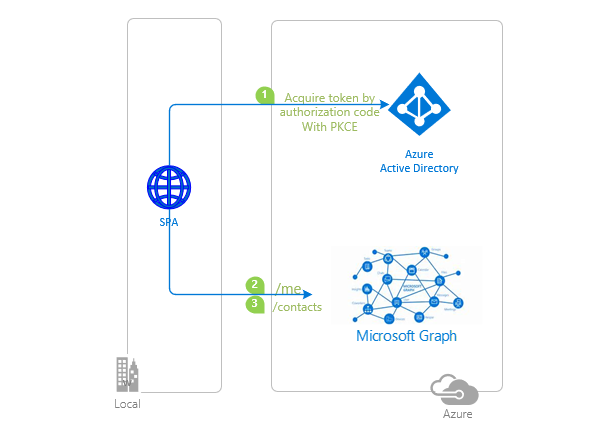

# React single-page application using MSAL React to sign-in users against Azure Active Directory

 1. [Overview](#overview)
 1. [Scenario](#scenario)
 1. [Contents](#contents)
 1. [Prerequisites](#prerequisites)
 1. [Setup](#setup)
 1. [Registration](#registration)
 1. [Running the sample](#running-the-sample)
 1. [Explore the sample](#explore-the-sample)
 1. [Deploy the sample](#deploy-the-sample)
 1. [About the code](#about-the-code)
 1. [More information](#more-information)
 1. [Community Help and Support](#community-help-and-support)
 1. [Contributing](#contributing)

## Overview

This sample demonstrates a React single-page application (SPA) that signs-in users with Azure AD and calls the [Microsoft Graph API](https://docs.microsoft.com/graph/overview) using the [Microsoft Authentication Library for React](https://github.com/AzureAD/microsoft-authentication-library-for-js/tree/dev/lib/msal-react) (MSAL React).

Here you'll learn how to [sign-in](https://docs.microsoft.com/azure/active-directory/develop/scenario-spa-sign-in), [acquire a token](https://docs.microsoft.com/azure/active-directory/develop/scenario-spa-acquire-token) and [call a protected web API](https://docs.microsoft.com/azure/active-directory/develop/scenario-spa-call-api), as well as [Dynamic Scopes and Incremental Consent](https://docs.microsoft.com/azure/active-directory/develop/v2-permissions-and-consent), **working with multiple resources** and **securing your routes** and more.

## Scenario

1. The client React SPA uses **MSAL React** to sign-in a user and obtain a JWT [access token](https://docs.microsoft.com/azure/active-directory/develop/access-tokens) from **Azure AD**.
2. The access token is used as a *bearer token* to authorize the user to call the **Microsoft Graph API**.
3. The **Microsoft Graph API** responds with the payload if user is authorized.



## Contents

| File/folder                         | Description                                                                |
|-------------------------------------|----------------------------------------------------------------------------|
| `App.jsx`                           | Main application logic resides here.                                       |
| `fetch.jsx`                         | Provides a helper method for making fetch calls using bearer token scheme. |
| `authConfig.js`                     | Contains authentication configuration parameters.                          |
| `pages/Home.jsx`                    | Contains a table with ID token claims and description                      |
| `pages/Redirect.jsx`                | Blank page for redirect purposes when using popup and silent APIs         |
| `pages/Profile.jsx`                 | Calls Microsoft Graph `/me` endpoint with Graph SDK.                       |
| `pages/Contacts.jsx`                | Calls Microsoft Graph `/me/contacts` endpoint with Graph SDK.              |
| `hooks/useTokenAcquisition.js`      | Custom hook to handle token acquisition with MSAL.js                       |
| `components/AccountPicker.jsx`      | Contains logic to handle multiple `account` selection with MSAL.js         |

## Prerequisites

- An **Azure AD** tenant. For more information see: [How to get an Azure AD tenant](https://docs.microsoft.com/azure/active-directory/develop/test-setup-environment#get-a-test-tenant)
- A user account in your **Azure AD** tenant. This sample will not work with a **personal Microsoft account**. Therefore, if you signed in to the [Azure portal](https://portal.azure.com) with a personal account and have never created a user account in your directory before, you need to do that now.

## Setup

### Step 1: Clone or download this repository

From your shell or command line:

```console
    git clone https://github.com/Azure-Samples/ms-identity-javascript-react-tutorial.git
```

or download and extract the repository .zip file.

> :warning: To avoid path length limitations on Windows, we recommend cloning into a directory near the root of your drive.

### Step 2: Install project dependencies

```console
    cd ms-identity-javascript-react-tutorial
    cd 2-Authorization-I/1-call-graph/SPA
    npm install
```

Developers who wish to increase their familiarity with programming for Microsoft Graph are advised to go through the [An introduction to Microsoft Graph for developers](https://www.youtube.com/watch?v=EBbnpFdB92A) recorded session.

## Registration

There is one project in this sample. To register it, you can:

- follow the steps below for manually register your apps
- or use PowerShell scripts that:
  - **automatically** creates the Azure AD applications and related objects (passwords, permissions, dependencies) for you.
  - modify the projects' configuration files.

<details>
  <summary>Expand this section if you want to use this automation:</summary>

> :warning: If you have never used **Microsoft Graph Powershell SDK** before, we recommend you go through the [App Creation Scripts](./AppCreationScripts/AppCreationScripts.md) once to ensure that your environment is prepared correctly for this step.

1. On Windows, run PowerShell as **Administrator** and navigate to the root of the cloned directory
1. If you have never used Microsoft Graph Powershell SDK before, we recommend you go through the [App Creation Scripts](./AppCreationScripts/AppCreationScripts.md) once to ensure that your environment is prepared correctly for this step.
1. In PowerShell run:

   ```PowerShell
   Set-ExecutionPolicy -ExecutionPolicy RemoteSigned -Scope Process -Force
   ```

1. Run the script to create your Azure AD application and configure the code of the sample application accordingly.
1. In PowerShell run:

   ```PowerShell
   cd .\AppCreationScripts\
   .\Configure.ps1
   ```

   > Other ways of running the scripts are described in [App Creation Scripts](./AppCreationScripts/AppCreationScripts.md)
   > The scripts also provide a guide to automated application registration, configuration and removal which can help in your CI/CD scenarios.

</details>

### Choose the Azure AD tenant where you want to create your applications

As a first step you'll need to:

1. Sign in to the [Azure portal](https://portal.azure.com).
1. If your account is present in more than one Azure AD tenant, select your profile at the top right corner in the menu on top of the page, and then **switch directory** to change your portal session to the desired Azure AD tenant.

### Register the app (msal-react-spa)

1. Navigate to the [Azure portal](https://portal.azure.com) and select the **Azure AD** service.
1. Select the **App Registrations** blade on the left, then select **New registration**.
1. In the **Register an application page** that appears, enter your application's registration information:
   - In the **Name** section, enter a meaningful application name that will be displayed to users of the app, for example `msal-react-spa`.
   - Under **Supported account types**, select **Accounts in this organizational directory only**.
1. Select **Register** to create the application.
1. In the app's registration screen, select the **Authentication** blade.
   - If you don't have a platform added, select **Add a platform** and select the **Single-page application** option.
   - In the **Redirect URI** section enter the following redirect URIs:
     - `http://localhost:3000/`
     - `http://localhost:3000/redirect`
1. In the app's registration screen, find and note the **Application (client) ID**. You use this value in your app's configuration file(s) later in your code.
1. Select **Save** to save your changes.
1. In the app's registration screen, select the **API permissions** blade in the left to open the page where we add access to the APIs that your application needs.
   - Select the **Add a permission** button and then,
   - Ensure that the **Microsoft APIs** tab is selected.
   - In the *Commonly used Microsoft APIs* section, select **Microsoft Graph**
   - In the **Delegated permissions** section, select the **User.Read** and **Contacts.Read** in the list. Use the search box if necessary.
   - Select the **Add permissions** button at the bottom.
  
#### Configure the app (msal-react-spa) to use your app registration

Open the project in your IDE (like Visual Studio or Visual Studio Code) to configure the code.

> In the steps below, "ClientID" is the same as "Application ID" or "AppId".

1. Open the `App\authConfig.js` file.
1. Find the key `Enter_the_Application_Id_Here` and replace the existing value with the application ID (clientId) of `msal-react-spa` app copied from the Azure portal.
1. Find the key `Enter_the_Tenant_Info_Here` and replace the existing value with your Azure AD tenant name.

## Running the sample

Locate the folder where `package.json` resides in your terminal. Then:

```console
    npm start
```

## Explore the sample

1. Open your browser and navigate to `http://localhost:3000`.
1. Select the **Sign In** button on the top right corner.
1. Select the **Profile** button on the navigation bar. This will make a call to the Graph API.
1. Select the **Contacts** button on the navigation bar. This will make a call to the Graph API (:warning: the user needs to have an Office subscription for this call to work).


> :information_source: Did the sample not work for you as expected? Then please reach out to us using the [GitHub Issues](../../../issues) page.

## We'd love your feedback!

Were we successful in addressing your learning objective? Consider taking a moment to [share your experience with us](https://forms.office.com/Pages/ResponsePage.aspx?id=v4j5cvGGr0GRqy180BHbR73pcsbpbxNJuZCMKN0lURpUMlRHSkc5U1NLUkxFNEtVN0dEOTFNQkdTWiQlQCN0PWcu).

## Deploy the sample

To deploy this sample to Azure please check both implementations in chapter 4:

1. [Deploy to Azure Storage and App Service](../../4-Deployment/1-deploy-storage/)  
1. [Deploy to Azure Static Web Apps](../../4-Deployment/2-deploy-static/)

## About the code

### Protected resources and scopes

In order to access a protected resource on behalf of a signed-in user, the app needs to present a valid **Access Token** to that resource owner (in this case, Microsoft Graph). **Access Token** requests in **MSAL** are meant to be *per-resource-per-scope(s)*. This means that an **Access Token** requested for resource **A** with scope `scp1`:

- cannot be used for accessing resource **A** with scope `scp2`, and,
- cannot be used for accessing resource **B** of any scope.

The intended recipient of an **Access Token** is represented by the `aud` claim (in this case, it should be the Microsoft Graph API's App ID); in case the value for the `aud` claim does not mach the resource **APP ID URI**, the token will be considered invalid by the API. Likewise, the permissions that an **Access Token** grants are provided in the `scp` claim. See [Access Token claims](https://docs.microsoft.com/azure/active-directory/develop/access-tokens#payload-claims) for more information.

### Working with multiple resources

When you have to access multiple resources, initiate a separate token request for each:

 ```javascript
     // "User.Read" stands as shorthand for "graph.microsoft.com/User.Read"
     const graphToken = await msalInstance.acquireTokenSilent({
          scopes: [ "User.Read" ]
     });
     const customApiToken = await msalInstance.acquireTokenSilent({
          scopes: [ "api://<myCustomApiClientId>/My.Scope" ]
     });
 ```

Bear in mind that you *can* request multiple scopes for the same resource (e.g. `User.Read`, `User.Write` and `Calendar.Read` for **MS Graph API**).

 ```javascript
     const graphToken = await msalInstance.acquireTokenSilent({
          scopes: [ "User.Read", "User.Write", "Calendar.Read"] // all MS Graph API scopes
     });
 ```

In case you *erroneously* pass multiple resources in your token request, Azure AD will throw an exception, and your request will fail.

 ```javascript
     // your request will fail for both resources
     const myToken = await msalInstance.acquireTokenSilent({
          scopes: [ "User.Read", "api://<myCustomApiClientId>/My.Scope" ]
     });
 ```

### Dynamic scopes and incremental consent

In **Azure AD**, the scopes (permissions) set directly on the application registration are called static scopes. Other scopes that are only defined within the code are called dynamic scopes. This has implications on the **login** (i.e. loginPopup, loginRedirect) and **acquireToken** (i.e. `acquireTokenPopup`, `acquireTokenRedirect`, `acquireTokenSilent`) methods of **MSAL.js**. Consider:

```javascript
     const loginRequest = {
          scopes: [ "openid", "profile", "User.Read" ]
     };

     const tokenRequest = {
          scopes: [ "Contacts.Read" ]
     };

     // will return an ID Token and an Access Token with scopes: "openid", "profile" and "User.Read"
     msalInstance.loginPopup(loginRequest);

     // will fail and fallback to an interactive method prompting a consent screen
     // after consent, the received token will be issued for "openid", "profile" ,"User.Read" and "Contacts.Read" combined
     msalInstance.acquireTokenPopup(tokenRequest);
```

In the code snippet above, the user will be prompted for consent once they authenticate and receive an **ID Token** and an **Access Token** with scope `User.Read`. Later, if they request an **Access Token** for `User.Read`, they will not be asked for consent again (in other words, they can acquire a token *silently*). On the other hand, the user did not consented to `Contacts.Read` at the authentication stage. As such, they will be asked for consent when requesting an **Access Token** for that scope. The token received will contain all the previously consented scopes, hence the term *incremental consent*. Read more on this topic at [Scopes, permissions and consent in the Microsoft identity platform](https://docs.microsoft.com/azure/active-directory/develop/v2-permissions-and-consent).

### Acquire a Token

**MSAL.js** exposes 3 APIs for acquiring a token: `acquireTokenPopup()`, `acquireTokenRedirect()` and `acquireTokenSilent()`. The `acquireTokenSilent()` API is meant to retrieve a non-expired access token from cache *silently*, or acquire a fresh access token using a non-expired refresh token. If `acquireTokenSilent()` fails, the recommended pattern is to fallback to one of the interactive methods i.e. `acquireTokenPopup()` or `acquireTokenRedirect()`. In the sample, a custom hook named [useTokenAcquisition.js](./SPA/src/hooks/useTokenAcquisition.js) is used to implement this logic.

> :information_source: Please see the documentation on [acquiring an access token](https://github.com/AzureAD/microsoft-authentication-library-for-js/blob/dev/lib/msal-browser/docs/acquire-token.md) to learn more about various methods available in **MSAL.js** to acquire tokens.

### Handle Continuous Access Evaluation (CAE) challenge from Microsoft Graph

Continuous access evaluation (CAE) enables applications to do just-in time token validation, for instance enforcing user session revocation in the case of password change/reset but there are other benefits. For details, see [Continuous access evaluation](https://docs.microsoft.com/azure/active-directory/conditional-access/concept-continuous-access-evaluation).

Microsoft Graph is now CAE-enabled in Preview. This means that it can ask its client apps for more claims when conditional access policies require it. Your can enable your application to be ready to consume CAE-enabled APIs by:

1. Declaring that the client app is capable of handling claims challenges.
2. Processing these challenges when they are thrown by the web API

#### Declare the CAE capability in the configuration

This sample declares that it's CAE-capable by adding the `clientCapabilities` property in the configuration in `authConfig.js`:

```javascript
const msalConfig = {
    auth: {
        clientId: 'Enter_the_Application_Id_Here', 
        authority: 'https://login.microsoftonline.com/Enter_the_Tenant_Info_Here',
        redirectUri: "/redirect", 
        postLogoutRedirectUri: "/",
        navigateToLoginRequestUrl: true, 
        clientCapabilities: ["CP1"] // this lets the resource owner know that this client is capable of handling claims challenge.
    }
}

const msalInstance = new PublicClientApplication(msalConfig);
```

#### Processing the CAE challenge from Microsoft Graph

Once the client app receives the CAE claims challenge from Microsoft Graph, it needs to present the user with a prompt for satisfying the challenge via Azure AD authorization endpoint. To do so, we use MSAL's `acquireTokenPopup()` API and provide the claims challenge as a parameter in the token request. This is shown in [fetch.js](./SPA/src/fetch.js), where we handle the response from the Microsoft Graph API with the `handleClaimsChallenge` method:

```javascript
/**
 * This method inspects the HTTPS response from a fetch call for the "www-authenticate header"
 * If present, it grabs the claims challenge from the header, then uses msal to ask Azure AD for a new access token containing the needed claims
 * If not present, then it simply returns the response as json
 * For more information, visit: https://docs.microsoft.com/en-us/azure/active-directory/develop/claims-challenge#claims-challenge-header-format
 * @param {object} response
 * @param {Array} scopes
 * @returns response
 */
const handleClaimsChallenge = async (response, scopes) => {
    if (response.status === 401) {
        if (response.headers.get('www-authenticate')) {
            let tokenResponse;
            const account = msalInstance.getActiveAccount();
            const authenticateHeader = response.headers.get('www-authenticate');

            const claimsChallenge = authenticateHeader
                .split(' ')
                .find((entry) => entry.includes('claims='))
                .split('claims="')[1]
                .split('",')[0];

            try {
                /**
                 * This method stores the claim challenge to the localStorage in the browser to be used when acquiring a token.
                 * To ensure that we are fetching the correct claim from the localStorage, we are using the clientId of the
                 * application and oid (user’s object id) as the key identifier of the claim in the localStorage.
                 */
                addClaimsToStorage(claimsChallenge, `cc.${msalConfig.auth.clientId}.${account.idTokenClaims.oid}`);

                tokenResponse = await msalInstance.acquireTokenPopup({
                    claims: window.atob(claimsChallenge), // decode the base64 string
                    scopes: scopes,
                    account: account,
                });

                if (tokenResponse) {
                    const data = await callApiWithToken(
                        tokenResponse.accessToken,
                        protectedResources.graphMe.endpoint,
                        scopes
                    );
                    return data;
                }
            } catch (error) {
                if (
                    error instanceof BrowserAuthError &&
                    (error.errorCode === 'popup_window_error' || error.errorCode === 'empty_window_error')
                ) {
                    /**
                     * This method stores the claim challenge to the localStorage in the browser to be used when acquiring a token.
                     * To ensure that we are fetching the correct claim from the localStorage, we are using the clientId
                     * of the application and oid (user’s object id) as the key identifier of the claim in the localStorage.
                     */
                    addClaimsToStorage(claimsChallenge, `cc.${msalConfig.auth.clientId}.${account.idTokenClaims.oid}`);

                    tokenResponse = await msalInstance.acquireTokenRedirect({
                        claims: window.atob(claimsChallenge),
                        scopes: protectedResources.apiTodoList.scopes,
                        account: account,
                    });
                } else {
                    throw error;
                }
            }
        }
    }

    if (response.status === 200) return response.json();
    else if (response.status === 401) return { error: 'Unauthorized' };
    else return { error: 'Something went wrong' };
};
```

### Access Token validation

Clients should treat access tokens as opaque strings, as the contents of the token are intended for the **resource only** (such as a web API or Microsoft Graph). For validation and debugging purposes, developers can decode **JWT**s (*JSON Web Tokens*) using a site like [jwt.ms](https://jwt.ms).

For more details on what's inside the access token, clients should use the token response data that's returned with the access token to your client. When your client requests an access token, the Microsoft identity platform also returns some metadata about the access token for your app's consumption. This information includes the expiry time of the access token and the scopes for which it's valid. For more details about access tokens, please see [Microsoft identity platform access tokens](https://docs.microsoft.com/azure/active-directory/develop/access-tokens)

### Calling the Microsoft Graph API

Using the [Fetch API](https://developer.mozilla.org/en-US/docs/Web/API/Fetch_API), simply add the `Authorization` header to your request, followed by the **access token** you have obtained previously for this resource/endpoint (as a [bearer token](https://tools.ietf.org/html/rfc6750)):

```javascript
/**
 * Makes a GET request using authorization header. For more, visit:
 * https://tools.ietf.org/html/rfc6750
 * @param {string} accessToken
 * @param {string} apiEndpoint
 * @param {Array} scopes
 * @param {boolean} isImage
 */
export const callApiWithToken = async (accessToken, apiEndpoint, scopes) => {
    const headers = new Headers();
    const bearer = `Bearer ${accessToken}`;

    headers.append('Authorization', bearer);

    const options = {
        method: 'GET',
        headers: headers,
    };

    return fetch(apiEndpoint, options)
        .then((response) => handleClaimsChallenge(response, scopes))
        .catch((error) => console.log(error));
};
```

See [fetch.js](./SPA/src/fetch.js).

### Working with React routes

You can use [React Router](https://reactrouter.com/) component in conjunction with **MSAL React**. Simply wrap the `MsalProvider` component between the `Router` component, passing the `PublicClientApplication` instance you have created earlier as props:

```javascript
const msalInstance = new PublicClientApplication(msalConfig);

root.render(
    <React.StrictMode>
        <App instance={msalInstance} />
    </React.StrictMode>
);

export const App = ({ instance }) => {
    return (
        <Router>
            <MsalProvider instance={msalInstance}>
                <PageLayout>
                    <Pages />
                </PageLayout>
            </MsalProvider>
        </Router>
    );
};

const Pages = () => {
    return (
        <Routes>
            <Route path="/profile" element={<Profile />} />
            <Route path="/contacts" element={<Contacts />} />
            <Route path="/redirect" element={<Redirect />} />
            <Route path="/" element={<Home />} />
        </Routes>
    );
};
```

### Securing your React routes

You can ensure that your users are authenticated when visiting a certain route/page with the help of `MsalAuthenticationTemplate` component. This component takes a number of props to manage the sign-in experience when an unauthenticated user hits the route:

```javascript
export const Profile = () => {
    const authRequest = {
        ...loginRequest
    };

    return (
        <MsalAuthenticationTemplate 
            interactionType={InteractionType.Popup} 
            authenticationRequest={authRequest} 
        >
            <ProfileContent />
        </MsalAuthenticationTemplate>
      )
};
```

### MSAL logging

The Microsoft Authentication Library (MSAL) apps generate log messages to help diagnose issues. An app can configure logging with a few lines of code and have custom control over the level of detail and whether or not personal and organizational data is logged. Please check the [authConfig.js](./SPA/src//authConfig.js) file to see an example of configuring the logger with MSAL.js. For more information about using the logger with MSAL.js, see the following [Logging in MSAL.js](https://docs.microsoft.com/azure/active-directory/develop/msal-logging-js).

## More information

- [Microsoft identity platform (Azure Active Directory for developers)](https://docs.microsoft.com/azure/active-directory/develop/)
- [Overview of Microsoft Authentication Library (MSAL)](https://docs.microsoft.com/azure/active-directory/develop/msal-overview)
- [Quickstart: Register an application with the Microsoft identity platform](https://docs.microsoft.com/azure/active-directory/develop/quickstart-register-app)
- [Quickstart: Configure a client application to access web APIs](https://docs.microsoft.com/azure/active-directory/develop/quickstart-configure-app-access-web-apis)
- [Initialize client applications using MSAL.js](https://docs.microsoft.com/azure/active-directory/develop/msal-js-initializing-client-applications)
- [Single sign-on with MSAL.js](https://docs.microsoft.com/azure/active-directory/develop/msal-js-sso)
- [Handle MSAL.js exceptions and errors](https://docs.microsoft.com/azure/active-directory/develop/msal-handling-exceptions?tabs=javascript)
- [Logging in MSAL.js applications](https://docs.microsoft.com/azure/active-directory/develop/msal-logging?tabs=javascript)
- [Pass custom state in authentication requests using MSAL.js](https://docs.microsoft.com/azure/active-directory/develop/msal-js-pass-custom-state-authentication-request)
- [Prompt behavior in MSAL.js interactive requests](https://docs.microsoft.com/azure/active-directory/develop/msal-js-prompt-behavior)
- [Continuous access evaluation in Azure AD](https://docs.microsoft.com/azure/active-directory/conditional-access/concept-continuous-access-evaluation)
- [How to use Continuous Access Evaluation enabled APIs in your applications](https://docs.microsoft.com/azure/active-directory/develop/app-resilience-continuous-access-evaluation)

For more information about how OAuth 2.0 protocols work in this scenario and other scenarios, see [Authentication Scenarios for Azure AD](https://docs.microsoft.com/azure/active-directory/develop/authentication-flows-app-scenarios).

## Community Help and Support

Use [Stack Overflow](http://stackoverflow.com/questions/tagged/msal) to get support from the community.
Ask your questions on Stack Overflow first and browse existing issues to see if someone has asked your question before.
Make sure that your questions or comments are tagged with [`azure-active-directory` `react` `ms-identity` `adal` `msal`].

If you find a bug in the sample, raise the issue on [GitHub Issues](../../../../issues).

To provide feedback on or suggest features for Azure Active Directory, visit [User Voice page](https://feedback.azure.com/forums/169401-azure-active-directory).

## Contributing

If you'd like to contribute to this sample, see [CONTRIBUTING.MD](/CONTRIBUTING.md).

This project has adopted the [Microsoft Open Source Code of Conduct](https://opensource.microsoft.com/codeofconduct/). For more information, see the [Code of Conduct FAQ](https://opensource.microsoft.com/codeofconduct/faq/) or contact [opencode@microsoft.com](mailto:opencode@microsoft.com) with any additional questions or comments.
