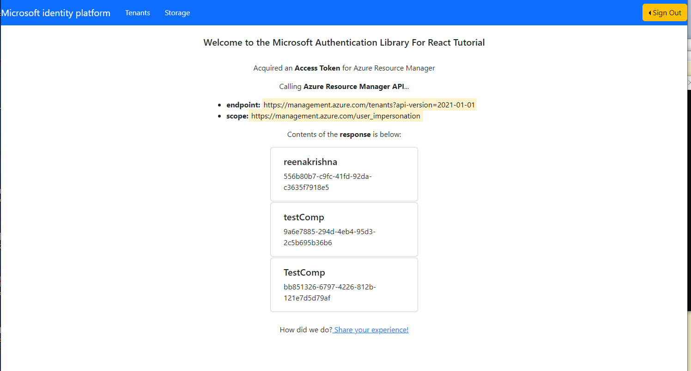
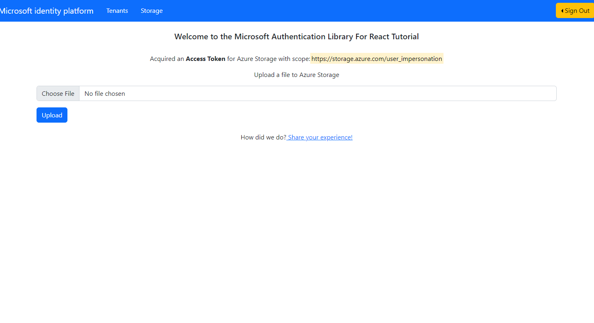
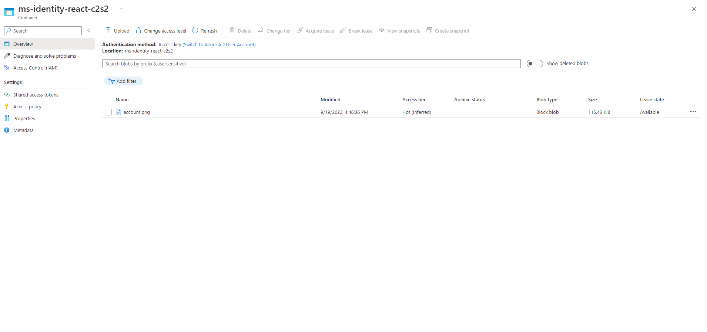

# React single-page application using MSAL React to sign-in users and call Azure REST API and Azure Storage

* [Overview](#overview)
* [Scenario](#scenario)
* [Contents](#contents)
* [Prerequisites](#prerequisites)
* [Setup the sample](#setup-the-sample)
* [Explore the sample](#explore-the-sample)
* [Troubleshooting](#troubleshooting)
* [About the code](#about-the-code)
* [Next Steps](#next-steps)
* [Contributing](#contributing)
* [Learn More](#learn-more)

## Overview

This sample demonstrates a React single-page application (SPA) that signs-in users with Azure AD and calls the [Azure Resource Manager API](https://docs.microsoft.com/rest/api/resources) and [Azure Storage API](https://docs.microsoft.com/rest/api/storageservices/) using the [Microsoft Authentication Library for React](https://github.com/AzureAD/microsoft-authentication-library-for-js/tree/dev/lib/msal-react) (MSAL React).

Here you'll learn how to [sign-in](https://docs.microsoft.com/azure/active-directory/develop/scenario-spa-sign-in), [acquire a token](https://docs.microsoft.com/azure/active-directory/develop/scenario-spa-acquire-token) and [call a protected web API](https://docs.microsoft.com/azure/active-directory/develop/scenario-spa-call-api), as well as [Dynamic Scopes and Incremental Consent](https://docs.microsoft.com/azure/active-directory/develop/v2-permissions-and-consent), **working with multiple resources** and **securing your routes** and more.

> :information_source: See the community call: [Deep dive on using MSAL.js to integrate React single-page applications with Azure Active Directory](https://www.youtube.com/watch?v=7oPSL5wWeS0)

## Scenario

1. The client React SPA uses **MSAL React** to sign-in a user and obtain a JWT [access token](https://docs.microsoft.com/azure/active-directory/develop/access-tokens) for Azure Resource Manager API and Azure Storage API from **Azure AD**.
1. The access token is used to authorize the user with [Azure SDK for JavaScript](https://github.com/Azure/azure-sdk-for-js) to call **Azure Resource Manager API** and **Azure Storage API**


## Contents

| File/folder                         | Description                                                                |
|-------------------------------------|----------------------------------------------------------------------------|
| `App.jsx`                           | Main application logic resides here.                                       |
| `authConfig.js`                     | Contains authentication configuration parameters.                          |
| `pages/Home.jsx`                    | Contains a table with ID token claims and description                      |
| `pages/Tenant.jsx`                  | Calls Azure Resource Manager with Azure SDK.                               |
| `pages/BlobStorage.jsx`             | Calls Azure Storage API with Azure SDK.                                    |
| `azureManagement.js`                | Initialize an instance of `SubscriptionClient` and  `BlobServiceClient`.   |


## Prerequisites

* [Node.js](https://nodejs.org/en/download/) must be installed to run this sample.
* [Visual Studio Code](https://code.visualstudio.com/download) is recommended for running and editing this sample.
* [VS Code Azure Tools](https://marketplace.visualstudio.com/items?itemName=ms-vscode.vscode-node-azure-pack) extension is recommended for interacting with Azure through VS Code Interface.
* A modern web browser. This sample uses **ES6** conventions and will not run on **Internet Explorer**.
* An **Azure AD** tenant. For more information, see: [How to get an Azure AD tenant](https://docs.microsoft.com/azure/active-directory/develop/test-setup-environment#get-a-test-tenant)
* A user account in your **Azure AD** tenant. This sample will not work with a **personal Microsoft account**. If you're signed in to the [Azure portal](https://portal.azure.com) with a personal Microsoft account and have not created a user account in your directory before, you will need to create one before proceeding.
* [An Azure Storage account](https://docs.microsoft.com/azure/storage/common/storage-account-create?tabs=azure-portal) To access Azure Storage you will  need an active storage account.

## Setup the sample

### Step 1: Clone or download this repository

From your shell or command line:

```console
git clone https://github.com/Azure-Samples/ms-identity-javascript-react-tutorial.git
```

or download and extract the repository *.zip* file.

> :warning: To avoid path length limitations on Windows, we recommend cloning into a directory near the root of your drive.

### Step 2: Install project dependencies

```console
    cd 2-Authorization-I\2-call-arm\SPA 
    npm install
```

### Step 3: Register the sample application(s) in your tenant

There is one project in this sample. To register it, you can:

- follow the steps below for manually register your apps
- or use PowerShell scripts that:
  - **automatically** creates the Azure AD applications and related objects (passwords, permissions, dependencies) for you.
  - modify the projects' configuration files.

  <details>
   <summary>Expand this section if you want to use this automation:</summary>

    > :warning: If you have never used **Microsoft Graph PowerShell** before, we recommend you go through the [App Creation Scripts Guide](./AppCreationScripts/AppCreationScripts.md) once to ensure that your environment is prepared correctly for this step.
  
    1. On Windows, run PowerShell as **Administrator** and navigate to the root of the cloned directory
    1. In PowerShell run:

       ```PowerShell
       Set-ExecutionPolicy -ExecutionPolicy RemoteSigned -Scope Process -Force
       ```

    1. Run the script to create your Azure AD application and configure the code of the sample application accordingly.
    1. For interactive process -in PowerShell, run:

       ```PowerShell
       cd .\AppCreationScripts\
       .\Configure.ps1 -TenantId "[Optional] - your tenant id" -AzureEnvironmentName "[Optional] - Azure environment, defaults to 'Global'"
       ```

    > Other ways of running the scripts are described in [App Creation Scripts guide](./AppCreationScripts/AppCreationScripts.md). The scripts also provide a guide to automated application registration, configuration and removal which can help in your CI/CD scenarios.

  </details>

#### Choose the Azure AD tenant where you want to create your applications

To manually register the apps, as a first step you'll need to:

1. Sign in to the [Azure portal](https://portal.azure.com).
1. If your account is present in more than one Azure AD tenant, select your profile at the top right corner in the menu on top of the page, and then **switch directory** to change your portal session to the desired Azure AD tenant.

#### Register the spa app (ms-identity-react-c2s2)

1. Navigate to the [Azure portal](https://portal.azure.com) and select the **Azure Active Directory** service.
1. Select the **App Registrations** blade on the left, then select **New registration**.
1. In the **Register an application page** that appears, enter your application's registration information:
    1. In the **Name** section, enter a meaningful application name that will be displayed to users of the app, for example `ms-identity-react-c2s2`.
    1. Under **Supported account types**, select **Accounts in this organizational directory only**
    1. Select **Register** to create the application.
1. In the **Overview** blade, find and note the **Application (client) ID**. You use this value in your app's configuration file(s) later in your code.
1. In the app's registration screen, select the **Authentication** blade to the left.
1. If you don't have a platform added, select **Add a platform** and select the **Single-page application** option.
    1. In the **Redirect URI** section enter the following redirect URIs:
        1. `http://localhost:3000/`
        1. `http://localhost:3000/redirect`
    1. Click **Save** to save your changes.
1. Since this app signs-in users, we will now proceed to select **delegated permissions**, which is is required by apps signing-in users.
   1. In the app's registration screen, select the **API permissions** blade in the left to open the page where we add access to the APIs that your application needs:
   1. Select the **Add a permission** button and then:
   1. Ensure that the **Microsoft APIs** tab is selected.
   1. In the list of APIs, select the API `Windows Azure Service Management API`.
      * Since this app signs-in users, we will now proceed to select **delegated permissions**, which is is requested by apps when signing-in users.
           1. In the **Delegated permissions** section, select **user_impersonation** in the list. Use the search box if necessary.
   1. Select the **Add permissions** button at the bottom.
   1. Select the **Add a permission** button and then:
   1. Ensure that the **Microsoft APIs** tab is selected.
   1. In the list of APIs, select the API `Azure Storage`.
      * Since this app signs-in users, we will now proceed to select **delegated permissions**, which is is requested by apps when signing-in users.
           1. In the **Delegated permissions** section, select **user_impersonation** in the list. Use the search box if necessary.
   1. Select the **Add permissions** button at the bottom.

##### Configure Optional Claims

1. Still on the same app registration, select the **Token configuration** blade to the left.
1. Select **Add optional claim**:
    1. Select **optional claim type**, then choose **ID**.
    1. Select the optional claim **acct**. 
    > Provides user's account status in tenant. If the user is a **member** of the tenant, the value is 0. If they're a **guest**, the value is 1.
    1. Select **Add** to save your changes


##### Assign Azure role-based access control (Azure RBAC)

1. Ensure that an [Azure Storage Account](https://docs.microsoft.com/azure/storage/common/storage-account-create?tabs=azure-portal) was created. If not, please create one.
1. Assign the role `Storage Blob Data Contributor` to your user or group to have read and write access to your blob storage. Please see [Assign Azure roles using the Azure portal](https://docs.microsoft.com/azure/role-based-access-control/role-assignments-portal?tabs=current).

##### Configure Cross-Origin Resource Sharing (CORS) support for your Azure Storage

1. Navigate to your Azure Storage Account.
1. Select the **Resource sharing (CORS)** blade on the left. Make sure that **Blob service** is selected.
1. In **Allowed origins** add the domain name `http://localhost:3000` and make sure there is no trailing slash.
1. In **Allowed methods** select all options.
1. In **Allowed headers** add `*`.
1. In **Exposed headers** add `*`.
1. Select **Save**.

##### Configure the spa app (ms-identity-react-c2s2) to use your app registration

Open the project in your IDE (like Visual Studio or Visual Studio Code) to configure the code.

> In the steps below, "ClientID" is the same as "Application ID" or "AppId".

1. Open the `SPA\src\authConfig.js` file.
1. Find the key `Enter_the_Application_Id_Here` and replace the existing value with the application ID (clientId) of `ms-identity-react-c2s2` app copied from the Azure portal.
1. Find the key `Enter_the_Tenant_Info_Here` and replace the existing value with your Azure AD tenant/directory ID.
1. find the key `Enter_Storage_Account_Name` and replace the existing value with your storage account name.

### Step 4: Running the sample

From your shell or command line, execute the following commands:

```console
    cd 2-Authorization-I\2-call-arm\SPA
    npm start
```

## Explore the sample

1. Open your browser and navigate to `http://localhost:3000`.
1. Select the **Sign In** button on the top right corner.
1. Select the **Tenants** button on the navigation bar. This will make a call to the Azure Resource Manager API.

1. Select the **Storage** button on the navigation bar. After that use the form upload a file to Azure Storage.

1. Navigate back to  **Azure Portal** and check the uploaded file under your storage account under the `ms-identity-react-c2s2` container.


> :information_source: Did the sample not work for you as expected? Then please reach out to us using the [GitHub Issues](../../../../issues) page.

## We'd love your feedback!

Were we successful in addressing your learning objective? Consider taking a moment to [share your experience with us](https://forms.office.com/Pages/ResponsePage.aspx?id=v4j5cvGGr0GRqy180BHbR73pcsbpbxNJuZCMKN0lURpUMlRHSkc5U1NLUkxFNEtVN0dEOTFNQkdTWiQlQCN0PWcu).

## Troubleshooting

<details>
 <summary>Expand for troubleshooting info</summary>

> Use [Stack Overflow](http://stackoverflow.com/questions/tagged/msal) to get support from the community.
Ask your questions on Stack Overflow first and browse existing issues to see if someone has asked your question before.
Make sure that your questions or comments are tagged with [`azure-active-directory` `react` `ms-identity` `adal` `msal`].

If you find a bug in the sample, raise the issue on [GitHub Issues](../../../../issues).
</details>

## About the code

### Protected resources and scopes

In order to access a protected resource on behalf of a signed-in user, the app needs to present a valid **Access Token** to that resource owner (in this case, Azure Resource Manager API and Azure Storage API). **Access Token** requests in **MSAL** are meant to be *per-resource-per-scope(s)*. This means that an **Access Token** requested for resource **A** with scope `scp1`:

* cannot be used for accessing resource **A** with scope `scp2`, and,
* cannot be used for accessing resource **B** of any scope.

The intended recipient of an **Access Token** is represented by the `aud` claim (in this case, it should be the Microsoft  Azure Resource Manager API and Azure Storage API's App ID); in case the value for the `aud` claim does not mach the resource **APP ID URI**, the token will be considered invalid by the API. Likewise, the permissions that an **Access Token** grants are provided in the `scp` claim. See [Access Token claims](https://docs.microsoft.com/azure/active-directory/develop/access-tokens#payload-claims) for more information.

### Working with multiple resources

When you have to access multiple resources, initiate a separate token request for each:

 ```javascript
     // "User.Read" stands as shorthand for "graph.microsoft.com/User.Read"
     const graphToken = await msalInstance.acquireTokenSilent({
          scopes: [ "" ]
     });
     const customApiToken = await msalInstance.acquireTokenSilent({
          scopes: [ "api://<myCustomApiClientId>/My.Scope" ]
     });
 ```

Bear in mind that you *can* request multiple scopes for the same resource (e.g. `User.Read`, `User.Write` and `Calendar.Read` for **MS Graph API**).

 ```javascript
     const graphToken = await msalInstance.acquireTokenSilent({
          scopes: [ "User.Read", "User.Write", "Calendar.Read"] // all MS Graph API scopes
     });
 ```

In case you *erroneously* pass multiple resources in your token request, Azure AD will throw an exception, and your request will fail.

```javascript
     // your request will fail for both resources
     const myToken = await msalInstance.acquireTokenSilent({
          scopes: [ "https://management.azure.com/user_impersonation", "api://<myCustomApiClientId>/My.Scope" ]
     });
 ```

### Acquire a Token

**MSAL.js** exposes 3 APIs for acquiring a token: `acquireTokenPopup()`, `acquireTokenRedirect()` and `acquireTokenSilent()`. MSAL React uses these APIs underneath, while offering developers higher level hooks and templates to simplify the token acquisition process. This is illustrated in [Tenant.jsx](./SPA/src/pages/Tenant.jsx).

```javascript
export const Tenant = () => {
    const { instance } = useMsal();
    const [tenantInfo, setTenantInfo] = useState(null);
    const account = instance.getActiveAccount();
    const request = {
        scopes: ["https://management.azure.com/user_impersonation"],
        account: account,
    };

    const { login, result, error } = useMsalAuthentication(InteractionType.Popup, request);

    useEffect(() => {
        if (!!tenantInfo) {
            return;
        }

        if (!!error) {
            // in case popup is blocked, use redirect instead
            if (error.errorCode === 'popup_window_error' || error.errorCode === 'empty_window_error') {
                login(InteractionType.Redirect, request);
            }

            console.log(error);
            return;
        }

        const fetchData = async (accessToken) => {
            const client = await getSubscriptionClient(accessToken);
            const resArray = [];
            for await (let item of client.tenants.list()) {
                resArray.push(item);
            }
            setTenantInfo(resArray);
        };
        if (result) {
            fetchData(result.accessToken).catch((error) => {
                console.log(error);
            });
        }
    }, [tenantInfo, result, error, login]);

    if (error) {
        return <div>Error: {error.message}</div>;
    }
    return <>{tenantInfo ? <TenantData response={result} tenantInfo={tenantInfo} /> : null}</>;
};
```

> :information_source: Please see the documentation on [acquiring an access token](https://github.com/AzureAD/microsoft-authentication-library-for-js/blob/dev/lib/msal-browser/docs/acquire-token.md) to learn more about various methods available in **MSAL.js** to acquire tokens. For MSAL React in particular, see the [useIsAuthenticated hook](https://github.com/AzureAD/microsoft-authentication-library-for-js/blob/dev/lib/msal-react/docs/hooks.md#useisauthenticated-hook) to learn more about `useMsalAuthentication` hook to acquire tokens.

### Calling the Microsoft Azure REST API and Azure Storage

[Azure SDK for JavaScript](https://github.com/Azure/azure-sdk-for-js) contains libraries for the breadth of Azure services. Management libraries are packages that you would use to provision and manage Azure resources. Client libraries are packages that you would use to consume these resources and interact with them. While the SDK has a default authentication provider that can be used in basic scenarios, it can also be extended to use with a pre-fetched access token. To do so, we will initialize the `SubscriptionClient` object and the `BlobServiceClient` object, which both contain a [StaticTokenCredential](https://github.com/Azure/azure-sdk-for-js/blob/@azure/identity_2.1.0/sdk/identity/identity/samples/AzureIdentityExamples.md#authenticating-with-a-pre-fetched-access-token) object of a class that implements the `TokenCredential` abstraction. It takes a pre-fetched access token in its constructor as an AccessToken and returns that from its implementation of `getToken()`. This is illustrated in [azureManagement.js](./SPA/src/azureManagement.js).

```javascript
/**
 * Returns a subscription client object with the provided token acquisition options
 */
export const getSubscriptionClient = async (accessToken) => {
      const credential = new StaticTokenCredential({
          token: accessToken,
          expiresOnTimestamp: accessToken.exp
      });

    const client = new SubscriptionClient(credential);
    return client;
};

/**
 * Returns a blob service client object with the provided token acquisition options
 */
export const getBlobServiceClient = async (accessToken) => {

    const credential = new StaticTokenCredential({
        token: accessToken,
        expiresOnTimestamp: accessToken.exp,
    });

    const client = new BlobServiceClient(`https://${storageInformation.accountName}.blob.core.windows.net`, credential);
    return client;
};

```

**StaticTokenCredential** needs to implement the `TokenCredential` interface, which can be done as shown below:

```javascript
class StaticTokenCredential {
  constructor(accessToken) {
    this.accessToken = accessToken; 
  }

  async getToken() {
    return this.accessToken;
  }

}
```

See [azureManagement.js](./SPA/src/azureManagement.js). The Subscription client can be used in your components as shown below. This is illustrated in [Tenant.jsx](./SPA/src/pages/Tenant.jsx).

```javascript
 useEffect(() => {
        if (!!tenantInfo) {
            return;
        }

        if (!!error) {
            // in case popup is blocked, use redirect instead
            if (error.errorCode === 'popup_window_error' || error.errorCode === 'empty_window_error') {
                login(InteractionType.Redirect, request);
            }

            console.log(error);
            return;
        }

        const fetchData = async (accessToken) => {
            const client = await getSubscriptionClient();
            const resArray = [];
            for await (let item of client.tenants.list()) {
                resArray.push(item);
            }
            setTenantInfo(resArray);
        };
        if (result) {
            fetchData(result.accessToken).catch((error) => {
                console.log(error);
            });
        }
    }, [tenantInfo, result, error, login]);
```

The Azure `BlobServiceClient` can be used in the your component as shown in the [BlobStorage.jsx](./SPA/src/pages/BlobStorage.jsx) file:

```javascript
const handleSubmit = async (e) => {
        e.preventDefault();
        if (uploadedFile) {
            try {
                const client = await getBlobServiceClient(result.accessToken);
                const containerClient = client.getContainerClient(storageInformation.containerName);
                const hasContainer = await containerExist(client, storageInformation.containerName);
                if (hasContainer) {
                    const blockBlobClient = containerClient.getBlockBlobClient(uploadedFile.name);
                    blockBlobClient.uploadData(uploadedFile);
                } else {
                    const createContainerResponse = await containerClient.create();
                    const blockBlobClient = containerClient.getBlockBlobClient(uploadedFile.name);
                    blockBlobClient.uploadData(uploadedFile);
                    console.log('Container was created successfully', createContainerResponse.requestId);
                }
            } catch (error) {
                console.log(error);
            }
        }
    };
```

## Next Steps

Learn how to:

* [Use MSAL React to authorize users to call a protected web API on Azure Active Directory](https://github.com/Azure-Samples/ms-identity-javascript-react-tutorial/tree/main/3-Authorization-II/1-call-api)
* [Deploy your React Application to Azure Cloud and use Azure services to manage your operations](https://github.com/Azure-Samples/ms-identity-javascript-react-tutorial/tree/main/4-Deployment/1-deploy-storage)

## Contributing

If you'd like to contribute to this sample, see [CONTRIBUTING.MD](/CONTRIBUTING.md).

This project has adopted the [Microsoft Open Source Code of Conduct](https://opensource.microsoft.com/codeofconduct/). For more information, see the [Code of Conduct FAQ](https://opensource.microsoft.com/codeofconduct/faq/) or contact [opencode@microsoft.com](mailto:opencode@microsoft.com) with any additional questions or comments.

## Learn More

* [Microsoft identity platform (Azure Active Directory for developers)](https://docs.microsoft.com/azure/active-directory/develop/)
* [Overview of Microsoft Authentication Library (MSAL)](https://docs.microsoft.com/azure/active-directory/develop/msal-overview)
* [Register an application with the Microsoft identity platform](https://docs.microsoft.com/azure/active-directory/develop/quickstart-register-app)
* [Configure a client application to access web APIs](https://docs.microsoft.com/azure/active-directory/develop/quickstart-configure-app-access-web-apis)
* [Understanding Azure AD application consent experiences](https://docs.microsoft.com/azure/active-directory/develop/application-consent-experience)
* [Understand user and admin consent](https://docs.microsoft.com/azure/active-directory/develop/howto-convert-app-to-be-multi-tenant#understand-user-and-admin-consent)
* [Application and service principal objects in Azure Active Directory](https://docs.microsoft.com/azure/active-directory/develop/app-objects-and-service-principals)
* [Authentication Scenarios for Azure AD](https://docs.microsoft.com/azure/active-directory/develop/authentication-flows-app-scenarios)
* [Building Zero Trust ready apps](https://aka.ms/ztdevsession)
* [National Clouds](https://docs.microsoft.com/azure/active-directory/develop/authentication-national-cloud#app-registration-endpoints)
* [Azure AD code samples](https://docs.microsoft.com/azure/active-directory/develop/sample-v2-code)
* [Initialize client applications using MSAL.js](https://docs.microsoft.com/azure/active-directory/develop/msal-js-initializing-client-applications)
* [Single sign-on with MSAL.js](https://docs.microsoft.com/azure/active-directory/develop/msal-js-sso)
* [Handle MSAL.js exceptions and errors](https://docs.microsoft.com/azure/active-directory/develop/msal-handling-exceptions?tabs=javascript)
* [Logging in MSAL.js applications](https://docs.microsoft.com/azure/active-directory/develop/msal-logging?tabs=javascript)
* [Pass custom state in authentication requests using MSAL.js](https://docs.microsoft.com/azure/active-directory/develop/msal-js-pass-custom-state-authentication-request)
* [Prompt behavior in MSAL.js interactive requests](https://docs.microsoft.com/azure/active-directory/develop/msal-js-prompt-behavior)
* [Use MSAL.js to work with Azure AD B2C](https://docs.microsoft.com/azure/active-directory/develop/msal-b2c-overview)
