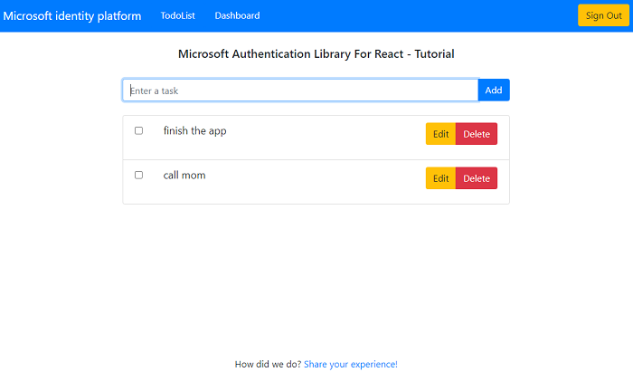

# A React single-page application using MSAL React to authorize users for calling a protected web API on Microsoft identity platform

 1. [Overview](#overview)
 1. [Scenario](#scenario)
 1. [Contents](#contents)
 1. [Setup](#setup)
 1. [Registration](#registration)
 1. [Running the sample](#running-the-sample)
 1. [Explore the sample](#explore-the-sample)
 1. [About the code](#about-the-code)
 1. [More information](#more-information)
 1. [Community Help and Support](#community-help-and-support)
 1. [Contributing](#contributing)

## Overview

This sample demonstrates a React single-page application (SPA) calling a protected Node.js web API using the [Microsoft Authentication Library for React](https://github.com/AzureAD/microsoft-authentication-library-for-js/tree/dev/lib/msal-react) (MSAL React). The Node.js web API itself is protected using the [passport-azure-ad](https://github.com/AzureAD/passport-azure-ad) plug-in for [Passport.js](http://www.passportjs.org/)

Here you'll learn how to [register a protected web API](https://docs.microsoft.com/azure/active-directory/develop/scenario-protected-web-api-app-registration), [accept authorized calls](https://docs.microsoft.com/azure/active-directory/develop/scenario-protected-web-api-verification-scope-app-roles) and [validate access tokens](https://docs.microsoft.com/azure/active-directory/develop/access-tokens#validating-tokens).

## Scenario

1. The client React SPA uses **MSAL React** to sign-in and obtain a JWT access token from **Azure AD**.
1. The access token is used as a bearer token to authorize the user to call the Node.js web API protected by **Azure AD**.
1. The protected web API responds with the signed-in user's todolist.


## Contents

| File/folder         | Description                                         |
|---------------------|-----------------------------------------------------|
| `SPA/App.jsx`       | Main application logic resides here.                |
| `SPA/fetch.jsx`     | Provides helper methods for making fetch calls.     |
| `SPA/authConfig.js` | Contains authentication parameters for SPA project. |
| `API/config.js`     | Contains authentication parameters for API project. |
| `API/app.js`        | Main application logic of custom web API.             |
| `API/auth/permissionUtils.js` | Contains helper methods for ensuring client permissions. |

## Setup

- Setup the service app:

```console
    cd ms-identity-javascript-react-tutorial
    cd 3-Authorization-II/1-call-api
    cd API
    npm install
```

- Setup the client app:

```console
    cd ..
    cd SPA
    npm install
```

### Registration

There are two projects in this sample. Each needs to be separately registered in your Azure AD tenant. To register these projects, you can:

- follow the steps below for manually register your apps
- or use PowerShell scripts that:
  - **automatically** creates the Azure AD applications and related objects (passwords, permissions, dependencies) for you.
  - modify the projects' configuration files.

<details>
  <summary>Expand this section if you want to use this automation:</summary>

> :warning: If you have never used **Microsoft Graph Powershell SDK** before, we recommend you go through the [App Creation Scripts](./AppCreationScripts/AppCreationScripts.md) once to ensure that your environment is prepared correctly for this step.

1. On Windows, run PowerShell as **Administrator** and navigate to the root of the cloned directory
1. If you have never used Azure AD Powershell before, we recommend you go through the [App Creation Scripts](./AppCreationScripts/AppCreationScripts.md) once to ensure that your environment is prepared correctly for this step.
1. In PowerShell run:

   ```PowerShell
   Set-ExecutionPolicy -ExecutionPolicy RemoteSigned -Scope Process -Force
   ```

1. Run the script to create your Azure AD application and configure the code of the sample application accordingly.
1. In PowerShell run:

   ```PowerShell
   cd .\AppCreationScripts\
   .\Configure.ps1
   ```

   > Other ways of running the scripts are described in [App Creation Scripts](./AppCreationScripts/AppCreationScripts.md)
   > The scripts also provide a guide to automated application registration, configuration and removal which can help in your CI/CD scenarios.

</details>

### Choose the Azure AD tenant where you want to create your applications

As a first step you'll need to:

1. Sign in to the [Azure portal](https://portal.azure.com).
1. If your account is present in more than one Azure AD tenant, select your profile at the top right corner in the menu on top of the page, and then **switch directory** to change your portal session to the desired Azure AD tenant.

### Register the service app (msal-node-api)

1. Navigate to the [Azure portal](https://portal.azure.com) and select the **Azure AD** service.
1. Select the **App Registrations** blade on the left, then select **New registration**.
1. In the **Register an application page** that appears, enter your application's registration information:
   - In the **Name** section, enter a meaningful application name that will be displayed to users of the app, for example `msal-node-api`.
   - Under **Supported account types**, select **Accounts in this organizational directory only**.
1. Select **Register** to create the application.
1. In the app's registration screen, find and note the **Application (client) ID**. You use this value in your app's configuration file(s) later in your code.
1. Select **Save** to save your changes.
1. In the app's registration screen, select the **Expose an API** blade to the left to open the page where you can declare the parameters to expose this app as an API for which client applications can obtain [access tokens](https://docs.microsoft.com/azure/active-directory/develop/access-tokens) for.
The first thing that we need to do is to declare the unique [resource](https://docs.microsoft.com/azure/active-directory/develop/v2-oauth2-auth-code-flow) URI that the clients will be using to obtain access tokens for this Api. To declare an resource URI, follow the following steps:
   - Select `Set` next to the **Application ID URI** to generate a URI that is unique for this app.
   - For this sample, accept the proposed Application ID URI (`api://{clientId}`) by selecting **Save**.
1. All APIs have to publish a minimum of two [scopes](https://docs.microsoft.com/azure/active-directory/develop/v2-oauth2-auth-code-flow#request-an-authorization-code), also called [delegated permissions](https://docs.microsoft.com/azure/active-directory/develop/v2-permissions-and-consent#permission-types), for the client's to obtain an access token successfully. To publish a scope, follow these steps:
   - Select **Add a scope** button open the **Add a scope** screen and Enter the values as indicated below:
        - For **Scope name**, enter `Todolist.Read`.
        - Select **Admins and users** options for **Who can consent?**.
        - For **Admin consent display name** type `Access msal-node-api`.
        - For **Admin consent description** type `Allows the app to access msal-node-api to read todo list.`
        - For **User consent display name** type `Access msal-node-api`.
        - For **User consent description** type `Allows the app to access msal-node-api to read todo list.`
        - Keep **State** as **Enabled**.
        - Select the **Add scope** button on the bottom to save this scope.
   - Repeat the steps above for publishing another scope named `Todolist.ReadWrite`.
1. APIs should also publish scopes that can only be consumed by applications (not users), also known as [application permissions](https://docs.microsoft.com/azure/active-directory/develop/permissions-consent-overview#types-of-permissions). To do so, select the **App roles** blade to the left.
   - Select **Create app role**:
        - For **Display name**, enter a suitable name, for instance **Todolist.Read.All**.
        - For **Allowed member types**, choose **Application**.
        - For **Value**, enter **Todolist.Read.All**.
        - For **Description**, enter **Application can only read ToDo list**.
        - Select **Apply** to save your changes.
   - Repeat the steps above for permission **Todolist.ReadWrite.All**
1. (Optional) Still on the same app registration, select the **Token configuration** blade to the left.
    - Select **Add optional claim**:
        - Select optional claim type, then choose `Access Token`.
        - Select optional claim name, then choose `idtyp`.
1. Select the `Manifest` blade on the left.
   - Set `accessTokenAcceptedVersion` property to **2**.
   - Click on **Save**.

> :information_source: Be aware of [the principle of least privilege](https://docs.microsoft.com/azure/active-directory/develop/secure-least-privileged-access) whenever you are publishing permissions for a web API.

> :information_source: See how to use **application permissions** in a client app here: [Node.js console application acquiring tokens using OAuth 2.0 Client Credentials Grant](https://github.com/Azure-Samples/ms-identity-javascript-nodejs-console).

#### Configure the service app (msal-node-api) to use your app registration

Open the project in your IDE (like Visual Studio or Visual Studio Code) to configure the code.

> In the steps below, "ClientID" is the same as "Application ID" or "AppId".

1. Open the `API\authConfig.js` file.
1. Find the key `clientID` and replace the existing value with the application ID (clientId) of `msal-node-api` app copied from the Azure portal.
1. Find the key `tenantID` and replace the existing value with your Azure AD tenant ID.

### Update the client app registration (msal-react-spa)

1. Navigate to the [Azure portal](https://portal.azure.com) and select the **Azure AD** service.
1. Select the **App Registrations** blade on the left, then find and select the application that you have registered in the previous tutorial (`msal-react-spa`).
1. In the app's registration screen, select the **API permissions** blade in the left to open the page where we add access to the APIs that your application needs.
   - Select the **Add a permission** button and then,
     - Ensure that the **My APIs** tab is selected.
     - In the list of APIs, select the API `msal-node-api`.
     - In the **Delegated permissions** section, select the **Todolist.Read** and **Todolist.ReadWrite** in the list. Use the search box if necessary.
     - Select the **Add permissions** button at the bottom.

#### Configure the client app (msal-react-spa) to use your app registration

Open the project in your IDE (like Visual Studio or Visual Studio Code) to configure the code.

> In the steps below, "ClientID" is the same as "Application ID" or "AppId".

1. Open the `SPA\src\authConfig.js` file.
1. Find the key `Enter_the_Application_Id_Here` and replace the existing value with the application ID (clientId) of `msal-react-spa` app copied from the Azure portal.
1. Find the key `Enter_the_Tenant_Info_Here` and replace the existing value with your Azure AD tenant ID.
1. Find the key `Enter_the_Web_Api_Application_Id_Here` and replace the existing value with APP ID URI of the web API project that you've registered earlier, e.g. `api://<msal-node-api-client-id>/Todolist.Read`

## Running the sample

- Run the service app:

```console
    cd 3-Authorization-II/1-call-api/API
    npm start
```

- In a separate terminal, run the client app:

```console
    cd 3-Authorization-II/1-call-api/SPA
    npm start
```

## Explore the sample

1. Open your browser and navigate to `http://localhost:3000`.
1. Select the **Sign In** button on the top right corner. Choose either **Popup** or **Redirect** flows.
1. Select the **Todolist** button on the navigation bar. This will make a call to the Todolist web API.



> :information_source: Did the sample not work for you as expected? Then please reach out to us using the [GitHub Issues](../../../issues) page.

## We'd love your feedback!

Were we successful in addressing your learning objective? Consider taking a moment to [share your experience with us](https://forms.office.com/Pages/ResponsePage.aspx?id=v4j5cvGGr0GRqy180BHbR73pcsbpbxNJuZCMKN0lURpUMlRHSkc5U1NLUkxFNEtVN0dEOTFNQkdTWiQlQCN0PWcu).

## About the code

### CORS settings

For the purpose of the sample, **cross-origin resource sharing** (CORS) is enabled for **all** domains and methods, using the Express.js cors middleware. This is insecure and only used for demonstration purposes here. In production, you should modify this as to allow only the domains that you designate. If your web API is going to be hosted on **Azure App Service**, we recommend configuring CORS on the App Service itself.

```javascript
const express = require('express');
const cors = require('cors');

const app = express();

app.use(cors());
```

### Access token validation

On the web API side, [passport-azure-ad](https://github.com/AzureAD/passport-azure-ad) verifies the incoming access token's signature and validates it's payload against the `issuer` and `audience` claims (defined in `BearerStrategy` constructor) using the `passport.authenticate()` API. In the `BearerStrategy` callback, you can add further validation steps as shown below:

```javascript
const express = require('express');
const passport = require('passport');
const passportAzureAd = require('passport-azure-ad');

const app = express();

const bearerStrategy = new passportAzureAd.BearerStrategy({
    identityMetadata: `https://${authConfig.metadata.authority}/${authConfig.credentials.tenantID}/${authConfig.metadata.version}/${authConfig.metadata.discovery}`,
    issuer: `https://${authConfig.metadata.authority}/${authConfig.credentials.tenantID}/${authConfig.metadata.version}`,
    clientID: authConfig.credentials.clientID,
    audience: authConfig.credentials.clientID, // audience is this application
    validateIssuer: authConfig.settings.validateIssuer,
    passReqToCallback: authConfig.settings.passReqToCallback,
    loggingLevel: authConfig.settings.loggingLevel,
    loggingNoPII: authConfig.settings.loggingNoPII,
}, (req, token, done) => {
    /**
     * Below you can do extended token validation and check for additional claims, such as:
     * - check if the caller's tenant is in the allowed tenants list via the 'tid' claim (for multi-tenant applications)
     * - check if the caller's account is homed or guest via the 'acct' optional claim
     * - check if the caller belongs to right roles or groups via the 'roles' or 'groups' claim, respectively
     *
     * Bear in mind that you can do any of the above checks within the individual routes and/or controllers as well.
     * For more information, visit: https://docs.microsoft.com/azure/active-directory/develop/access-tokens#validate-the-user-has-permission-to-access-this-data
     */


    /**
     * Below we verify if the caller's ID is in the list of allowed client apps.
     * To do so, we use "azp" claim in the access token. Uncomment the lines below to enable this check.
     */

    const allowedClientApps = [
        // Enter the Application ID (client ID) of the client application(s) you want to allow to access this API
    ]
    
    if (!allowedClientApps.includes(token.azp)) {
        return done(new Error('Unauthorized'), {}, "Client not allowed");
    }

    /**
     * Below we verify if there's at least one allowed permission in the access token
     * to be considered valid.
     */
    if (!requiredScopesOrAppPermissions(token, [
        ...authConfig.protectedRoutes.todolist.delegatedPermissions.read,
        ...authConfig.protectedRoutes.todolist.delegatedPermissions.write,
        ...authConfig.protectedRoutes.todolist.applicationPermissions.read,
        ...authConfig.protectedRoutes.todolist.applicationPermissions.write,
    ])) {
        return done(new Error('Unauthorized'), {}, "No required delegated or app permission found");
    }

    /**
     * If needed, pass down additional user info to route using the second argument below.
     * This information will be available in the req.user object.
     */
    return done(null, {}, token);
});

app.use(passport.initialize());

passport.use(bearerStrategy);

// exposed API endpoint
app.use('/api',
    passport.authenticate('oauth-bearer', {
        session: false,
    }),
    router
);
```

For validation and debugging purposes, developers can decode **JWT**s (*JSON Web Tokens*) using [jwt.ms](https://jwt.ms).

### Verifying permissions

Access tokens that have neither the **scp** (for delegated permissions) nor **roles** (for application permissions) claim should not be accepted. In the sample, this is illustrated via the `requiredScopeOrAppPermission` method in [permissionUtils.js](./API/auth/permissionUtils.js)

```JavaScript
const requiredScopesOrAppPermissions = (accessTokenPayload, listOfPermissions) => {
    /**
     * Access tokens that have neither the 'scp' (for delegated permissions) nor
     * 'roles' (for application permissions) claim are not to be honored.
     *
     * An access token issued by Azure AD will have at least one of the two claims. Access tokens
     * issued to a user will have the 'scp' claim. Access tokens issued to an application will have
     * the roles claim. Access tokens that contain both claims are issued only to users, where the scp
     * claim designates the delegated permissions, while the roles claim designates the user's roles.
     */

    if (!accessTokenPayload.hasOwnProperty('scp') && !accessTokenPayload.hasOwnProperty('roles')) {
        return false;
    } else if (isAppOnlyToken(accessTokenPayload)) {
        return hasRequiredApplicationPermissions(accessTokenPayload, listOfPermissions);
    } else {
        return hasRequiredDelegatedPermissions(accessTokenPayload, listOfPermissions);
    }
}
```

### Access to data

Web API endpoints should be prepared to accept calls from both users and applications, and should have control structures in place to respond each accordingly. This is illustrated in the [todolist](./API/controllers/todolist.js) controller:

```JavaScript
exports.getTodo = (req, res, next) => {
    if (hasRequiredDelegatedPermissions(req.authInfo, authConfig.protectedRoutes.todolist.delegatedPermissions.read)) {
        try {
            /**
             * The 'oid' (object id) is the only claim that should be used to uniquely identify
             * a user in an Azure AD tenant. The token might have one or more of the following claim,
             * that might seem like a unique identifier, but is not and should not be used as such,
             * especially for systems which act as system of record (SOR):
             *
             * - upn (user principal name): might be unique amongst the active set of users in a tenant but
             * tend to get reassigned to new employees as employees leave the organization and
             * others take their place or might change to reflect a personal change like marriage.
             *
             * - email: might be unique amongst the active set of users in a tenant but tend to get
             * reassigned to new employees as employees leave the organization and others take their place.
             */
            const owner = req.authInfo['oid'];
            const id = req.params.id;

            const todo = db.get('todos')
                .filter({ owner: owner })
                .find({ id: id })
                .value();

            res.status(200).send(todo);
        } catch (error) {
            next(error);
        }
    } else if (hasRequiredApplicationPermissions(req.authInfo, authConfig.protectedRoutes.todolist.applicationPermissions.read)) {
        try {
            const id = req.params.id;

            const todo = db.get('todos')
                .find({ id: id })
                .value();

            res.status(200).send(todo);
        } catch (error) {
            next(error);
        }
    } else (
        next(new Error('User or application does not have the required permissions'))
    )
}
```

When granting access to data based on scopes, be sure to follow [the principle of least privilege](https://docs.microsoft.com/azure/active-directory/develop/secure-least-privileged-access).

## Next Tutorial

Continue with the next tutorial: [Deploy your apps to Azure](../../4-Deployment/1-deploy-storage/README.md).

## More information

- [Microsoft identity platform (Azure Active Directory for developers)](https://docs.microsoft.com/azure/active-directory/develop/)
- [Overview of Microsoft Authentication Library (MSAL)](https://docs.microsoft.com/azure/active-directory/develop/msal-overview)
- [Quickstart: Register an application with the Microsoft identity platform](https://docs.microsoft.com/azure/active-directory/develop/quickstart-register-app)
- [Quickstart: Configure a client application to access web APIs](https://docs.microsoft.com/azure/active-directory/develop/quickstart-configure-app-access-web-apis)
- [Initialize client applications using MSAL.js](https://docs.microsoft.com/azure/active-directory/develop/msal-js-initializing-client-applications)
- [Single sign-on with MSAL.js](https://docs.microsoft.com/azure/active-directory/develop/msal-js-sso)
- [Handle MSAL.js exceptions and errors](https://docs.microsoft.com/azure/active-directory/develop/msal-handling-exceptions?tabs=javascript)
- [Logging in MSAL.js applications](https://docs.microsoft.com/azure/active-directory/develop/msal-logging?tabs=javascript)
- [Pass custom state in authentication requests using MSAL.js](https://docs.microsoft.com/azure/active-directory/develop/msal-js-pass-custom-state-authentication-request)
- [Prompt behavior in MSAL.js interactive requests](https://docs.microsoft.com/azure/active-directory/develop/msal-js-prompt-behavior)

For more information about how OAuth 2.0 protocols work in this scenario and other scenarios, see [Authentication Scenarios for Azure AD](https://docs.microsoft.com/azure/active-directory/develop/authentication-flows-app-scenarios).

## Community Help and Support

Use [Stack Overflow](http://stackoverflow.com/questions/tagged/msal) to get support from the community.
Ask your questions on Stack Overflow first and browse existing issues to see if someone has asked your question before.
Make sure that your questions or comments are tagged with [`azure-active-directory` `azure-ad-b2c` `ms-identity` `adal` `msal`].

If you find a bug in the sample, raise the issue on [GitHub Issues](../../../issues).

To provide feedback on or suggest features for Azure Active Directory, visit [User Voice page](https://feedback.azure.com/forums/169401-azure-active-directory).

## Contributing

If you'd like to contribute to this sample, see [CONTRIBUTING.MD](/CONTRIBUTING.md).

This project has adopted the [Microsoft Open Source Code of Conduct](https://opensource.microsoft.com/codeofconduct/). For more information, see the [Code of Conduct FAQ](https://opensource.microsoft.com/codeofconduct/faq/) or contact [opencode@microsoft.com](mailto:opencode@microsoft.com) with any additional questions or comments.
