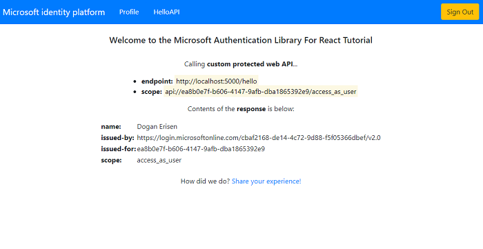

# React single-page application using MSAL React to authorize users for calling a Express.js web API on Azure Active Directory

* [Overview](#overview)
* [Scenario](#scenario)
* [Contents](#contents)
* [Prerequisites](#prerequisites)
* [Setup the sample](#setup-the-sample)
* [Explore the sample](#explore-the-sample)
* [Troubleshooting](#troubleshooting)
* [About the code](#about-the-code)
* [Next Steps](#next-steps)
* [Contributing](#contributing)
* [Learn More](#learn-more)

## Overview

This sample demonstrates a React single-page application (SPA) calling a protected Node.js web API using the [Microsoft Authentication Library for React](https://github.com/AzureAD/microsoft-authentication-library-for-js/tree/dev/lib/msal-react) (MSAL React). The Node.js web API itself is protected using the [passport-azure-ad](https://github.com/AzureAD/passport-azure-ad) plug-in for [Passport.js](http://www.passportjs.org/).

Here you'll learn how to [register a protected web API](https://docs.microsoft.com/azure/active-directory/develop/scenario-protected-web-api-app-registration), [accept authorized calls](https://docs.microsoft.com/azure/active-directory/develop/scenario-protected-web-api-verification-scope-app-roles) and [validate access tokens](https://docs.microsoft.com/azure/active-directory/develop/access-tokens#validating-tokens).

> :information_source: See the community call: [Implement authorization in your applications with the Microsoft identity platform](https://www.youtube.com/watch?v=LRoc-na27l0)

> :information_source: See the community call: [Deep dive on using MSAL.js to integrate React Single-page applications with Azure Active Directory](https://www.youtube.com/watch?v=7oPSL5wWeS0)

## Scenario

1. The client React SPA uses **MSAL React** to sign-in and obtain a JWT access token from **Azure AD**.
1. The access token is used as a bearer token to authorize the user to call the Node.js web API protected by **Azure AD**.
1. The protected web API responds with the signed-in user's todolist.


## Contents

| File/folder         | Description                                         |
|---------------------|-----------------------------------------------------|
| `SPA/App.jsx`       | Main application logic resides here.                |
| `SPA/hooks/useFetchWithMsal.jsx`     | Custom hook to make fetch calls with bearer tokens.     |
| `SPA/authConfig.js` | Contains authentication parameters for SPA project. |
| `API/config.js`     | Contains authentication parameters for API project. |
| `API/app.js`        | Main application logic of custom web API.             |
| `API/auth/permissionUtils.js` | Contains helper methods for ensuring client permissions. |

## Prerequisites

* [Node.js](https://nodejs.org/en/download/) must be installed to run this sample.
* [Visual Studio Code](https://code.visualstudio.com/download) is recommended for running and editing this sample.
* [VS Code Azure Tools](https://marketplace.visualstudio.com/items?itemName=ms-vscode.vscode-node-azure-pack) extension is recommended for interacting with Azure through VS Code Interface.
* A modern web browser. This sample uses **ES6** conventions and will not run on **Internet Explorer**.
* An **Azure AD** tenant. For more information, see: [How to get an Azure AD tenant](https://docs.microsoft.com/azure/active-directory/develop/test-setup-environment#get-a-test-tenant)
* A user account in your **Azure AD** tenant. This sample will not work with a **personal Microsoft account**. If you're signed in to the [Azure portal](https://portal.azure.com) with a personal Microsoft account and have not created a user account in your directory before, you will need to create one before proceeding.

## Setup the sample

### Step 1: Clone or download this repository

From your shell or command line:

```console
    git clone https://github.com/Azure-Samples/ms-identity-javascript-react-tutorial.git
```

or download and extract the repository *.zip* file.

> :warning: To avoid path length limitations on Windows, we recommend cloning into a directory near the root of your drive.

### Step 2: Install project dependencies

Install the dependencies for the service app:

```console
    cd ms-identity-javascript-react-tutorial
    cd 3-Authorization-II/1-call-api
    cd API
    npm install
```

Next, install the dependencies for the client app:

```console
    cd ..
    cd SPA
    npm install
```

### Step 3: Register the sample application(s) in your tenant

* follow the steps below for manually register your apps
* or use PowerShell scripts that:
  * **automatically** creates the Azure AD applications and related objects (passwords, permissions, dependencies) for you.
  * modify the projects' configuration files.

  <details>
   <summary>Expand this section if you want to use this automation:</summary>

    > :warning: If you have never used **Microsoft Graph PowerShell** before, we recommend you go through the [App Creation Scripts Guide](./AppCreationScripts/AppCreationScripts.md) once to ensure that your environment is prepared correctly for this step.
  
    1. On Windows, run PowerShell as **Administrator** and navigate to the root of the cloned directory
    1. In PowerShell run:

       ```PowerShell
       Set-ExecutionPolicy -ExecutionPolicy RemoteSigned -Scope Process -Force
       ```

    1. Run the script to create your Azure AD application and configure the code of the sample application accordingly.
    1. For interactive process -in PowerShell, run:

       ```PowerShell
       cd .\AppCreationScripts\
       .\Configure.ps1 -TenantId "[Optional] - your tenant id" -AzureEnvironmentName "[Optional] - Azure environment, defaults to 'Global'"
       ```

    > Other ways of running the scripts are described in [App Creation Scripts guide](./AppCreationScripts/AppCreationScripts.md). The scripts also provide a guide to automated application registration, configuration and removal which can help in your CI/CD scenarios.

  </details>

#### Choose the Azure AD tenant where you want to create your applications

To manually register the apps, as a first step you'll need to:

1. Sign in to the [Azure portal](https://portal.azure.com).
1. If your account is present in more than one Azure AD tenant, select your profile at the top right corner in the menu on top of the page, and then **switch directory** to change your portal session to the desired Azure AD tenant.

#### Register the service app (msal-node-api)

1. Navigate to the [Azure portal](https://portal.azure.com) and select the **Azure Active Directory** service.
1. Select the **App Registrations** blade on the left, then select **New registration**.
1. In the **Register an application page** that appears, enter your application's registration information:
    1. In the **Name** section, enter a meaningful application name that will be displayed to users of the app, for example `msal-node-api`.
    1. Under **Supported account types**, select **Accounts in this organizational directory only**
    1. Select **Register** to create the application.
1. In the **Overview** blade, find and note the **Application (client) ID**. You use this value in your app's configuration file(s) later in your code.
1. In the app's registration screen, select the **Expose an API** blade to the left to open the page where you can publish the permission as an API for which client applications can obtain [access tokens](https://aka.ms/access-tokens) for. The first thing that we need to do is to declare the unique [resource](https://docs.microsoft.com/azure/active-directory/develop/v2-oauth2-auth-code-flow) URI that the clients will be using to obtain access tokens for this API. To declare an resource URI(Application ID URI), follow the following steps:
    1. Select **Set** next to the **Application ID URI** to generate a URI that is unique for this app.
    1. For this sample, accept the proposed Application ID URI (`api://{clientId}`) by selecting **Save**. Read more about Application ID URI at [Validation differences by supported account types \(signInAudience\)](https://docs.microsoft.com/azure/active-directory/develop/supported-accounts-validation).

##### Publish Delegated Permissions

1. All APIs must publish a minimum of one [scope](https://docs.microsoft.com/azure/active-directory/develop/v2-oauth2-auth-code-flow#request-an-authorization-code), also called [Delegated Permission](https://docs.microsoft.com/azure/active-directory/develop/v2-permissions-and-consent#permission-types), for the client apps to obtain an access token for a *user* successfully. To publish a scope, follow these steps:
1. Select **Add a scope** button open the **Add a scope** screen and Enter the values as indicated below:
    1. For **Scope name**, use `Todolist.Read`.
    1. Select **Admins and users** options for **Who can consent?**.
    1. For **Admin consent display name** type in scopeName.
    1. For **Admin consent description** type in e.g. Allows the app to read the signed-in user's files..
    1. For **User consent display name** type in scopeName.
    1. For **User consent description** type in eg. Allows the app to read your files..
    1. Keep **State** as **Enabled**.
    1. Select the **Add scope** button on the bottom to save this scope.
    > Repeat the steps above for another scope named **Todolist.ReadWrite**
1. Select the **Manifest** blade on the left.
    1. Set `accessTokenAcceptedVersion` property to **2**.
    1. Select on **Save**.

> :information_source: Follow  [the principle of least privilege](https://docs.microsoft.com/azure/active-directory/develop/secure-least-privileged-access) whenever you are publishing permissions for a web API.

##### Publish Application Permissions

1. All APIs should publish a minimum of one [App role](https://docs.microsoft.com/azure/active-directory/develop/howto-add-app-roles-in-azure-ad-apps#assign-app-roles-to-applications), also called [Application Permission](https://docs.microsoft.com/azure/active-directory/develop/v2-permissions-and-consent#permission-types), for the client apps to obtain an access token as *themselves*, i.e. when they are not signing-in a user. **Application permissions** are the type of permissions that APIs should publish when they want to enable client applications to successfully authenticate as themselves and not need to sign-in users. To publish an application permission, follow these steps:
1. Still on the same app registration, select the **App roles** blade to the left.
1. Select **Create app role**:
    1. For **Display name**, enter a suitable name for your application permission, for instance **Todolist.Read.All**.
    1. For **Allowed member types**, choose **Application** to ensure other applications can be granted this permission.
    1. For **Value**, enter **Todolist.Read.All**.
    1. For **Description**, enter **Allow this application to read every users Todolist items**.
    1. Select **Apply** to save your changes.
    > Repeat the steps above for another app permission named **Todolist.ReadWrite.All**

##### Configure Optional Claims

1. Still on the same app registration, select the **Token configuration** blade to the left.
1. Select **Add optional claim**:
    1. Select **optional claim type**, then choose **Access**.
    1. Select the optional claim **idtyp**.
        > Indicates token type. This claim is the most accurate way for an API to determine if a token is an app token or or user token
    1. Select the optional claim **acct**.
        > Provides user's account status in tenant. If the user is a member of the tenant, the value is 0. If they're a guest, the value is 1.
    1. Select **Add** to save your changes.

##### Configure the service app (msal-node-api) to use your app registration

Open the project in your IDE (like Visual Studio or Visual Studio Code) to configure the code.

> In the steps below, "ClientID" is the same as "Application ID" or "AppId".

1. Open the `API\authConfig.js` file.
1. Find the string `Enter_the_Application_Id_Here` and replace the existing value with the application ID (clientId) of `msal-node-api` app copied from the Azure portal.
1. Find the string `Enter_the_Tenant_Info_Here` and replace the existing value with your Azure AD tenant/directory ID.

#### Register the client app (msal-react-spa)

1. Navigate to the [Azure portal](https://portal.azure.com) and select the **Azure Active Directory** service.
1. Select the **App Registrations** blade on the left, then select **New registration**.
1. In the **Register an application page** that appears, enter your application's registration information:
    1. In the **Name** section, enter a meaningful application name that will be displayed to users of the app, for example `msal-react-spa`.
    1. Under **Supported account types**, select **Accounts in this organizational directory only**
    1. Select **Register** to create the application.
1. In the **Overview** blade, find and note the **Application (client) ID**. You use this value in your app's configuration file(s) later in your code.
1. In the app's registration screen, select the **Authentication** blade to the left.
1. If you don't have a platform added, select **Add a platform** and select the **Single-page application** option.
    1. In the **Redirect URI** section enter the following redirect URIs:
        1. `http://localhost:3000`
        1. `http://localhost:3000/redirect`
    1. Click **Save** to save your changes.
1. Since this app signs-in users, we will now proceed to select **delegated permissions**, which is is required by apps signing-in users.
   1. In the app's registration screen, select the **API permissions** blade in the left to open the page where we add access to the APIs that your application needs:
   1. Select the **Add a permission** button and then,
   1. Ensure that the **My APIs** tab is selected.
   1. In the list of APIs, select the API `msal-node-api`.
        1. Since this app signs-in users, we will now proceed to select **delegated permissions**, which is is requested by apps when signing-in users.
            1. In the **Delegated permissions** section, select the **Todolist.Read**, **Todolist.ReadWrite** in the list. Use the search box if necessary.
   1. Select the **Add permissions** button at the bottom.

##### Configure the client app (msal-react-spa) to use your app registration

Open the project in your IDE (like Visual Studio or Visual Studio Code) to configure the code.

> In the steps below, "ClientID" is the same as "Application ID" or "AppId".

1. Open the `SPA\src\authConfig.js` file.
1. Find the string `Enter_the_Application_Id_Here` and replace the existing value with the application ID (clientId) of `msal-react-spa` app copied from the Azure portal.
1. Find the string `Enter_the_Tenant_Info_Here` and replace the existing value with your Azure AD tenant/directory ID.
1. Find the string `Enter_the_Web_Api_Application_Id_Here` and replace the existing value with the application ID (clientId) of `msal-node-api` app copied from the Azure portal.

### Step 4: Running the sample

From your shell or command line, run the following commands:

```console
    cd 3-Authorization-II/1-call-api/API
    npm start
```

In a seperate command line, run:

```console
    cd 3-Authorization-II/1-call-api/SPA
    npm start
```

## Explore the sample

1. Open your browser and navigate to `http://localhost:3000`.
1. Select the **Sign In** button on the top right corner. Choose either **Popup** or **Redirect** flows.
1. Select the **Todolist** button on the navigation bar. This will make a call to the Todolist web API.



> :information_source: Did the sample not work for you as expected? Then please reach out to us using the [GitHub Issues](../../../issues) page.

## We'd love your feedback

Were we successful in addressing your learning objective? Consider taking a moment to [share your experience with us](https://forms.office.com/Pages/ResponsePage.aspx?id=v4j5cvGGr0GRqy180BHbR73pcsbpbxNJuZCMKN0lURpUMlRHSkc5U1NLUkxFNEtVN0dEOTFNQkdTWiQlQCN0PWcu).

## Troubleshooting

Use [Stack Overflow](http://stackoverflow.com/questions/tagged/msal) to get support from the community. Ask your questions on Stack Overflow first and browse existing issues to see if someone has asked your question before. Make sure that your questions or comments are tagged with [`azure-active-directory` `react` `ms-identity` `adal` `msal`].

If you find a bug in the sample, raise the issue on [GitHub Issues](../../../../issues).

## About the code

### Calling the web API with access token

Using a custom hook [useFetchWithMsal](./SPA/src/hooks/useFetchWithMsal.jsx), SPA acquires an access token using MSAL React useMsalAuthentication hook and then makes a call to the web API (i.e. bearer token authorization). This is illustrated in [TodoList.jsx](./SPA/src/pages/TodoList.jsx):

```javascript
const TodoListContent = () => {
    const { error, execute } = useFetchWithMsal({
        scopes: protectedResources.apiTodoList.scopes.read,
    });

    const [todoListData, setTodoListData] = useState(null);

    useEffect(() => {
        if (!todoListData) {
            execute("GET", protectedResources.apiTodoList.endpoint).then((response) => {
                setTodoListData(response);
            });
        }
    }, [execute, todoListData])

    if (error) {
        return <div>Error: {error.message}</div>;
    }

    return <>{todoListData ? <ListView todoListData={todoListData} /> : null}</>;
};
```

### CORS settings

For the purpose of the sample, **cross-origin resource sharing** (CORS) is enabled for **all** domains and methods, using the Express.js cors middleware. This is insecure and only used for demonstration purposes here. In production, you should modify this as to allow only the domains that you designate. If your web API is going to be hosted on **Azure App Service**, we recommend configuring CORS on the App Service itself. This is illustrated in [app.js](./API/app.js):

```javascript
const express = require('express');
const cors = require('cors');

const app = express();

app.use(cors());
```

### Access token validation

On the web API side, [passport-azure-ad](https://github.com/AzureAD/passport-azure-ad) verifies the incoming access token's signature and validates it's payload against the `issuer` and `audience` claims (defined in `BearerStrategy` constructor) using the `passport.authenticate()` API. In the `BearerStrategy` callback, you can add further validation steps as shown below (see [app.js](./API/app.js)):

```javascript
const express = require('express');
const passport = require('passport');
const passportAzureAd = require('passport-azure-ad');

const app = express();

const bearerStrategy = new passportAzureAd.BearerStrategy({
    identityMetadata: `https://${authConfig.metadata.authority}/${authConfig.credentials.tenantID}/${authConfig.metadata.version}/${authConfig.metadata.discovery}`,
    issuer: `https://${authConfig.metadata.authority}/${authConfig.credentials.tenantID}/${authConfig.metadata.version}`,
    clientID: authConfig.credentials.clientID,
    audience: authConfig.credentials.clientID, // audience is this application
    validateIssuer: authConfig.settings.validateIssuer,
    passReqToCallback: authConfig.settings.passReqToCallback,
    loggingLevel: authConfig.settings.loggingLevel,
    loggingNoPII: authConfig.settings.loggingNoPII,
}, (req, token, done) => {
    /**
     * Access tokens that have neither the 'scp' (for delegated permissions) nor
     * 'roles' (for application permissions) claim are not to be honored.
     */
    if (!token.hasOwnProperty('scp') && !token.hasOwnProperty('roles')) {
        return done(new Error('Unauthorized'), null, "No delegated or app permission claims found");
    }

    /**
     * If needed, pass down additional user info to route using the second argument below.
     * This information will be available in the req.user object.
     */
    return done(null, {}, token);
});

app.use(passport.initialize());

passport.use(bearerStrategy);

// exposed API endpoint
app.use('/api',
    passport.authenticate('oauth-bearer', {
        session: false,
    }),
    router
);
```

For validation and debugging purposes, developers can decode **JWT**s (*JSON Web Tokens*) using [jwt.ms](https://jwt.ms).

### Verifying permission type

Web API endpoints should be prepared to accept calls from both users and applications, and should have control structures in place to respond each accordingly. This is illustrated in [permissionUtils.js](./API/auth/permissionUtils.js):

```JavaScript
const isAppOnlyToken = (accessTokenPayload) => {

     if (!accessTokenPayload.hasOwnProperty('idtyp')) {
        if (accessTokenPayload.hasOwnProperty('scp')) {
            return false;
        } else if (!accessTokenPayload.hasOwnProperty('scp') && accessTokenPayload.hasOwnProperty('roles')) {
            return true;
        }
    }

    return accessTokenPayload.idtyp === 'app';
};
```

### Access to data

Controllers should check if the presented access token has the necessary permissions to access the data, depending on the type of permission. This is illustrated in [todolist.js](./API/controllers/todolist.js):

```JavaScript
exports.getTodos = (req, res, next) => {
    if (isAppOnlyToken(req.authInfo)) {
        if (hasRequiredApplicationPermissions(req.authInfo, authConfig.protectedRoutes.todolist.applicationPermissions.read)) {
            try {
                const todos = db.get('todos')
                    .value();
    
                res.status(200).send(todos);
            } catch (error) {
                next(error);
            }
        } else {
            next(new Error('Application does not have the required permissions'))
        }
    } else {
        if (hasRequiredDelegatedPermissions(req.authInfo, authConfig.protectedRoutes.todolist.delegatedPermissions.read)) {
            try {
                const owner = req.authInfo['oid'];
    
                const todos = db.get('todos')
                    .filter({ owner: owner })
                    .value();
    
                res.status(200).send(todos);
            } catch (error) {
                next(error);
            }
        } else {
            next(new Error('User does not have the required permissions'))
        }
    }
}
```

When granting access to data based on scopes, be sure to follow [the principle of least privilege](https://docs.microsoft.com/azure/active-directory/develop/secure-least-privileged-access).

## Next Steps

Learn how to:

* [Call a web API using Roles for Access Control](../../../5-AccessControl/1-call-api-roles/README.md)
* [Call a web API using Groups for Access Control](../../../5-AccessControl/1-call-api-groups/README.md)

## Contributing

If you'd like to contribute to this sample, see [CONTRIBUTING.MD](/CONTRIBUTING.md).

This project has adopted the [Microsoft Open Source Code of Conduct](https://opensource.microsoft.com/codeofconduct/). For more information, see the [Code of Conduct FAQ](https://opensource.microsoft.com/codeofconduct/faq/) or contact [opencode@microsoft.com](mailto:opencode@microsoft.com) with any additional questions or comments.

## Learn More

* [Microsoft identity platform (Azure Active Directory for developers)](https://docs.microsoft.com/azure/active-directory/develop/)
* [Overview of Microsoft Authentication Library (MSAL)](https://docs.microsoft.com/azure/active-directory/develop/msal-overview)
* [Register an application with the Microsoft identity platform](https://docs.microsoft.com/azure/active-directory/develop/quickstart-register-app)
* [Configure a client application to access web APIs](https://docs.microsoft.com/azure/active-directory/develop/quickstart-configure-app-access-web-apis)
* [Understanding Azure AD application consent experiences](https://docs.microsoft.com/azure/active-directory/develop/application-consent-experience)
* [Understand user and admin consent](https://docs.microsoft.com/azure/active-directory/develop/howto-convert-app-to-be-multi-tenant#understand-user-and-admin-consent)
* [Application and service principal objects in Azure Active Directory](https://docs.microsoft.com/azure/active-directory/develop/app-objects-and-service-principals)
* [Authentication Scenarios for Azure AD](https://docs.microsoft.com/azure/active-directory/develop/authentication-flows-app-scenarios)
* [Building Zero Trust ready apps](https://aka.ms/ztdevsession)
* [National Clouds](https://docs.microsoft.com/azure/active-directory/develop/authentication-national-cloud#app-registration-endpoints)
* [Azure AD code samples](https://docs.microsoft.com/azure/active-directory/develop/sample-v2-code)
* [Initialize client applications using MSAL.js](https://docs.microsoft.com/azure/active-directory/develop/msal-js-initializing-client-applications)
* [Single sign-on with MSAL.js](https://docs.microsoft.com/azure/active-directory/develop/msal-js-sso)
* [Handle MSAL.js exceptions and errors](https://docs.microsoft.com/azure/active-directory/develop/msal-handling-exceptions?tabs=javascript)
* [Logging in MSAL.js applications](https://docs.microsoft.com/azure/active-directory/develop/msal-logging?tabs=javascript)
* [Pass custom state in authentication requests using MSAL.js](https://docs.microsoft.com/azure/active-directory/develop/msal-js-pass-custom-state-authentication-request)
* [Prompt behavior in MSAL.js interactive requests](https://docs.microsoft.com/azure/active-directory/develop/msal-js-prompt-behavior)
* [Use MSAL.js to work with Azure AD B2C](https://docs.microsoft.com/azure/active-directory/develop/msal-b2c-overview)
* [Validating Access Tokens](https://docs.microsoft.com/azure/active-directory/develop/access-tokens#validating-tokens)
* [User and application tokens](https://docs.microsoft.com/azure/active-directory/develop/access-tokens#user-and-application-tokens)
* [Validation differences by supported account types](https://docs.microsoft.com/azure/active-directory/develop/supported-accounts-validation)
* [How to manually validate a JWT access token using the Microsoft identity platform](https://github.com/Azure-Samples/active-directory-dotnet-webapi-manual-jwt-validation/blob/master/README.md)