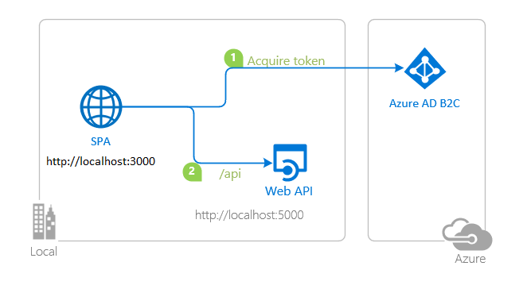

# A React single-page application using MSAL React to authorize users for calling a protected web API on Azure AD B2C

* [Overview](#overview)
* [Scenario](#scenario)
* [Contents](#contents)
* [Prerequisites](#prerequisites)
* [Setup the sample](#setup-the-sample)
* [Explore the sample](#explore-the-sample)
* [Troubleshooting](#troubleshooting)
* [About the code](#about-the-code)
* [Next Steps](#next-steps)
* [Contributing](#contributing)
* [Learn More](#learn-more)

## Overview

This sample demonstrates a React single-page application (SPA) calling a protected Node.js web API using the [Microsoft Authentication Library for React](https://github.com/AzureAD/microsoft-authentication-library-for-js/tree/dev/lib/msal-react) (MSAL React). The Node.js web API itself is protected using the [passport-azure-ad](https://github.com/AzureAD/passport-azure-ad) plug-in for [Passport.js](http://www.passportjs.org/)

Here you'll learn how to [register a protected web API](https://docs.microsoft.com/azure/active-directory/develop/scenario-protected-web-api-app-registration), [accept authorized calls](https://docs.microsoft.com/azure/active-directory/develop/scenario-protected-web-api-verification-scope-app-roles) and [validate access tokens](https://docs.microsoft.com/azure/active-directory/develop/access-tokens#validating-tokens).

> :information_source: See the community call: [Deep dive on using MSAL.js to integrate React single-page applications with Azure Active Directory](https://www.youtube.com/watch?v=7oPSL5wWeS0)

## Scenario

1. The client React SPA uses **MSAL React** to sign-in and obtain a JWT access token from **Azure AD B2C**.
1. The access token is used as a bearer token to authorize the user to call the Node.js web API protected **Azure AD B2C**.
1. The protected web API responds with the signed-in user's todolist.



## Contents

| File/folder                   | Description                                                        |
|-------------------------------|------------------------------------------------------------------- |
| `SPA/App.jsx`                 | Main application logic resides here.                               |
| `SPA/hooks/useFetchWithMsal.jsx`     | Custom hook to make fetch calls with bearer tokens.     |
| `SPA/authConfig.js`           | Contains authentication parameters for SPA project.                |
| `API/authConfig.js`           | Contains authentication parameters for API project.                |
| `API/app.js`                  | Main application logic of custom web API.                          |
| `API/auth/permissionUtils.js` | Contains helper methods for ensuring client permissions.           |

## Prerequisites

* [Node.js](https://nodejs.org/en/download/) must be installed to run this sample.
* [Visual Studio Code](https://code.visualstudio.com/download) is recommended for running and editing this sample.
* [VS Code Azure Tools](https://marketplace.visualstudio.com/items?itemName=ms-vscode.vscode-node-azure-pack) extension is recommended for interacting with Azure through VS Code Interface.
* A modern web browser. This sample uses **ES6** conventions and will not run on **Internet Explorer**.
* An **Azure AD B2C** tenant. For more information, see: [How to get an Azure AD B2C tenant](https://docs.microsoft.com/azure/active-directory-b2c/tutorial-create-tenant)
* A user account in your **Azure AD B2C** tenant.

## Setup the sample

### Step 1: Clone or download this repository

From your shell or command line:

```console
git clone https://github.com/Azure-Samples/ms-identity-javascript-react-tutorial.git
```

or download and extract the repository *.zip* file.

> :warning: To avoid path length limitations on Windows, we recommend cloning into a directory near the root of your drive.

### Step 2: Navigate to project folder

Install the dependencies for the service app:

```console
    cd ms-identity-javascript-react-tutorial
    cd 3-Authorization-II/2-call-api-b2c/API
    npm install
```

Next, install the dependencies for the client app:

```console
    cd ..
    cd SPA
    npm install
```

### Step 3: Register the sample application(s) in your tenant

> :warning: This sample comes with a pre-registered application for demo purposes. If you would like to use your own **Azure AD B2C** tenant and application, follow the steps below to register and configure the application on **Azure portal**. Otherwise, continue with the steps.

#### Choose the Azure AD B2C tenant where you want to create your applications

as a first step you'll need to:

1. Sign in to the [Azure portal](https://portal.azure.com).
2. If your account is present in more than one Azure AD B2C tenant, select your profile at the top right corner in the menu on top of the page, and then **switch directory** to change your portal session to the desired Azure AD B2C tenant.

#### Create User Flows and Custom Policies

Please refer to: [Tutorial: Create user flows in Azure Active Directory B2C](https://docs.microsoft.com/azure/active-directory-b2c/tutorial-create-user-flows)

> :warning: This sample requires Azure AD B2C to emit the **emails** claim in the ID token, which is used as **username** by MSAL. To do so, navigate to the [Azure portal](https://portal.azure.com) and locate the **Azure AD B2C** service. Then, navigate to the **User flows** blade. Select the **User Attributes** tab and make sure **Email Address** is checked. Then select the **Application Claims** tab and make sure **Email Addresses** is checked.
>
> You may want additional claims (such as  **object ID** (*oid*) and etc.) to appear in the ID tokens obtained from Azure AD B2C user-flows. In that case, please refer to [User profile attributes](https://learn.microsoft.com/azure/active-directory-b2c/user-profile-attributes) to learn about how to configure your user-flows to emit those claims.

#### Add External Identity Providers

Please refer to: [Tutorial: Add identity providers to your applications in Azure Active Directory B2C](https://docs.microsoft.com/azure/active-directory-b2c/tutorial-add-identity-providers)

#### Register the service app (ms-identity-react-c3s2-api)

1. Navigate to the [Azure portal](https://portal.azure.com) and select the **Azure Active Directory B2C** service.
1. Select the **App Registrations** blade on the left, then select **New registration**.
1. In the **Register an application page** that appears, enter your application's registration information:
    1. In the **Name** section, enter a meaningful application name that will be displayed to users of the app, for example `ms-identity-react-c3s2-api`.
    1. Under **Supported account types**, select **Accounts in any identity provider or organizational directory (for authenticating users with user flows)**
    1. Select **Register** to create the application.
1. In the **Overview** blade, find and note the **Application (client) ID**. You use this value in your app's configuration file(s) later in your code.
1. In the app's registration screen, select the **Expose an API** blade to the left to open the page where you can publish the permission as an API for which client applications can obtain [access tokens](https://aka.ms/access-tokens) for. The first thing that we need to do is to declare the unique [resource](https://docs.microsoft.com/azure/active-directory/develop/v2-oauth2-auth-code-flow) URI that the clients will be using to obtain access tokens for this API. To declare an resource URI(Application ID URI), follow the following steps:
    1. Select **Set** next to the **Application ID URI** to generate a URI that is unique for this app.
    2. For this sample, accept the proposed Application ID URI (`https://{tenantName}.onmicrosoft.com/{clientId}`) by selecting **Save**.

##### Publish Delegated Permissions

1. All APIs must publish a minimum of one [scope](https://docs.microsoft.com/azure/active-directory/develop/v2-oauth2-auth-code-flow#request-an-authorization-code), also called [Delegated Permission](https://docs.microsoft.com/azure/active-directory/develop/v2-permissions-and-consent#permission-types), for the client apps to obtain an access token for a *user* successfully. To publish a scope, follow these steps:
1. Select **Add a scope** button open the **Add a scope** screen and Enter the values as indicated below:
    1. For **Scope name**, use `ToDoList.Read`.
    1. For **Admin consent display name** type in *Read users ToDo list using the 'ms-identity-react-c3s2-api'*.
    1. For **Admin consent description** type in *Allow the app to read the user's ToDo list using the 'ms-identity-react-c3s2-api'*.
    1. Keep **State** as **Enabled**.
    1. Select the **Add scope** button on the bottom to save this scope.
    > Repeat the steps above for another scope named **ToDoList.ReadWrite**
    1. Select on **Save**.

> :information_source:  Follow [the principle of least privilege when publishing permissions](https://learn.microsoft.com/security/zero-trust/develop/protected-api-example) for a web API.

##### Configure the service app (ms-identity-react-c3s2-api) to use your app registration

Open the project in your IDE (like Visual Studio or Visual Studio Code) to configure the code.

> In the steps below, "ClientID" is the same as "Application ID" or "AppId".

1. Open the `API\authConfig.js` file.
1. Find the key `clientID` and replace the existing value with the application ID (clientId) of `ms-identity-react-c3s2-api` app copied from the Azure portal.
1. Find the key `tenantName` and replace the existing value with your Azure AD B2C tenant's name (e.g. `fabrikamb2c.onmicrosoft.com`).
1. Find the key `b2cDomain` and replace it with the domain portion of your authority string e.g. `<your-tenant-name>.b2clogin.com`.
1. Find the key `policyName` and replace it with your policy name e.g. `B2C_1_susi_v2`

#### Register the client app (ms-identity-react-c3s2-spa)

1. Navigate to the [Azure portal](https://portal.azure.com) and select the **Azure Active Directory B2C** service.
1. Select the **App Registrations** blade on the left, then select **New registration**.
1. In the **Register an application page** that appears, enter your application's registration information:
    1. In the **Name** section, enter a meaningful application name that will be displayed to users of the app, for example `ms-identity-react-c3s2-spa`.
    1. Under **Supported account types**, select **Accounts in any identity provider or organizational directory (for authenticating users with user flows)**
    1. Select **Register** to create the application.
1. In the **Overview** blade, find and note the **Application (client) ID**. You use this value in your app's configuration file(s) later in your code.
1. In the app's registration screen, select the **Authentication** blade to the left.
1. If you don't have a platform added, select **Add a platform** and select the **Single-page application** option.
    1. In the **Redirect URI** section enter the following redirect URIs:
        1. `http://localhost:3000`
        1. `http://localhost:3000/redirect`
    1. Click **Save** to save your changes.
1. Since this app signs-in users, we will now proceed to select **delegated permissions**, which is is required by apps signing-in users.
    1. In the app's registration screen, select the **API permissions** blade in the left to open the page where we add access to the APIs that your application needs:
    1. Select the **Add a permission** button and then:
    1. Ensure that the **My APIs** tab is selected.
    1. In the list of APIs, select the API `ms-identity-react-c3s2-api`.
      * Since this app signs-in users, we will now proceed to select **delegated permissions**, which is requested by apps that signs-in users.
      * In the **Delegated permissions** section, select **ToDoList.Read**, **ToDoList.ReadWrite** in the list. Use the search box if necessary.
    1. Select the **Add permissions** button at the bottom.
1. At this stage, the permissions are assigned correctly, but since it's a B2C tenant, the users themselves cannot consent to these permissions. To get around this problem, we'd let the [tenant administrator consent on behalf of all users in the tenant](https://docs.microsoft.com/azure/active-directory/develop/v2-admin-consent). Select the **Grant admin consent for {tenant}** button, and then select **Yes** when you are asked if you want to grant consent for the requested permissions for all accounts in the tenant. You need to be a tenant admin to be able to carry out this operation.

##### Configure the client app (ms-identity-react-c3s2-spa) to use your app registration

Open the project in your IDE (like Visual Studio or Visual Studio Code) to configure the code.

> In the steps below, "ClientID" is the same as "Application ID" or "AppId".

1. Open the `SPA\src\authConfig.js` file.
1. Find the key `msalConfig.auth.clientId` and replace the existing value with the application ID (clientId) of `ms-identity-react-c3s2-spa` app copied from the Azure portal.
1. Find the key `protectedResources.apiTodoList.scopes` and replace the existing value with the Scopes.

To setup your B2C user-flows, do the following:

1. Find the key `b2cPolicies.names` and populate it with your policy names e.g. `signUpSignIn`.
1. Find the key `b2cPolicies.authorities` and populate it with your policy authority strings e.g. `https://<your-tenant-name>.b2clogin.com/<your-tenant-name>.onmicrosoft.com/b2c_1_susi`.
1. Find the key `b2cPolicies.authorityDomain` and populate it with the domain portion of your authority string e.g. `<your-tenant-name>.b2clogin.com`.

### Step 4: Running the sample

From your shell or command line, execute the following commands:

```console
    cd 3-Authorization-II\1-call-api-b2c\API
    npm start
```

```console
    cd 3-Authorization-II\1-call-api-b2c\SPA
    npm start
```

## Explore the sample

1. Open your browser and navigate to `http://localhost:3000`.
1. Select the **Sign In** button on the top right corner. Choose either **Popup** or **Redirect** flows.
1. Select the **Todolist** button on the navigation bar. This will make a call to the Todolist web API.

> :information_source: Did the sample not work for you as expected? Then please reach out to us using the [GitHub Issues](../../../../issues) page.

> :information_source: if you believe your issue is with the B2C service itself rather than with the sample, please file a support ticket with the B2C team by following the instructions [here](https://docs.microsoft.com/azure/active-directory-b2c/support-options).

## We'd love your feedback!

Were we successful in addressing your learning objective? Consider taking a moment to [share your experience with us](https://forms.office.com/Pages/ResponsePage.aspx?id=v4j5cvGGr0GRqy180BHbR73pcsbpbxNJuZCMKN0lURpUMlRHSkc5U1NLUkxFNEtVN0dEOTFNQkdTWiQlQCN0PWcu).

## Troubleshooting

Use [Stack Overflow](http://stackoverflow.com/questions/tagged/msal) to get support from the community. Ask your questions on Stack Overflow first and browse existing issues to see if someone has asked your question before. Make sure that your questions or comments are tagged with [`azure-active-directory-b2c` `react` `ms-identity` `adal` `msal`].

If you find a bug in the sample, raise the issue on [GitHub Issues](../../../../issues).

## About the code

### Calling the web API with access token

Using a custom hook [useFetchWithMsal](./SPA/src/hooks/useFetchWithMsal.jsx), SPA acquires an access token using MSAL React useMsalAuthentication hook and then makes a call to the web API (i.e. bearer token authorization). This is illustrated in [TodoList.jsx](./SPA/src/pages/TodoList.jsx):

```javascript
const TodoListContent = () => {
    const { error, execute } = useFetchWithMsal({
        scopes: protectedResources.apiTodoList.scopes.read,
    });

    const [todoListData, setTodoListData] = useState(null);

    useEffect(() => {
        if (!todoListData) {
            execute("GET", protectedResources.apiTodoList.endpoint).then((response) => {
                setTodoListData(response);
            });
        }
    }, [execute, todoListData])

    if (error) {
        return <div>Error: {error.message}</div>;
    }

    return <>{todoListData ? <ListView todoListData={todoListData} /> : null}</>;
};
```

### CORS Settings

For the purpose of the sample, **cross-origin resource sharing** (CORS) is enabled for **all** domains and methods, using the Express.js cors middleware. This is insecure and only used for demonstration purposes here. In production, you should modify this as to allow only the domains that you designate. If your web API is going to be hosted on **Azure App Service**, we recommend configuring CORS on the App Service itself. This is illustrated in [app.js](./API/app.js):

```javascript
    const express = require('express');
    const cors = require('cors');

    const app = express();
    app.use(cors());
```

### Access token validation

On the web API side, [passport-azure-ad](https://github.com/AzureAD/passport-azure-ad) verifies the incoming access token's signature and validates it's payload against the `issuer` and `audience` claims (defined in `BearerStrategy` constructor) using the `passport.authenticate()` API. In the `BearerStrategy` callback, you can add further validation steps as shown below (see [app.js](./API/app.js)):

```javascript
    const options = {
    identityMetadata: `https://${authConfig.metadata.b2cDomain}/${authConfig.credentials.tenantName}/${authConfig.policies.policyName}/${authConfig.metadata.version}/${authConfig.metadata.discovery}`,
    clientID: authConfig.credentials.clientID,
    audience: authConfig.credentials.clientID,
    policyName: authConfig.policies.policyName,
    isB2C: authConfig.settings.isB2C,
    validateIssuer: authConfig.settings.validateIssuer,
    loggingLevel: authConfig.settings.loggingLevel,
    passReqToCallback: authConfig.settings.passReqToCallback,
};

const bearerStrategy = new passportAzureAd.BearerStrategy(options, (token, done) => {
    /**
     * Below you can do extended token validation and check for additional claims, such as:
     * - check if the delegated permissions in the 'scp' are the same as the ones declared in the application registration.
     *
     * Bear in mind that you can do any of the above checks within the individual routes and/or controllers as well.
     * For more information, visit: https://learn.microsoft.com/en-us/azure/active-directory-b2c/tokens-overview
     */

    /**
     * Lines below verifies if the caller's client ID is in the list of allowed clients.
     * This ensures only the applications with the right client ID can access this API.
     * To do so, we use "azp" claim in the access token. Uncomment the lines below to enable this check.
     */

    // const myAllowedClientsList = [
    //     /* add here the client IDs of the applications that are allowed to call this API */
    // ]

    // if (!myAllowedClientsList.includes(token.azp)) {
    //     return done(new Error('Unauthorized'), {}, "Client not allowed");
    // }


    /**
     * Access tokens that have no 'scp' (for delegated permissions).
     */
    if (!token.hasOwnProperty('scp')) {
        return done(new Error('Unauthorized'), null, 'No delegated permissions found');
    }

    done(null, {}, token);
});


app.use(passport.initialize());

passport.use(bearerStrategy);
```

Clients should treat access tokens as opaque strings, as the contents of the token are intended for the resource only (such as a web API or Microsoft Graph). For validation and debugging purposes, developers can decode **JWT**s (*JSON Web Tokens*) using a site like [jwt.ms](https://jwt.ms).

### Access to data

Controllers should check if the presented access token has the necessary permissions to access the data, depending on the type of permission. This is illustrated in [todolist.js](./API/controllers/todolist.js):

```javascript
    exports.getTodo = (req, res, next) => {
        if (hasRequiredDelegatedPermissions(req.authInfo, authConfig.protectedRoutes.todolist.delegatedPermissions.read)) {
            try {
                const id = req.params.id;
                const todo = db.get('todos').find({ id: id }).value();
                res.status(200).send(todo);
            } catch (error) {
                next(error);
            }
        } else {
            next(new Error('User does not have the required permissions'));
        }
    };
```

When granting access to data based on scopes, be sure to follow [the principle of least privilege](https://docs.microsoft.com/azure/active-directory/develop/secure-least-privileged-access).

## Next Steps

Learn how to:

* [Deploy your React Application to Azure Cloud using the Azure Static Web Apps service](https://github.com/Azure-Samples/ms-identity-javascript-react-tutorial/tree/main/4-Deployment/2-deploy-static)

## Contributing

If you'd like to contribute to this sample, see [CONTRIBUTING.MD](/CONTRIBUTING.md).

This project has adopted the [Microsoft Open Source Code of Conduct](https://opensource.microsoft.com/codeofconduct/). For more information, see the [Code of Conduct FAQ](https://opensource.microsoft.com/codeofconduct/faq/) or contact [opencode@microsoft.com](mailto:opencode@microsoft.com) with any additional questions or comments.

## Learn More

* [What is Azure Active Directory B2C?](https://docs.microsoft.com/azure/active-directory-b2c/overview)
* [Application types that can be used in Active Directory B2C](https://docs.microsoft.com/azure/active-directory-b2c/application-types)
* [Recommendations and best practices for Azure Active Directory B2C](https://docs.microsoft.com/azure/active-directory-b2c/best-practices)
* [Azure AD B2C session](https://docs.microsoft.com/azure/active-directory-b2c/session-overview)
* [Building Zero Trust ready apps](https://aka.ms/ztdevsession)
* [Initialize client applications using MSAL.js](https://docs.microsoft.com/azure/active-directory/develop/msal-js-initializing-client-applications)
* [Single sign-on with MSAL.js](https://docs.microsoft.com/azure/active-directory/develop/msal-js-sso)
* [Handle MSAL.js exceptions and errors](https://docs.microsoft.com/azure/active-directory/develop/msal-handling-exceptions?tabs=javascript)
* [Logging in MSAL.js applications](https://docs.microsoft.com/azure/active-directory/develop/msal-logging?tabs=javascript)
* [Pass custom state in authentication requests using MSAL.js](https://docs.microsoft.com/azure/active-directory/develop/msal-js-pass-custom-state-authentication-request)
* [Prompt behavior in MSAL.js interactive requests](https://docs.microsoft.com/azure/active-directory/develop/msal-js-prompt-behavior)
* [Use MSAL.js to work with Azure AD B2C](https://docs.microsoft.com/azure/active-directory/develop/msal-b2c-overview)
* [Validating Access Tokens](https://docs.microsoft.com/azure/active-directory/develop/access-tokens#validating-tokens)
* [User and application tokens](https://docs.microsoft.com/azure/active-directory/develop/access-tokens#user-and-application-tokens)
* [Validation differences by supported account types](https://docs.microsoft.com/azure/active-directory/develop/supported-accounts-validation)
* [How to manually validate a JWT access token using the Microsoft identity platform](https://github.com/Azure-Samples/active-directory-dotnet-webapi-manual-jwt-validation/blob/master/README.md)
