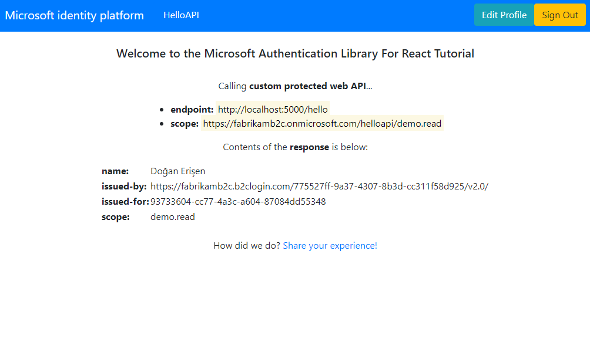

# A React single-page application using MSAL React to authorize users for calling a protected web API on Azure AD B2C

 1. [Overview](#overview)
 1. [Scenario](#scenario)
 1. [Contents](#contents)
 1. [Prerequisites](#prerequisites)
 1. [Setup](#setup)
 1. [Registration](#registration)
 1. [Running the sample](#running-the-sample)
 1. [Explore the sample](#explore-the-sample)
 1. [About the code](#about-the-code)
 1. [More information](#more-information)
 1. [Community Help and Support](#community-help-and-support)
 1. [Contributing](#contributing)

## Overview

This sample demonstrates a React SPA calling a Node.js web API that is secured using Azure AD B2C.

## Scenario

1. The client React SPA uses the Microsoft Authentication Library (MSAL) to sign-in and obtain a JWT access token from **Azure AD B2C**.
2. The access token is used as a bearer token to authorize the user to call the Node.js web API protected **Azure AD B2C**.


## Contents

| File/folder         | Description                                         |
|---------------------|-----------------------------------------------------|
| `SPA/App.jsx`       | Main application logic resides here.                |
| `SPA/fetch.jsx`     | Provides a helper method for making fetch calls.    |
| `SPA/authConfig.js` | Contains authentication parameters for SPA project. |
| `API/config.js`     | Contains authentication parameters for API project. |
| `API/index.js`      | Main application logic of custom web API.           |

## Prerequisites

- [Node.js](https://nodejs.org/en/download/) must be installed to run this sample.
- A modern web browser. This sample uses **ES6** conventions and will not run on **Internet Explorer**.
- [Visual Studio Code](https://code.visualstudio.com/download) is recommended for running and editing this sample.
- [VS Code Azure Tools](https://marketplace.visualstudio.com/items?itemName=ms-vscode.vscode-node-azure-pack) extension is recommended for interacting with Azure through VS Code Interface.
- An **Azure AD B2C** tenant. For more information see: [How to get an Azure AD B2C tenant](https://docs.microsoft.com/azure/active-directory-b2c/tutorial-create-tenant)
- A user account in your **Azure AD B2C** tenant.

## Setup

### Step 1: Clone or download this repository

From your shell or command line:

```console
    git clone https://github.com/Azure-Samples/ms-identity-javascript-react-tutorial.git
```

or download and extract the repository .zip file.

> :warning: To avoid path length limitations on Windows, we recommend cloning into a directory near the root of your drive.

### Step 2: Install project dependencies

```console
    cd ms-identity-react-c3s2-spa
    npm install
```

```console
    cd ms-identity-react-c3s2-api
    npm install
```

### Register the sample application(s) with your Azure Active Directory tenant

:warning: This sample comes with a pre-registered application for demo purposes. If you would like to use your own **Azure AD B2C** tenant and application, follow the steps below to register and configure the application on **Azure portal**. Otherwise, continue with the steps for [Running the sample](#running-the-sample).

### Choose the Azure AD tenant where you want to create your applications

As a first step you'll need to:

1. Sign in to the [Azure portal](https://portal.azure.com).
1. If your account is present in more than one Azure AD B2C tenant, select your profile at the top right corner in the menu on top of the page, and then **switch directory** to change your portal session to the desired Azure AD B2C tenant.

### Create User Flows and Custom Policies

Please refer to: [Tutorial: Create user flows in Azure Active Directory B2C](https://docs.microsoft.com/azure/active-directory-b2c/tutorial-create-user-flows)

### Add External Identity Providers

Please refer to: [Tutorial: Add identity providers to your applications in Azure Active Directory B2C](https://docs.microsoft.com/azure/active-directory-b2c/tutorial-add-identity-providers)

### Register the service app (ms-identity-react-c3s2-api)

1. Navigate to the [Azure portal](https://portal.azure.com) and select the **Azure AD B2C** service.
1. Select the **App Registrations** blade on the left, then select **New registration**.
1. In the **Register an application page** that appears, enter your application's registration information:
   - In the **Name** section, enter a meaningful application name that will be displayed to users of the app, for example `ms-identity-react-c3s2-api`.
   - Under **Supported account types**, select **Accounts in any identity provider or organizational directory (for authenticating users with user flows)**.
1. Select **Register** to create the application.
1. In the app's registration screen, find and note the **Application (client) ID**. You use this value in your app's configuration file(s) later in your code.
1. Select **Save** to save your changes.
1. In the app's registration screen, select the **Expose an API** blade to the left to open the page where you can declare the parameters to expose this app as an API for which client applications can obtain [access tokens](https://docs.microsoft.com/azure/active-directory/develop/access-tokens) for.
The first thing that we need to do is to declare the unique [resource](https://docs.microsoft.com/azure/active-directory/develop/v2-oauth2-auth-code-flow) URI that the clients will be using to obtain access tokens for this Api. To declare an resource URI, follow the following steps:
   - Select `Set` next to the **Application ID URI** to generate a URI that is unique for this app.
   - For this sample, accept the proposed Application ID URI (`https://{tenantName}.onmicrosoft.com/{clientId}`) by selecting **Save**.
1. All APIs have to publish a minimum of one [scope](https://docs.microsoft.com/azure/active-directory/develop/v2-oauth2-auth-code-flow#request-an-authorization-code) for the client's to obtain an access token successfully. To publish a scope, follow the following steps:
   - Select **Add a scope** button open the **Add a scope** screen and Enter the values as indicated below:
        - For **Scope name**, use `access_as_user`.
        - For **Admin consent display name** type `Access ms-identity-react-c3s2-api`.
        - For **Admin consent description** type `Allows the app to access ms-identity-react-c3s2-api as the signed-in user.`
        - Keep **State** as **Enabled**.
        - Select the **Add scope** button on the bottom to save this scope.

#### Configure the service app (ms-identity-react-c3s2-api) to use your app registration

Open the project in your IDE (like Visual Studio or Visual Studio Code) to configure the code.

> In the steps below, "ClientID" is the same as "Application ID" or "AppId".

1. Open the `API\config.json` file.
1. Find the key `clientID` and replace the existing value with the application ID (clientId) of `ms-identity-react-c3s2-api` app copied from the Azure portal.
1. Find the key `tenantID` and replace the existing value with your Azure AD tenant ID.

### Register the spa app (ms-identity-react-c3s2-spa)

1. Navigate to the [Azure portal](https://portal.azure.com) and select the **Azure AD B2C** service.
1. Select the **App Registrations** blade on the left, then select **New registration**.
1. In the **Register an application page** that appears, enter your application's registration information:
   - In the **Name** section, enter a meaningful application name that will be displayed to users of the app, for example `ms-identity-react-c3s2-spa`.
   - Under **Supported account types**, select **Accounts in any identity provider or organizational directory (for authenticating users with user flows)**.
   - In the **Redirect URI (optional)** section, select **Single-page application** in the combo-box and enter the following redirect URI: `http://localhost:3000/`.
1. Select **Register** to create the application.
1. In the app's registration screen, find and note the **Application (client) ID**. You use this value in your app's configuration file(s) later in your code.
1. Select **Save** to save your changes.
1. In the app's registration screen, select the **API permissions** blade in the left to open the page where we add access to the APIs that your application needs.
   - Select the **Add a permission** button and then:
       - Ensure that the **Microsoft APIs** tab is selected.
       - In the *Commonly used Microsoft APIs* section, select **Microsoft Graph**
       - In the **Delegated permissions** section, select the **User.Read** in the list. Use the search box if necessary.
       - Select the **Add permissions** button at the bottom.
   - Select the **Add a permission** button and then:
       - Ensure that the **My APIs** tab is selected.
       - In the list of APIs, select the API `ms-identity-react-c3s2-api`.
       - In the **Delegated permissions** section, select the **Access 'ms-identity-react-c3s2-api'** in the list. Use the search box if necessary.
       - Select the **Add permissions** button at the bottom.

#### Configure the spa app (ms-identity-react-c3s2-spa) to use your app registration

Open the project in your IDE (like Visual Studio or Visual Studio Code) to configure the code.

> In the steps below, "ClientID" is the same as "Application ID" or "AppId".

1. Open the `SPA\src\authConfig.js` file.
1. Find the key `Enter_the_Application_Id_Here` and replace the existing value with the application ID (clientId) of `ms-identity-react-c3s2-spa` app copied from the Azure portal.
1. Find the key `Enter_the_Tenant_Info_Here` and replace the existing value with your Azure AD tenant ID.
1. Find the key `Enter_the_Web_Api_Scope_Here` and replace the existing value with Scope.

<!-- ENTER CONFIGURATION STEPS FOR B2C USER-FLOWS/CUSTOM POLICIES BELOW -->

## Running the sample

```console
    cd ms-identity-react-c3s2-spa
    npm start
```

```console
    cd ms-identity-react-c3s2-api
    npm start
```

## Explore the sample

1. Open your browser and navigate to `http://localhost:3000`.
1. Select the **Sign In** button on the top right corner. Choose either **Popup** or **Redirect** flows.
1. Select the **HelloAPI** button on the navigation bar. This will make a call to your web API.



> :information_source: Did the sample not work for you as expected? Then please reach out to us using the [GitHub Issues](../../../issues) page.

> :information_source: if you believe your issue is with the B2C service itself rather than with the sample, please file a support ticket with the B2C team by following the instructions [here](https://docs.microsoft.com/azure/active-directory-b2c/support-options).

## We'd love your feedback!

Were we successful in addressing your learning objective? Consider taking a moment to [share your experience with us](https://forms.office.com/Pages/ResponsePage.aspx?id=v4j5cvGGr0GRqy180BHbR73pcsbpbxNJuZCMKN0lURpUMlRHSkc5U1NLUkxFNEtVN0dEOTFNQkdTWiQlQCN0PWcu).

## About the code

### Token Validation

[passport-azure-ad](https://github.com/AzureAD/passport-azure-ad) validates the token against the `issuer`, `scope` and `audience` claims (defined in `BearerStrategy` constructor) using the `passport.authenticate()` API:

```javascript
    app.get('/api', passport.authenticate('oauth-bearer', { session: false }),
        (req, res) => {
            console.log('Validated claims: ', req.authInfo);
    );
```

On the web API side, [passport-azure-ad](https://github.com/AzureAD/passport-azure-ad) validates the token against the `issuer`, `scope` and `audience` claims (defined in `BearerStrategy` constructor) using the `passport.authenticate()` API:

```javascript
    app.get('/api', passport.authenticate('oauth-bearer', { session: false }),
        (req, res) => {
            console.log('Validated claims: ', req.authInfo);
    );
```

Clients should treat access tokens as opaque strings, as the contents of the token are intended for the resource only (such as a web API or Microsoft Graph). For validation and debugging purposes, developers can decode **JWT**s (*JSON Web Tokens*) using a site like [jwt.ms](https://jwt.ms).

### CORS Settings

For the purpose of the sample, **cross-origin resource sharing** is enabled for **all** domains. This is insecure. In production, you should modify this as to allow only the domains that you designate.

```javascript
    app.use((req, res, next) => {
        res.header("Access-Control-Allow-Origin", "*");
        res.header("Access-Control-Allow-Headers", "Authorization, Origin, X-Requested-With, Content-Type, Accept");
        next();
    });
```

## More information

- [What is Azure Active Directory B2C?](https://docs.microsoft.com/azure/active-directory-b2c/overview)
- [Application types that can be used in Active Directory B2C](https://docs.microsoft.com/azure/active-directory-b2c/application-types)
- [Recommendations and best practices for Azure Active Directory B2C](https://docs.microsoft.com/azure/active-directory-b2c/best-practices)
- [Azure AD B2C session](https://docs.microsoft.com/azure/active-directory-b2c/session-overview)
- [Initialize client applications using MSAL.js](https://docs.microsoft.com/azure/active-directory/develop/msal-js-initializing-client-applications)
- [Single sign-on with MSAL.js](https://docs.microsoft.com/azure/active-directory/develop/msal-js-sso)
- [Handle MSAL.js exceptions and errors](https://docs.microsoft.com/azure/active-directory/develop/msal-handling-exceptions?tabs=javascript)
- [Logging in MSAL.js applications](https://docs.microsoft.com/azure/active-directory/develop/msal-logging?tabs=javascript)
- [Pass custom state in authentication requests using MSAL.js](https://docs.microsoft.com/azure/active-directory/develop/msal-js-pass-custom-state-authentication-request)
- [Prompt behavior in MSAL.js interactive requests](https://docs.microsoft.com/azure/active-directory/develop/msal-js-prompt-behavior)
- [Use MSAL.js to work with Azure AD B2C](https://docs.microsoft.com/azure/active-directory/develop/msal-b2c-overview)

For more information about how OAuth 2.0 protocols work in this scenario and other scenarios, see [Authentication Scenarios for Azure AD](https://docs.microsoft.com/azure/active-directory/develop/authentication-flows-app-scenarios).

## Community Help and Support

Use [Stack Overflow](http://stackoverflow.com/questions/tagged/msal) to get support from the community.
Ask your questions on Stack Overflow first and browse existing issues to see if someone has asked your question before.
Make sure that your questions or comments are tagged with [`azure-active-directory` `azure-ad-b2c` `ms-identity` `adal` `msal`].

If you find a bug in the sample, raise the issue on [GitHub Issues](../../../issues).

To provide feedback on or suggest features for Azure Active Directory, visit [User Voice page](https://feedback.azure.com/forums/169401-azure-active-directory).

## Contributing

If you'd like to contribute to this sample, see [CONTRIBUTING.MD](/CONTRIBUTING.md).

This project has adopted the [Microsoft Open Source Code of Conduct](https://opensource.microsoft.com/codeofconduct/). For more information, see the [Code of Conduct FAQ](https://opensource.microsoft.com/codeofconduct/faq/) or contact [opencode@microsoft.com](mailto:opencode@microsoft.com) with any additional questions or comments.