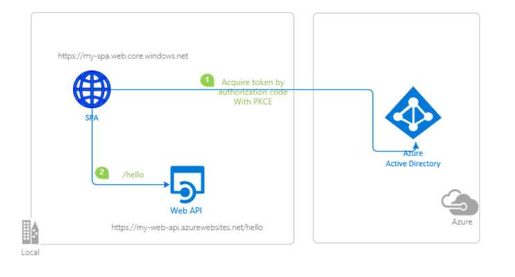
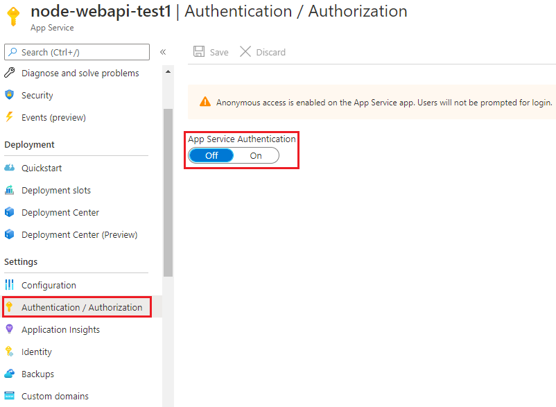
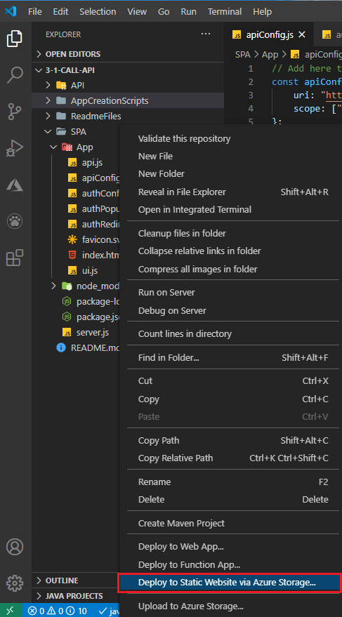
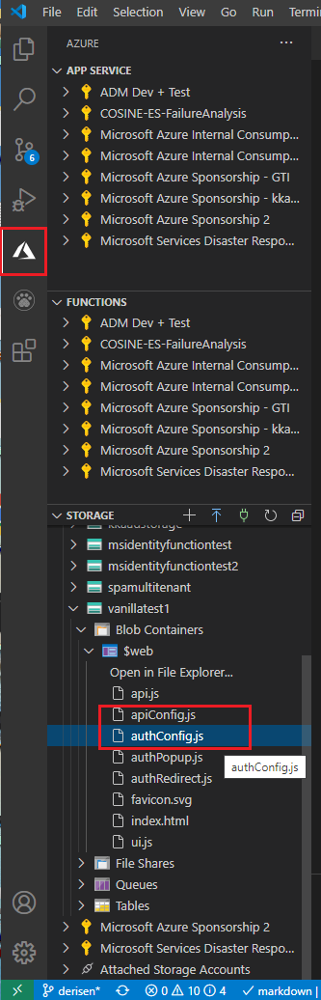
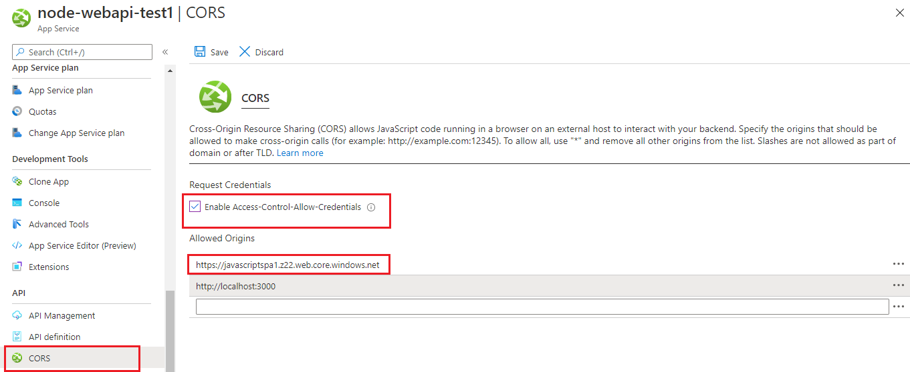
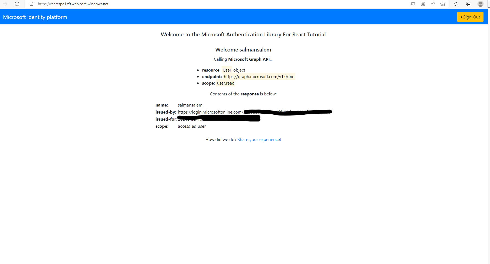

# Deploy your React Application to Azure Cloud and use Azure services to manage your operations

 1. [Overview](#overview)
 1. [Scenario](#scenario)
 1. [Prerequisites](#prerequisites)
 1. [Registration](#registration)
 1. [Deployment](#deployment)
 1. [Explore the sample](#explore-the-sample)
 1. [More information](#more-information)
 1. [Community Help and Support](#community-help-and-support)
 1. [Contributing](#contributing)
 1. [Code of Conduct](#code-of-conduct)

## Overview

This sample demonstrates how to deploy a React single-page application (SPA) coupled with a Node.js web API to **Azure Cloud** using [Azure Storage](https://docs.microsoft.com/azure/storage/blobs/) and [Azure App Service](https://docs.microsoft.com/azure/app-service/), respectively.

Azure Storage provides a low cost static website hosting alternative. However, these static websites do not have advanced routing capabilities. As such, [the React SPA in this tutorial](./SPA) does not have a router component.

For React applications with routing support, you can use [Azure Static Web Apps](https://docs.microsoft.com/azure/static-web-apps/) instead. See [Static Web App Deployment](../2-deploy-static/README.md) in the next section.

## Scenario

1. The client application uses **MSAL React** to sign-in a user and obtain a JWT **Access Token** from **Azure AD**.
1. The **Access Token** is used as a **bearer** token to *authorize* the user to call the protected web API.
1. The protected web API responds with the claims in the **Access Token**.



## Prerequisites

- [VS Code Azure Tools Extension](https://marketplace.visualstudio.com/items?itemName=ms-vscode.vscode-node-azure-pack) extension is recommended for interacting with **Azure** through VS Code interface.
- An **Azure subscription**. This sample uses **Azure Storage** and **Azure App Service**.

## Setup

### Step 1: Clone or download this repository

From your shell or command line:

```console
    git clone https://github.com/Azure-Samples/ms-identity-javascript-react-tutorial.git
```

or download and extract the repository .zip file.

> :warning: To avoid path length limitations on Windows, we recommend cloning into a directory near the root of your drive.

### Step 2: Install project dependencies

- Setup the service app:

```console
    cd ms-identity-javascript-react-tutorial
    cd 4-Deployment/1-deploy-storage
    cd API
    npm install
```

- Setup the client app:

```console
    cd ..
    cd SPA
    npm install
```

## Registration

There are two projects in this sample. Each needs to be separately registered in your Azure AD tenant. To register these projects, you can:

- follow the steps below for manually register your apps
- or use PowerShell scripts that:
  - **automatically** creates the Azure AD applications and related objects (passwords, permissions, dependencies) for you.
  - modify the projects' configuration files.

  <details>
   <summary>Expand this section if you want to use this automation:</summary>

    > :warning: If you have never used **Microsoft Graph PowerShell** before, we recommend you go through the [App Creation Scripts Guide](./AppCreationScripts/AppCreationScripts.md) once to ensure that your environment is prepared correctly for this step.
  
    1. On Windows, run PowerShell as **Administrator** and navigate to the root of the cloned directory
    1. In PowerShell run:

       ```PowerShell
       Set-ExecutionPolicy -ExecutionPolicy RemoteSigned -Scope Process -Force
       ```

    1. Run the script to create your Azure AD application and configure the code of the sample application accordingly.
    1. For interactive process -in PowerShell, run:

       ```PowerShell
       cd .\AppCreationScripts\
       .\Configure.ps1 -TenantId "[Optional] - your tenant id" -AzureEnvironmentName "[Optional] - Azure environment, defaults to 'Global'"
       ```

    > Other ways of running the scripts are described in [App Creation Scripts guide](./AppCreationScripts/AppCreationScripts.md). The scripts also provide a guide to automated application registration, configuration and removal which can help in your CI/CD scenarios.

  </details>

### Choose the Azure AD tenant where you want to create your applications

To manually register the apps, as a first step you'll need to:

1. Sign in to the [Azure portal](https://portal.azure.com).
1. If your account is present in more than one Azure AD tenant, select your profile at the top right corner in the menu on top of the page, and then **switch directory** to change your portal session to the desired Azure AD tenant.

### Register the service app (msal-node-api)

1. Navigate to the [Azure portal](https://portal.azure.com) and select the **Azure Active Directory** service.
1. Select the **App Registrations** blade on the left, then select **New registration**.
1. In the **Register an application page** that appears, enter your application's registration information:
    1. In the **Name** section, enter a meaningful application name that will be displayed to users of the app, for example `msal-node-api`.
    1. Under **Supported account types**, select **Accounts in this organizational directory only**
    1. Select **Register** to create the application.
1. In the **Overview** blade, find and note the **Application (client) ID**. You use this value in your app's configuration file(s) later in your code.
1. In the app's registration screen, select the **Expose an API** blade to the left to open the page where you can publish the permission as an API for which client applications can obtain [access tokens](https://aka.ms/access-tokens) for. The first thing that we need to do is to declare the unique [resource](https://docs.microsoft.com/azure/active-directory/develop/v2-oauth2-auth-code-flow) URI that the clients will be using to obtain access tokens for this API. To declare an resource URI(Application ID URI), follow the following steps:
    1. Select **Set** next to the **Application ID URI** to generate a URI that is unique for this app.
    1. For this sample, accept the proposed Application ID URI (`api://{clientId}`) by selecting **Save**. Read more about Application ID URI at [Validation differences by supported account types \(signInAudience\)](https://docs.microsoft.com/azure/active-directory/develop/supported-accounts-validation).

#### Publish Delegated Permissions

1. All APIs must publish a minimum of one [scope](https://docs.microsoft.com/azure/active-directory/develop/v2-oauth2-auth-code-flow#request-an-authorization-code), also called [Delegated Permission](https://docs.microsoft.com/azure/active-directory/develop/v2-permissions-and-consent#permission-types), for the client apps to obtain an access token for a *user* successfully. To publish a scope, follow these steps:
1. Select **Add a scope** button open the **Add a scope** screen and Enter the values as indicated below:
    1. For **Scope name**, use `access_as_user`.
    1. Select **Admins and users** options for **Who can consent?**.
    1. For **Admin consent display name** type in *access_as_user*.
    1. For **Admin consent description** type in *e.g. Allows the app to read the signed-in user's files.*.
    1. For **User consent display name** type in *scopeName*.
    1. For **User consent description** type in *eg. Allows the app to read your files.*.
    1. Keep **State** as **Enabled**.
    1. Select the **Add scope** button on the bottom to save this scope.
1. Select the **Manifest** blade on the left.
    1. Set `accessTokenAcceptedVersion` property to **2**.
    1. Select on **Save**.

> :information_source:  Follow  [the principle of least privilege](https://docs.microsoft.com/azure/active-directory/develop/secure-least-privileged-access) whenever you are publishing permissions for a web API.

#### Configure the service app (msal-node-api) to use your app registration

Open the project in your IDE (like Visual Studio or Visual Studio Code) to configure the code.

> In the steps below, "ClientID" is the same as "Application ID" or "AppId".

1. Open the `API\config.json` file.
1. Find the key `Enter_the_Application_Id_Here` and replace the existing value with the application ID (clientId) of `msal-node-api` app copied from the Azure portal.
1. Find the key `Enter_the_Tenant_Info_Here` and replace the existing value with your Azure AD tenant/directory ID.

### Register the client app (msal-react-spa)

> :information_source: Below, we are using a single app registration for both SPA and web API projects.

1. Navigate to the [Azure portal](https://portal.azure.com) and select the **Azure Active Directory** service.
1. Select the **App Registrations** blade on the left, then select **New registration**.
1. In the **Register an application page** that appears, enter your application's registration information:
    1. In the **Name** section, enter a meaningful application name that will be displayed to users of the app, for example `msal-react-spa`.
    1. Under **Supported account types**, select **Accounts in this organizational directory only**
    1. Select **Register** to create the application.
1. In the **Overview** blade, find and note the **Application (client) ID**. You use this value in your app's configuration file(s) later in your code.
1. In the app's registration screen, select the **Expose an API** blade to the left to open the page where you can publish the permission as an API for which client applications can obtain [access tokens](https://aka.ms/access-tokens) for. The first thing that we need to do is to declare the unique [resource](https://docs.microsoft.com/azure/active-directory/develop/v2-oauth2-auth-code-flow) URI that the clients will be using to obtain access tokens for this API. To declare an resource URI(Application ID URI), follow the following steps:
    1. Select **Set** next to the **Application ID URI** to generate a URI that is unique for this app.
    1. For this sample, accept the proposed Application ID URI (`api://{clientId}`) by selecting **Save**. Read more about Application ID URI at [Validation differences by supported account types \(signInAudience\)](https://docs.microsoft.com/azure/active-directory/develop/supported-accounts-validation).

#### Publish Delegated Permissions

1. All APIs must publish a minimum of one [scope](https://docs.microsoft.com/azure/active-directory/develop/v2-oauth2-auth-code-flow#request-an-authorization-code), also called [Delegated Permission](https://docs.microsoft.com/azure/active-directory/develop/v2-permissions-and-consent#permission-types), for the client apps to obtain an access token for a *user* successfully. To publish a scope, follow these steps:
1. Select the **Manifest** blade on the left.
    1. Set `accessTokenAcceptedVersion` property to **2**.
    1. Select on **Save**.

> :information_source:  Follow  [the principle of least privilege](https://docs.microsoft.com/azure/active-directory/develop/secure-least-privileged-access) whenever you are publishing permissions for a web API.

#### Grant Delegated Permissions to msal-react-spa

1. Since this app signs-in users, we will now proceed to select **delegated permissions**, which is is required by apps signing-in users.
   1. In the app's registration screen, select the **API permissions** blade in the left to open the page where we add access to the APIs that your application needs:
   1. Select the **Add a permission** button and then:
   1. Ensure that the **My APIs** tab is selected.
   1. In the list of APIs, select the API `msal-node-api`.
      - Since this app signs-in users, we will now proceed to select **delegated permissions**, which is is requested by apps when signing-in users.
           1. In the **Delegated permissions** section, select **access_as_user** in the list. Use the search box if necessary.
   1. Select the **Add permissions** button at the bottom.

#### Configure the client app (msal-react-spa) to use your app registration

Open the project in your IDE (like Visual Studio or Visual Studio Code) to configure the code.

> In the steps below, "ClientID" is the same as "Application ID" or "AppId".

1. Open the `SPA\src\authConfig.js` file.
1. Find the key `Enter_the_Application_Id_Here` and replace the existing value with the application ID (clientId) of `msal-react-spa` app copied from the Azure portal.
1. Find the key `Enter_the_Tenant_Info_Here` and replace the existing value with your Azure AD tenant/directory ID.
1. Find the key `Enter_the_Web_Api_Application_Id_Here` and replace the existing value with the application ID (clientId) of `msal-node-api` app copied from the Azure portal.

## Deployment

There are basically **3** stages that you will have to go through in order to deploy your projects and enable authentication:

1. Upload your project files to **Azure** services and obtain published website URIs
1. Update **Azure AD** **App Registration** with URIs you have just obtained
1. Update your configuration files with URIs you have just obtained

### Deploy the service app (Node.js web API)

There are various ways to deploy your applications to **Azure App Service**. Here we provide steps for deployment via **VS Code Azure Tools Extension**. For more alternatives, visit: [Static website hosting in Azure Storage](https://docs.microsoft.com/azure/storage/blobs/storage-blob-static-website#uploading-content).

> We recommend watching the [video tutorial](https://docs.microsoft.com/azure/developer/javascript/tutorial-vscode-azure-app-service-node-01) offered by Microsoft Docs for preparation.

#### Step 1: Deploy your app

1. In the **VS Code** activity bar, select the **Azure** logo to show the **AZURE APP SERVICE** explorer. Select **Sign in to Azure...** and follow the instructions. Once signed in, the explorer should show the name of your **Azure** subscription(s).


1. On the **App Service** explorer section you will see an upward-facing arrow icon. Click on it publish your local files in the `API` folder to **Azure App Services**.


1. Choose a creation option based on the operating system to which you want to deploy. in this sample, we choose **Linux**.
1. Select a Node.js version when prompted. An **LTS** version is recommended.
1. Type a globally unique name for your web app and press Enter. The name must be unique across all of **Azure**.
1. After you respond to all the prompts, **VS Code** shows the **Azure** resources that are being created for your app in its notification popup.
1. Select **Yes** when prompted to update your configuration to run npm install on the target Linux server.


#### Step 2: Disable default authentication

Now you need to navigate to the **Azure App Service** Portal, and locate your project there. Once you do, click on the **Authentication/Authorization** blade. There, make sure that the **App Services Authentication** is switched off (and nothing else is checked), as we are using **our own** authentication logic.  



### Deploy the client app (React SPA)

There are various ways to deploy your applications to **Azure Storage**. Here we provide steps for deployment via **VS Code Azure Tools Extension**. For more alternatives, visit: [Static website hosting in Azure Storage](https://docs.microsoft.com/azure/storage/blobs/storage-blob-static-website#uploading-content).

> We recommend watching the [video tutorial](https://docs.microsoft.com/azure/developer/javascript/tutorial-vscode-static-website-node-01) offered by Microsoft Docs for preparation.

#### Step 1: Deploy the app

1. Create a distributable files folder, where your `html`, `css` and `javascript` files will be located. To do so, locate the `SPA` folder in your terminal, then type:

```console
    npm run build
```

This will create a `build` folder. We will upload the contents of this folder next.

1. Right click on the `SPA/build` folder. This will open a context menu where you will see the option **Deploy to static website via Azure Storage**. Click on it.



2. Follow the dialog window that opens on the top. Select your subscription, then give a name to your storage account.


3. Once your storage account is created and your files are uploaded, you will see a notification on the bottom-right corner of VS Code interface. When it's done, you will be notified with the published URI of your static website (e.g. `https://reactspa1.z22.web.core.windows.net/`).


#### Step 2: Update the client app's authentication parameters

1. Navigate back to to the [Azure Portal](https://portal.azure.com).
1. In the left-hand navigation pane, select the **Azure Active Directory** service, and then select **App registrations**.
1. In the resulting screen, select the name of your application.
1. From the *Branding* menu, update the **Home page URL**, to the address of your service, for example [https://reactspa1.z22.web.core.windows.net/](https://reactspa1.z22.web.core.windows.net/). Save the configuration.
1. Add the same URI in the list of values of the *Authentication -> Redirect URIs* menu. If you have multiple redirect URIs, make sure that there a new entry using the App service's URI for each redirect URI.

#### Step 3: Update the client app's configuration files

Now you need to update your authentication configuration files in the client project. To do so, go to your **Azure Storage Account** explorer via **VS Code** Azure panel. There, click on your project's name > **Blob Container** > **Web** as shown below:



Open [authConfig.js](/4-Deployment/1-deploy-storage/SPA/src/authConfig.js). Then:

1. Find the key `protectedResources.apiHello.endpoint` and replace the existing value with your published web API's endpoint, e.g. `https://my-web-api.azurewebsites.net/hello`

#### Step 4: Enable cross-origin resource sharing (CORS) for service app

Finally, we need to enable Cross-Origin Resource Sharing by designating the domain of the SPA we've just deployed. Navigate to App Service portal and locate your web API. Then, enable CORS by entering your website's URI as shown below:



## Explore the sample

1. Open your browser and navigate to your deployed client app's URI, for instance: `https://reactspa1.z22.web.core.windows.net/`.
1. Select the **Sign In** button on the top right corner. Choose either **Popup** or **Redirect** flow.
1. Select the **Call the API** button in the home screen. This will make a call to your web API.



## We'd love your feedback!

Were we successful in addressing your learning objective? Consider taking a moment to [share your experience with us](https://forms.office.com/Pages/ResponsePage.aspx?id=v4j5cvGGr0GRqy180BHbR73pcsbpbxNJuZCMKN0lURpUNDVHTkg2VVhWMTNYUTZEM05YS1hSN01EOSQlQCN0PWcu).

## More information

- [Azure Blob Storage](https://docs.microsoft.com/azure/storage/blobs/)
- [Azure App Services](https://docs.microsoft.com/azure/app-service/)

For more information about how OAuth 2.0 protocols work in this scenario and other scenarios, see [Authentication Scenarios for Azure AD](https://docs.microsoft.com/azure/active-directory/develop/authentication-flows-app-scenarios).

## Community Help and Support

Use [Stack Overflow](http://stackoverflow.com/questions/tagged/msal) to get support from the community.
Ask your questions on Stack Overflow first and browse existing issues to see if someone has asked your question before.
Make sure that your questions or comments are tagged with [`azure-ad` `azure-ad-b2c` `ms-identity` `msal`].

If you find a bug in the sample, please raise the issue on [GitHub Issues](../../issues).

To provide a recommendation, visit the following [User Voice page](https://feedback.azure.com/forums/169401-azure-active-directory).

## Contributing

If you'd like to contribute to this sample, see [CONTRIBUTING.MD](../../CONTRIBUTING.md).

This project has adopted the [Microsoft Open Source Code of Conduct](https://opensource.microsoft.com/codeofconduct/). For more information, see the [Code of Conduct FAQ](https://opensource.microsoft.com/codeofconduct/faq/) or contact [opencode@microsoft.com](mailto:opencode@microsoft.com) with any additional questions or comments.

## Code of Conduct

This project has adopted the [Microsoft Open Source Code of Conduct](https://opensource.microsoft.com/codeofconduct/).
For more information see the [Code of Conduct FAQ](https://opensource.microsoft.com/codeofconduct/faq/) or
contact [opencode@microsoft.com](mailto:opencode@microsoft.com) with any additional questions or comments.
