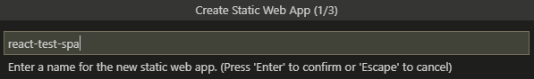

# Deploy your React Application to Azure Cloud and use Azure services to manage your operations

 1. [Overview](#overview)
 1. [Scenario](#scenario)
 1. [Prerequisites](#prerequisites)
 1. [Registration](#registration)
 1. [Deployment](#deployment)
 1. [Explore the sample](#explore-the-sample)
 1. [About the code](#about-the-code)
 1. [More information](#more-information)
 1. [Community Help and Support](#community-help-and-support)
 1. [Contributing](#contributing)
 1. [Code of Conduct](#code-of-conduct)

## Overview

This sample demonstrates how to deploy a React single-page application (SPA) coupled with a Node.js [Azure Function](https://docs.microsoft.com/azure/azure-functions/) API to **Azure Cloud** using the [Azure Static Web Apps (Preview)](https://docs.microsoft.com/azure/static-web-apps/) service.

## Scenario

1. The client application uses **MSAL React** to sign-in a user and obtain a JWT **Access Token** from **Azure AD**.
1. The **Access Token** is sent over to Function API using a **POST** request.
1. The Function API responds validates the **Access Token** and responds with the claims in it.


## Prerequisites

- [VS Code Azure Static Web Apps Extension (Preview)](https://marketplace.visualstudio.com/items?itemName=ms-azuretools.vscode-azurestaticwebapps) extension is recommended for interacting with **Azure** through VS Code interface.
- An **Azure AD** tenant. For more information, see: [How to get an Azure AD tenant](https://azure.microsoft.com/documentation/articles/active-directory-howto-tenant/)
- A user account in your **Azure AD** tenant.
- An **Azure subscription**. This sample uses **Azure Static Web Apps (Preview)**.

## Registration

There is one project in this sample. To register it, you can:

- follow the steps below for manually register your apps
- or use PowerShell scripts that:
  - **automatically** creates the Azure AD applications and related objects (passwords, permissions, dependencies) for you.
  - modify the projects' configuration files.

<details>
  <summary>Expand this section if you want to use this automation:</summary>

> :warning: If you have never used **Azure AD Powershell** before, we recommend you go through the [App Creation Scripts](./AppCreationScripts/AppCreationScripts.md) once to ensure that your environment is prepared correctly for this step.

1. On Windows, run PowerShell as **Administrator** and navigate to the root of the cloned directory
1. If you have never used Azure AD Powershell before, we recommend you go through the [App Creation Scripts](./AppCreationScripts/AppCreationScripts.md) once to ensure that your environment is prepared correctly for this step.
1. In PowerShell run:

   ```PowerShell
   Set-ExecutionPolicy -ExecutionPolicy RemoteSigned -Scope Process -Force
   ```

1. Run the script to create your Azure AD application and configure the code of the sample application accordingly.
1. In PowerShell run:

   ```PowerShell
   cd .\AppCreationScripts\
   .\Configure.ps1
   ```

   > Other ways of running the scripts are described in [App Creation Scripts](./AppCreationScripts/AppCreationScripts.md)
   > The scripts also provide a guide to automated application registration, configuration and removal which can help in your CI/CD scenarios.

</details>

### Choose the Azure AD tenant where you want to create your applications

As a first step you'll need to:

1. Sign in to the [Azure portal](https://portal.azure.com).
1. If your account is present in more than one Azure AD tenant, select your profile at the top right corner in the menu on top of the page, and then **switch directory** to change your portal session to the desired Azure AD tenant.

### Register the app

1. Navigate to the [Azure portal](https://portal.azure.com) and select the **Azure AD** service.
1. Select the **App Registrations** blade on the left, then select **New registration**.
1. In the **Register an application page** that appears, enter your application's registration information:
   - In the **Name** section, enter a meaningful application name that will be displayed to users of the app, for example `msal-react-spa`.
   - Under **Supported account types**, select **Accounts in this organizational directory only**.
   - In the **Redirect URI** section, select **Single-page application** in the combo-box and enter the following redirect URI: `http://localhost:3000/`.
1. Select **Register** to create the application.
1. In the app's registration screen, find and note the **Application (client) ID**. You use this value in your app's configuration file(s) later in your code.
1. Select **Save** to save your changes.
1. In the app's registration screen, select the **Expose an API** blade to the left to open the page where you can declare the parameters to expose this app as an API for which client applications can obtain [access tokens](https://docs.microsoft.com/azure/active-directory/develop/access-tokens) for.
The first thing that we need to do is to declare the unique [resource](https://docs.microsoft.com/azure/active-directory/develop/v2-oauth2-auth-code-flow) URI that the clients will be using to obtain access tokens for this Api. To declare an resource URI, follow the following steps:
   - Select `Set` next to the **Application ID URI** to generate a URI that is unique for this app.
   - For this sample, accept the proposed Application ID URI (`api://{clientId}`) by selecting **Save**.
1. All APIs have to publish a minimum of one [scope](https://docs.microsoft.com/azure/active-directory/develop/v2-oauth2-auth-code-flow#request-an-authorization-code) for the client's to obtain an access token successfully. To publish a scope, follow the following steps:
   - Select **Add a scope** button open the **Add a scope** screen and Enter the values as indicated below:
        - For **Scope name**, use `access_as_user`.
        - Select **Admins and users** options for **Who can consent?**.
        - For **Admin consent display name** type `Access msal-react-spa`.
        - For **Admin consent description** type `Allows the app to access msal-react-spa as the signed-in user.`
        - For **User consent display name** type `Access msal-react-spa`.
        - For **User consent description** type `Allow the application to access msal-react-spa on your behalf.`
        - Keep **State** as **Enabled**.
        - Select the **Add scope** button on the bottom to save this scope.
1. In the app's registration screen, select the **API permissions** blade in the left to open the page where we add access to the APIs that your application needs.
   - Select the **Add a permission** button and then,
     - Ensure that the **Microsoft APIs** tab is selected.
     - In the *Commonly used Microsoft APIs* section, select **Microsoft Graph**
     - In the **Delegated permissions** section, select the **User.Read** in the list. Use the search box if necessary.
     - Select the **Add permissions** button at the bottom.
   - Select the **Add a permission** button and then,
     - Ensure that the **My APIs** tab is selected.
     - In the list of APIs, select the API `msal-react-spa`.
     - In the **Delegated permissions** section, select the **Access 'msal-react-api'** in the list. Use the search box if necessary.
     - Select the **Add permissions** button at the bottom.

#### Configure the app (msal-react-spa) to use your app registration

Open the project in your IDE (like Visual Studio or Visual Studio Code) to configure the code.

> In the steps below, "ClientID" is the same as "Application ID" or "AppId".

1. Open the `App/src/authConfig.js` file.
1. Find the key `Enter_the_Application_Id_Here` and replace the existing value with the application ID (clientId) of `msal-react-spa` app copied from the Azure portal.
1. Find the key `Enter_the_Tenant_Info_Here` and replace the existing value with your Azure AD tenant ID.
1. Find the key `Enter_the_Redirect_Uri_Here` and replace the existing value with the Redirect URI for `msal-react-spa`. (by default `http://localhost:3000/`).
1. Find the key `Enter_the_Web_Api_Uri_Here` and replace the existing value with the URI of your function API (by default `/api/hello`).
1. Find the key `Enter_the_Web_Api_Scope_Here` and replace the existing value with APP ID URI that you've registered earlier, e.g. `api://****-****-********-********/access_as_user`

## Deployment

There are basically **3** stages that you will have to go through in order to deploy your projects and enable authentication:

1. Create a repository on GitHub and commit your project.
1. Create a **Static Web App** via VS Code extensions.
1. Update **Azure AD** **App Registration** with deployed website URI that you have just obtained.

### Deploy the app (msal-react-spa)

There are various ways to deploy your applications to **Azure Static Web Apps**. Here we provide steps for deployment via **VS Code Azure Static Web Apps Extension**.

> We recommend reading the [Quickstart: Building your first static site with Azure Static Web Apps](https://docs.microsoft.com/azure/static-web-apps/getting-started?tabs=vanilla-javascript) for gaining familiarity with the process outlined below.

#### Step 1: Deploy the app

1. Locate the project in [4-Deployment/App](./App). Then, [create a GitHub repository](https://docs.github.com/en/github/getting-started-with-github/create-a-repo) and [commit the project there](https://docs.github.com/en/github/importing-your-projects-to-github/adding-an-existing-project-to-github-using-the-command-line).
2. Open the project in **VS Code**, select the **Azure** icon on the left hand side. Sign-in if you haven't already.


3. Follow the steps below to create a static web app. Note its URI once it's created.





4. Once your static web app is created, Azure will add a [GitHub action](https://docs.github.com/en/actions/learn-github-actions) to your repository. After that, each new push to your repository will trigger a deployment cycle.


#### Step 2: Update the app's registration

1. Navigate back to the [Azure Portal](https://portal.azure.com).
1. In the left-hand navigation pane, select the **Azure Active Directory** service, and then select **App registrations**.
1. In the resulting screen, select the name of your application.
1. From the *Branding* menu, update the **Home page URL**, to the address of your service, for example [https://reactspa1.z22.web.core.windows.net/](https://reactspa1.z22.web.core.windows.net/). Save the configuration.
1. Add the same URI in the list of values of the *Authentication -> Redirect URIs* menu. If you have multiple redirect URIs, make sure that there a new entry using the App service's URI for each redirect URI.

#### Step 3: Add environment variables to your static web app

1. Navigate back to the [Azure Portal](https://portal.azure.com).
1. Find the application you've created previously under **Azure Static Web Apps** and select it.
1. Select the **Configuration** blade on the left hand side. Add the following **environment variables** there:
    1. `CLIENT_ID`: enter the application ID (clientId) of `msal-react-spa` app copied from the Azure portal.
    1. `TENANT_ID`: enter your Azure AD tenant ID.
    1. `EXPECTED_SCOPES`: enter the name of the scope in APP ID URI that you've registered earlier.


For more information, see [Configure application settings for Azure Static Web Apps Preview](https://docs.microsoft.com/azure/static-web-apps/application-settings#uploading-application-settings)

## Explore the sample

1. Open your browser and navigate to your deployed client app's URI, for instance: `https://reactspa1.z22.web.core.windows.net/`.
1. Select the **Sign In** button on the top right corner. Choose either **Popup** or **Redirect** flow.
1. Select the **Profile** button on the navigation bar. This will make a call to the Microsoft Graph API.
1. Select the **FunctionAPI** button on the navigation bar. This will make a call to your web API.


## We'd love your feedback!

Were we successful in addressing your learning objective? Consider taking a moment to [share your experience with us](https://forms.office.com/Pages/ResponsePage.aspx?id=v4j5cvGGr0GRqy180BHbR73pcsbpbxNJuZCMKN0lURpUNDVHTkg2VVhWMTNYUTZEM05YS1hSN01EOSQlQCN0PWcu).

## About the code

This application is such and such. Registration is combined. Authentication handled manually.

### Handling React routes

routes.json in public folder

```json
{
    "routes": [
        {
            "route": "/*",
            "serve": "/index.html",
            "statusCode": 200
        }
    ],
    "platformErrorOverrides": [
        {
            "errorType": "NotFound",
            "serve": "/index.html"
        },
        {
            "errorType": "Unauthenticated",
            "statusCode": "302",
            "serve": "/"
        }
    ],
    "defaultHeaders": {
        "content-security-policy": "default-src https: 'unsafe-eval' 'unsafe-inline'; object-src 'none'"
    },
    "mimeTypes": {
        "custom": "text/html"
    }
}
```

### Protecting Function API

Also how to call it

```javascript
export const callOwnApiWithToken = async(accessToken, apiEndpoint) => {
    return fetch(apiEndpoint, {
            method: "POST",
            body: JSON.stringify({
                  ssoToken: accessToken
                })
        }).then((response) => {
            console.log(response);
            return response;
        })
        .then(response => response.json())
        .catch(error => console.log(error));
}
```

### Validating access tokens

Token validation details

```javascript
validateAccessToken = async(accessToken) => {
    
    if (!accessToken || accessToken === "" || accessToken === "undefined") {
        console.log('No tokens found');
        return false;
    }

    // we will first decode to get kid parameter in header
    let decodedToken; 
    
    try {
        decodedToken = jwt.decode(accessToken, {complete: true});
    } catch (error) {
        console.log('Token cannot be decoded');
        console.log(error);
        return false;
    }

    // obtains signing keys from discovery endpoint
    let keys;

    try {
        keys = await getSigningKeys(decodedToken.header);        
    } catch (error) {
        console.log('Signing keys cannot be obtained');
        console.log(error);
        return false;
    }

    // verify the signature at header section using keys
    let verifiedToken;

    try {
        verifiedToken = jwt.verify(accessToken, keys);
    } catch(error) {
        console.log('Token cannot be verified');
        console.log(error);
        return false;
    }

    /**
     * Validates the token against issuer, audience, scope
     * and timestamp, though implementation and extent vary. For more information, visit:
     * https://docs.microsoft.com/azure/active-directory/develop/access-tokens#validating-tokens
     */

    const now = Math.round((new Date()).getTime() / 1000); // in UNIX format

    const checkTimestamp = verifiedToken["iat"] <= now && verifiedToken["exp"] >= now ? true : false;
    const checkAudience = verifiedToken['aud'] === process.env['CLIENT_ID'] || verifiedToken['aud'] === 'api://' + process.env['CLIENT_ID'] ? true : false;
    const checkScope = verifiedToken['scp'] === process.env['EXPECTED_SCOPES'] ? true : false;
    const checkIssuer = verifiedToken['iss'].includes(process.env['TENANT_INFO']) ? true : false;

    if (checkTimestamp && checkAudience && checkScope && checkIssuer) {
        return true;
    }
    return false;
}
```

## More information

For more information about how OAuth 2.0 protocols work in this scenario and other scenarios, see [Authentication Scenarios for Azure AD](https://docs.microsoft.com/azure/active-directory/develop/authentication-flows-app-scenarios).

## Community Help and Support

Use [Stack Overflow](http://stackoverflow.com/questions/tagged/msal) to get support from the community.
Ask your questions on Stack Overflow first and browse existing issues to see if someone has asked your question before.
Make sure that your questions or comments are tagged with [`azure-ad` `azure-ad-b2c` `ms-identity` `msal`].

If you find a bug in the sample, please raise the issue on [GitHub Issues](../../issues).

To provide a recommendation, visit the following [User Voice page](https://feedback.azure.com/forums/169401-azure-active-directory).

## Contributing

If you'd like to contribute to this sample, see [CONTRIBUTING.MD](../../CONTRIBUTING.md).

This project has adopted the [Microsoft Open Source Code of Conduct](https://opensource.microsoft.com/codeofconduct/). For more information, see the [Code of Conduct FAQ](https://opensource.microsoft.com/codeofconduct/faq/) or contact [opencode@microsoft.com](mailto:opencode@microsoft.com) with any additional questions or comments.

## Code of Conduct

This project has adopted the [Microsoft Open Source Code of Conduct](https://opensource.microsoft.com/codeofconduct/).
For more information see the [Code of Conduct FAQ](https://opensource.microsoft.com/codeofconduct/faq/) or
contact [opencode@microsoft.com](mailto:opencode@microsoft.com) with any additional questions or comments.
