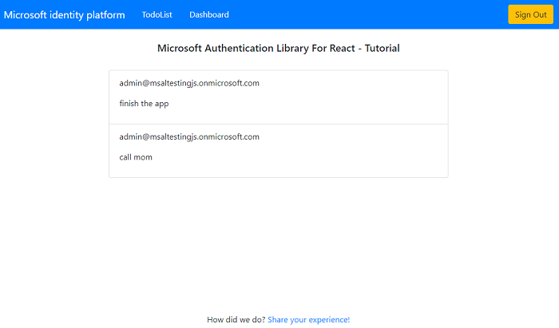
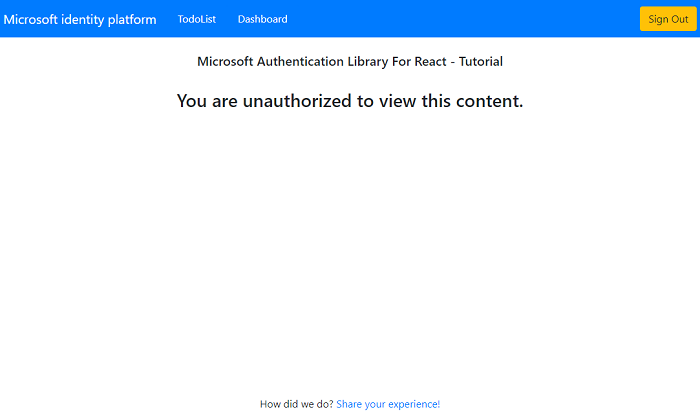

# Add authorization using App roles to a React single-page app that signs-in users and calls a protected Node.js Web Api

* [Overview](#overview)
* [Scenario](#scenario)
* [Contents](#contents)
* [Prerequisites](#prerequisites)
* [Setup the sample](#setup-the-sample)
* [Explore the sample](#explore-the-sample)
* [Troubleshooting](#troubleshooting)
* [About the code](#about-the-code)
* [Next Steps](#next-steps)
* [Contributing](#contributing)
* [Learn More](#learn-more)

## Overview

This sample demonstrates a cross-platform application suite involving an React single-page application (*TodoListSPA*) calling an Node.js & Express web API (*TodoListAPI*) secured with the Microsoft identity platform. In doing so, it implements **Role-based Access Control** (RBAC) by using Azure AD **App Roles**.

Role based access control in Azure AD can be done with **Delegated** and **App** permissions and **Security Groups** as well. we will cover RBAC using Security Groups in the [next tutorial](../2-call-api-groups/README.md). **Delegated** and **App** permissions, **Security Groups** and **App Roles** in Azure AD are by no means mutually exclusive - they can be used in tandem to provide even finer grained access control.

> :information_source: See the community call: [Deep dive on using MSAL.js to integrate React Single-page applications with Azure Active Directory](https://www.youtube.com/watch?v=7oPSL5wWeS0)

> :information_source: See the community call: [Implement authorization in your applications with the Microsoft identity platform](https://www.youtube.com/watch?v=LRoc-na27l0)

## Scenario

In the sample, a **dashboard** component allows signed-in users to see the tasks assigned to users and is only accessible by users assigned to **app role** named **TaskAdmin**. A user needs to be assigned an app role **TaskUser** to be able to create tasks for themselves

* The **TodoListSPA** uses [MSAL React](https://github.com/AzureAD/microsoft-authentication-library-for-js/tree/dev/lib/msal-react) to authenticate a user with the Microsoft identity platform.
* The app then obtains an [access token](https://aka.ms/access-tokens) from Azure AD on behalf of the authenticated user for the **TodoListAPI**. The API maintains the To-Do list and ensures access to the right users based on permissions
* **TodoListAPI** uses [passport-azure-ad](https://github.com/AzureAD/passport-azure-ad) to protect its endpoint and accept only authorized calls.
* **TodoListAPI** maintains the To-Do list and ensures access to the right users based on [permissions](https://docs.microsoft.com/azure/active-directory/develop/v2-permissions-and-consent#permission-types).


## Contents

| File/folder                         | Description                                                                   |
|-------------------------------------|-------------------------------------------------------------------------------|
| `SPA/src/authConfig.js`             | Authentication parameters for SPA project reside here.                        |
| `SPA/src/components/RouteGuard.jsx` | This component protects other components that require a user to be in a role. |
| `SPA/src/index.js`                  | MSAL React is initialized here.                                               |
| `API/authConfig.json`               | Authentication parameters for web API project.                                |
| `API/auth/guard.js`                 | Custom middleware protecting app routes that require a user to be in a role.  |
| `API/app.js`                        | passport-azure-ad is initialized here.                                        |

## Prerequisites

* [Node.js](https://nodejs.org/en/download/) must be installed to run this sample.
* [Visual Studio Code](https://code.visualstudio.com/download) is recommended for running and editing this sample.
* [VS Code Azure Tools](https://marketplace.visualstudio.com/items?itemName=ms-vscode.vscode-node-azure-pack) extension is recommended for interacting with Azure through VS Code Interface.
* A modern web browser. This sample uses **ES6** conventions and will not run on **Internet Explorer**.
* An **Azure AD** tenant. For more information, see: [How to get an Azure AD tenant](https://docs.microsoft.com/azure/active-directory/develop/test-setup-environment#get-a-test-tenant)
* A user account in your **Azure AD** tenant. This sample will not work with a **personal Microsoft account**. If you're signed in to the [Azure portal](https://portal.azure.com) with a personal Microsoft account and have not created a user account in your directory before, you will need to create one before proceeding.

## Setup the sample

### Step 1: Clone or download this repository

From your shell or command line:

```console
git clone https://github.com/Azure-Samples/ms-identity-javascript-react-tutorial.git
```

or download and extract the repository *.zip* file.

> :warning: To avoid path length limitations on Windows, we recommend cloning into a directory near the root of your drive.

### Step 2. Install Express web API dependencies

```console
    cd 5-AccessControl\1-call-api-roles\API
    npm install
```

### Step 3. Install React SPA dependencies

```console
    cd  5-AccessControl\1-call-api-roles\SPA
    npm install
```

### Step 3: Register the sample application(s) in your tenant

> :information_source: While there are multiple projects in this sample, we'd register just one app with Azure AD and use the registered app's *client id* in both apps. This reuse of app ids (client ids) is used when the apps themselves are just components of one larger app topology.  

There is one project in this sample. To register it, you can:

- follow the steps below for manually register your apps
- or use PowerShell scripts that:
  - **automatically** creates the Azure AD applications and related objects (passwords, permissions, dependencies) for you.
  - modify the projects' configuration files.

  <details>
   <summary>Expand this section if you want to use this automation:</summary>

    > :warning: If you have never used **Microsoft Graph PowerShell** before, we recommend you go through the [App Creation Scripts Guide](./AppCreationScripts/AppCreationScripts.md) once to ensure that your environment is prepared correctly for this step.
  
    1. On Windows, run PowerShell as **Administrator** and navigate to the root of the cloned directory
    1. In PowerShell run:

       ```PowerShell
       Set-ExecutionPolicy -ExecutionPolicy RemoteSigned -Scope Process -Force
       ```

    1. Run the script to create your Azure AD application and configure the code of the sample application accordingly.
    1. For interactive process -in PowerShell, run:

       ```PowerShell
       cd .\AppCreationScripts\
       .\Configure.ps1 -TenantId "[Optional] - your tenant id" -AzureEnvironmentName "[Optional] - Azure environment, defaults to 'Global'"
       ```

    > Other ways of running the scripts are described in [App Creation Scripts guide](./AppCreationScripts/AppCreationScripts.md). The scripts also provide a guide to automated application registration, configuration and removal which can help in your CI/CD scenarios.

  </details>

#### Choose the Azure AD tenant where you want to create your applications

To manually register the apps, as a first step you'll need to:

1. Sign in to the [Azure portal](https://portal.azure.com).
1. If your account is present in more than one Azure AD tenant, select your profile at the top right corner in the menu on top of the page, and then **switch directory** to change your portal session to the desired Azure AD tenant.

#### Register the client app (msal-react-spa)

> :information_source: Below, we are using a single app registration for both SPA and web API projects.

1. Navigate to the [Azure portal](https://portal.azure.com) and select the **Azure Active Directory** service.
1. Select the **App Registrations** blade on the left, then select **New registration**.
1. In the **Register an application page** that appears, enter your application's registration information:
    1. In the **Name** section, enter a meaningful application name that will be displayed to users of the app, for example `msal-react-spa`.
    1. Under **Supported account types**, select **Accounts in this organizational directory only**
    1. Select **Register** to create the application.
1. In the **Overview** blade, find and note the **Application (client) ID**. You use this value in your app's configuration file(s) later in your code.
1. In the app's registration screen, select the **Authentication** blade to the left.
1. If you don't have a platform added, select **Add a platform** and select the **Single-page application** option.
    1. In the **Redirect URI** section enter the following redirect URIs:
        1. `http://localhost:3000/`
        1. `http://localhost:3000/redirect`
    1. Click **Save** to save your changes.
1. In the app's registration screen, select the **Expose an API** blade to the left to open the page where you can publish the permission as an API for which client applications can obtain [access tokens](https://aka.ms/access-tokens) for. The first thing that we need to do is to declare the unique [resource](https://docs.microsoft.com/azure/active-directory/develop/v2-oauth2-auth-code-flow) URI that the clients will be using to obtain access tokens for this API. To declare an resource URI(Application ID URI), follow the following steps:
    1. Select **Set** next to the **Application ID URI** to generate a URI that is unique for this app.
    1. For this sample, accept the proposed Application ID URI (`api://{clientId}`) by selecting **Save**. Read more about Application ID URI at [Validation differences by supported account types \(signInAudience\)](https://docs.microsoft.com/azure/active-directory/develop/supported-accounts-validation).

##### Publish Delegated Permissions

1. All APIs must publish a minimum of one [scope](https://docs.microsoft.com/azure/active-directory/develop/v2-oauth2-auth-code-flow#request-an-authorization-code), also called [Delegated Permission](https://docs.microsoft.com/azure/active-directory/develop/v2-permissions-and-consent#permission-types), for the client apps to obtain an access token for a *user* successfully. To publish a scope, follow these steps:
1. Select **Add a scope** button open the **Add a scope** screen and Enter the values as indicated below:
    1. For **Scope name**, use `access_via_approle_assignments`.
    1. Select **Admins and users** options for **Who can consent?**.
    1. For **Admin consent display name** type in *Access 'msal-react-spa' as the signed-in user assigned to App role*.
    1. For **Admin consent description** type in *Allow the app to access the 'msal-react-spa' as a signed-in user assigned to one or more App roles*.
    1. For **User consent display name** type in *Access 'msal-react-spa' on your behalf after App role assignment*.
    1. For **User consent description** type in *Allow the app to access the 'msal-react-spa' on your behalf after assignment to one or more App roles*.
    1. Keep **State** as **Enabled**.
    1. Select the **Add scope** button on the bottom to save this scope.
1. Select the **Manifest** blade on the left.
    1. Set `accessTokenAcceptedVersion` property to **2**.
    1. Select on **Save**.

> :information_source:  Follow  [the principle of least privilege](https://docs.microsoft.com/azure/active-directory/develop/secure-least-privileged-access) whenever you are publishing permissions for a web API.

##### Grant Delegated Permissions to msal-react-spa

1. Since this app signs-in users, we will now proceed to select **delegated permissions**, which is is required by apps signing-in users.
   1. In the app's registration screen, select the **API permissions** blade in the left to open the page where we add access to the APIs that your application needs:
   1. Select the **Add a permission** button and then:
   1. Ensure that the **My APIs** tab is selected.
   1. In the list of APIs, select the API `msal-react-spa`.
   1. In the **Delegated permissions** section, select **access_via_approle_assignments** in the list. Use the search box if necessary.
   1. Select the **Add permissions** button at the bottom.

##### Publish Application Roles for users and groups

1. Still on the same app registration, select the **App roles** blade to the left.
1. Select **Create app role**:
    1. For **Display name**, enter a suitable name, for instance **TaskAdmin**.
    1. For **Allowed member types**, choose **User**.
    1. For **Value**, enter **TaskAdmin**.
    1. For **Description**, enter **Admins can read and write any user's todo list**.
    > Repeat the steps above for another role named **TaskUser**
    1. Select **Apply** to save your changes.

To add users to this app role, follow the guidelines here: [Assign users and groups to roles](https://docs.microsoft.com/azure/active-directory/develop/howto-add-app-roles-in-azure-ad-apps#assign-users-and-groups-to-roles).

> :bulb: **Important security tip**
>
> When you set **User assignment required?** to **Yes**, Azure AD will check that only users assigned to your application in the **Users and groups** blade are able to sign-in to your app. You can assign users directly or by assigning security groups they belong to.

For more information, see: [How to: Add app roles in your application and receive them in the token](https://docs.microsoft.com/azure/active-directory/develop/howto-add-app-roles-in-azure-ad-apps)

##### Configure Optional Claims

1. Still on the same app registration, select the **Token configuration** blade to the left.
1. Select **Add optional claim**:
    1. Select **optional claim type**, then choose **ID**.
    1. Select the optional claim **acct**. 
    > Provides user's account status in tenant. If the user is a **member** of the tenant, the value is 0. If they're a **guest**, the value is 1.
    1. Select **Add** to save your changes

##### Configure the client app (msal-react-spa) to use your app registration

Open the project in your IDE (like Visual Studio or Visual Studio Code) to configure the code.

> In the steps below, "ClientID" is the same as "Application ID" or "AppId".

1. Open the `API\authConfig.js` file.
1. Find the key `tenantID` and replace the existing value with your Azure AD tenant/directory ID.
1. Find the key `clientID` and replace the existing value with the application ID (clientId) of `msal-react-spa` app copied from the Azure portal.

1. Open the `SPA\src\authConfig.js` file.
1. Find the key `Enter_the_Application_Id_Here` and replace the existing value with the application ID (clientId) of `msal-react-spa` app copied from the Azure portal.
1. Find the key `Enter_the_Tenant_Info_Here` and replace the existing value with your Azure AD tenant/directory ID.
1. Find the key `Enter_the_Web_Api_App_Id_Uri_Here` and replace the existing value with the application ID (clientId) of `msal-react-spa` app copied from the Azure portal.

### Step 5: Running the sample

From your shell or command line, execute the following commands:

```console
   cd 5-AccessControl\1-call-api-roles\SPA
   npm start
```

In a separate console window, execute the following commands:

```console
   cd 5-AccessControl\1-call-api-roles\API
   npm start
```

## Explore the sample

1. Open your browser and navigate to `http://localhost:3000`.
1. Sign-in using the button on top-right:


1. Click on the **TodoList** button to access your (the signed-in user's) todo list:


1. If the signed-in user has the right privileges (i.e. in the right "role"), click on the **Dashboard** button to access every users' todo list:



1. If the signed-in user does not have the right privileges, clicking on the **Dashboard** will give an error:



> :information_source: Did the sample not work for you as expected? Then please reach out to us using the [GitHub Issues](../../../../issues) page.

## We'd love your feedback!

Were we successful in addressing your learning objective? Consider taking a moment to [share your experience with us]([Enter_Survey_Form_Link](https://forms.office.com/Pages/ResponsePage.aspx?id=v4j5cvGGr0GRqy180BHbR73pcsbpbxNJuZCMKN0lURpUMlRHSkc5U1NLUkxFNEtVN0dEOTFNQkdTWiQlQCN0PWcu)).

## Troubleshooting

<details>
 <summary>Expand for troubleshooting info</summary>

> * Use [Stack Overflow](http://stackoverflow.com/questions/tagged/msal) to get support from the community.
Ask your questions on Stack Overflow first and browse existing issues to see if someone has asked your question before.
Make sure that your questions or comments are tagged with [`azure-active-directory` `react` `ms-identity` `adal` `msal`].

If you find a bug in the sample, raise the issue on [GitHub Issues](../../../../issues).
</details>

## About the code

### React RouteGuard component

The client application React SPA has a [RouteGuard](./SPA/src/components/RouteGuard.jsx) component that checks whether a user has the right privileges to access a protected route. It does this by checking `roles` claim in the ID token of the signed-in user:

```javascript
export const RouteGuard = ({ ...props }) => {
    const { instance } = useMsal();
    const [isAuthorized, setIsAuthorized] = useState(false);

    const onLoad = async () => {
        const currentAccount = instance.getActiveAccount();

        if (currentAccount && currentAccount.idTokenClaims['roles']) {
            let intersection = props.roles.filter((role) => currentAccount.idTokenClaims['roles'].includes(role));

            if (intersection.length > 0) {
                setIsAuthorized(true);
            }
        }
    };

    useEffect(() => {
        onLoad();
    }, [instance]);
    return (
        <>
            {isAuthorized ? (
                <div>{props.children}</div>
            ) : (
                <div className="data-area-div">
                    <h3>You are unauthorized to view this content.</h3>
                </div>
            )}
        </>
    );
};
```

We then enable **RouteGuard** in [App.jsx](./SPA/src/App.jsx) as follows:

```javascript
const Pages = () => {
    return (
        <Routes>
            <Route
                exact
                path="/todolist"
                element={
                    <RouteGuard roles={[appRoles.TaskUser, appRoles.TaskAdmin]}>
                        <TodoList />
                    </RouteGuard>
                }
            />
            <Route
                exact
                path="/dashboard"
                element={
                    <RouteGuard roles={[appRoles.TaskAdmin]}>
                        <Dashboard />
                    </RouteGuard>
                }
            />
            <Route path="/redirect" element={<Redirect />} />
            <Route path="/" element={<Home />} />
        </Routes>
    );
};
```

However, it is important to be aware of that no content on the front-end application can be **truly** secure. That is, our **RouteGuard** component is primarily responsible for rendering the correct pages and other UI elements for a user in a particular role; in the example above, we allow only users in the `TaskAdmin` role to see the `Dashboard` component. In order to **truly** protect data and expose certain REST operations to a selected set of users, we enable **RBAC** on the back-end/web API as well in this sample. This is shown next.

### Express routeGuard middleware

As mentioned before, in order to **truly** implement **RBAC** and secure data, we allow only authorized calls to our web API. We do this by defining an *access matrix* and protecting our routes with a `routeGuard` custom middleware (see [guard](./API/auth/guard.js)):

```javascript
const routeGuard = (accessMatrix) => {
    return (req, res, next) => {
        if (!req.authInfo.hasOwnProperty('roles')) {
            return res.status(403).json({ error: 'No roles claim found!' });
        }

        const roles = req.authInfo['roles'];

        if (!requestHasRequiredAttributes(accessMatrix, req.path, req.method, roles)) {
            return res.status(403).json({ error: 'User does not have the role, method or path' });
        }

        next();
    };
};
```

We defined these roles in [authConfig.js](./API/authConfig.js) as follows:

```javascript
 accessMatrix: {
        todolist: {
            path: '/todolist',
            methods: ['GET', 'POST', 'PUT', 'DELETE'],
            roles: ['TaskUser', 'TaskAdmin'],
        },
        dashboard: {
            path: '/dashboard',
            methods: ['GET'],
            roles: ['TaskAdmin'],
        },
    },
```

Finally, in [app.js](./API/app.js), we add the routeGuard middleware to `/api` route:

```javascript
const bearerStrategy = new BearerStrategy(options, (token, done) => {
    // Send user info using the second argument
    done(null, {}, token);
});

const app = express();

app.use(passport.initialize());

passport.use(bearerStrategy);

app.use('/api',
    passport.authenticate('oauth-bearer', { session: false }),
    roleGuard(config.accessMatrix),
    router
);

app.listen(port, () => {
    console.log('Listening on port ' + port);
});
```

> :information_source: Did the sample not work for you as expected? Then please reach out to us using the [GitHub Issues](../../../../issues) page.

## Next Steps

Learn how to:

* [Use MSAL React to call a protected web API using Security Groups to implement Role-Based Access Control](https://github.com/Azure-Samples/ms-identity-javascript-react-tutorial/tree/main/5-AccessControl/2-call-api-groups)
* [Use MSAL React to call a protected web API using Conditional Access auth context to perform step-up authentication](https://github.com/Azure-Samples/ms-identity-javascript-react-tutorial/tree/main/6-AdvancedScenarios/3-call-api-acrs)
* [Sign-in users interactively server-side (Node.js) and silently acquire a token for MS Graph from a React single-page app (SPA)](https://github.com/Azure-Samples/ms-identity-javascript-react-tutorial/tree/main/6-AdvancedScenarios/4-sign-in-hybrid)

## Contributing

If you'd like to contribute to this sample, see [CONTRIBUTING.MD](/CONTRIBUTING.md).

This project has adopted the [Microsoft Open Source Code of Conduct](https://opensource.microsoft.com/codeofconduct/). For more information, see the [Code of Conduct FAQ](https://opensource.microsoft.com/codeofconduct/faq/) or contact [opencode@microsoft.com](mailto:opencode@microsoft.com) with any additional questions or comments.

## Learn More

* [Microsoft identity platform (Azure Active Directory for developers)](https://docs.microsoft.com/azure/active-directory/develop/)
* [Overview of Microsoft Authentication Library (MSAL)](https://docs.microsoft.com/azure/active-directory/develop/msal-overview)
* [Register an application with the Microsoft identity platform](https://docs.microsoft.com/azure/active-directory/develop/quickstart-register-app)
* [Configure a client application to access web APIs](https://docs.microsoft.com/azure/active-directory/develop/quickstart-configure-app-access-web-apis)
* [Understanding Azure AD application consent experiences](https://docs.microsoft.com/azure/active-directory/develop/application-consent-experience)
* [Understand user and admin consent](https://docs.microsoft.com/azure/active-directory/develop/howto-convert-app-to-be-multi-tenant#understand-user-and-admin-consent)
* [Application and service principal objects in Azure Active Directory](https://docs.microsoft.com/azure/active-directory/develop/app-objects-and-service-principals)
* [Authentication Scenarios for Azure AD](https://docs.microsoft.com/azure/active-directory/develop/authentication-flows-app-scenarios)
* [Building Zero Trust ready apps](https://aka.ms/ztdevsession)
* [National Clouds](https://docs.microsoft.com/azure/active-directory/develop/authentication-national-cloud#app-registration-endpoints)
* [Azure AD code samples](https://docs.microsoft.com/azure/active-directory/develop/sample-v2-code)
* [Initialize client applications using MSAL.js](https://docs.microsoft.com/azure/active-directory/develop/msal-js-initializing-client-applications)
* [Single sign-on with MSAL.js](https://docs.microsoft.com/azure/active-directory/develop/msal-js-sso)
* [Handle MSAL.js exceptions and errors](https://docs.microsoft.com/azure/active-directory/develop/msal-handling-exceptions?tabs=javascript)
* [Logging in MSAL.js applications](https://docs.microsoft.com/azure/active-directory/develop/msal-logging?tabs=javascript)
* [Pass custom state in authentication requests using MSAL.js](https://docs.microsoft.com/azure/active-directory/develop/msal-js-pass-custom-state-authentication-request)
* [Prompt behavior in MSAL.js interactive requests](https://docs.microsoft.com/azure/active-directory/develop/msal-js-prompt-behavior)
* [Use MSAL.js to work with Azure AD B2C](https://docs.microsoft.com/azure/active-directory/develop/msal-b2c-overview)
