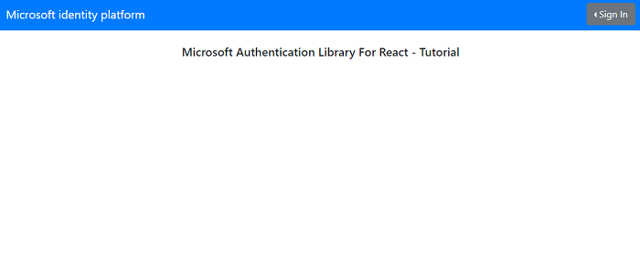

# React single-page application calling a protected Node.js & Express web API using Security Groups to implement Role-Based Access Control

- [Overview](#overview)
- [Scenario](#scenario)
- [Contents](#contents)
- [Prerequisites](#prerequisites)
- [Setup the sample](#setup-the-sample)
- [Explore the sample](#explore-the-sample)
- [We'd love your feedback!](#wed-love-your-feedback)
- [Troubleshooting](#troubleshooting)
- [About the code](#about-the-code)
  - [The Groups Overage Claim](#the-groups-overage-claim)
- [Next Steps](#next-steps)
- [Contributing](#contributing)
- [Learn More](#learn-more)

## Overview

This sample demonstrates a cross-platform application suite involving an React single-page application (*TodoListSPA*) calling an Node.js web API (*TodoListAPI*) secured with the Microsoft identity platform. In doing so, it implements **Role-based Access Control** (RBAC) by using Azure AD **[Security Groups](https://learn.microsoft.com/azure/active-directory/fundamentals/how-to-manage-groups)**.

Role based access control in Azure AD can be done with **Delegated** and **App** permissions and **App Roles** as well. We cover RBAC using App Roles in the [previous tutorial](../1-call-api-roles/README.md). **Delegated** and **App** permissions, **Security Groups** and **App Roles** in Azure AD are by no means mutually exclusive - they can be used in tandem to provide even finer grained access control.

> :information_source: See the community call: [Deep dive on using MSAL.js to integrate React single-page applications with Azure Active Directory](https://www.youtube.com/watch?v=7oPSL5wWeS0)

> :information_source: See the community call: [Implement authorization in your applications with App roles and Security Groups with the Microsoft identity platform](https://www.youtube.com/watch?v=LRoc-na27l0)

## Scenario

In the sample, a dashboard component allows signed-in users to see the tasks assigned to them or other users based on their memberships to one of the two security groups, **GroupAdmin** and **GroupMember**.

1. The **TodoListSPA** uses [MSAL React](https://github.com/AzureAD/microsoft-authentication-library-for-js/tree/dev/lib/msal-react) to authenticate a user with the Microsoft identity platform.
1. The app then obtains an [access token](https://docs.microsoft.com/azure/active-directory/develop/access-tokens) from Azure Active Directory (Azure AD) on behalf of the authenticated user for the **TodoListAPI**.
1. **TodoListAPI** uses [passport-azure-ad](https://github.com/AzureAD/passport-azure-ad) to protect its endpoint and accept only authorized calls.


## Contents

| File/folder          | Description                                                                                  |
|----------------------|----------------------------------------------------------------------------------------------|
| `SPA/src/authConfig.js`             | Authentication parameters for SPA project reside here.                        |
| `SPA/src/components/RouteGuard.jsx` | This component protects other components that require a user to be in a group.|
| `SPA/src/pages/Overage.jsx`         | This component handles overage scenarios.                                     |
| `SPA/src/index.js`                  | MSAL React is initialized here.                                               |
| `API/authConfig.json`               | Authentication parameters for web API project.                                |
| `API/auth/guard.js`                 | Custom middleware protecting app routes that require a user to be in a group. |
| `API/auth/overage.js`               | Custom middleware for handling overage scenarios.                             |
| `API/app.js`                        | passport-azure-ad is initialized here.                                        |

## Prerequisites

* [Node.js](https://nodejs.org/en/download/) must be installed to run this sample.
* [Visual Studio Code](https://code.visualstudio.com/download) is recommended for running and editing this sample.
* [VS Code Azure Tools](https://marketplace.visualstudio.com/items?itemName=ms-vscode.vscode-node-azure-pack) extension is recommended for interacting with Azure through VS Code Interface.
* A modern web browser. This sample uses **ES6** conventions and will not run on **Internet Explorer**.
* An **Azure AD** tenant. For more information, see: [How to get an Azure AD tenant](https://docs.microsoft.com/azure/active-directory/develop/test-setup-environment#get-a-test-tenant)
* A user account in your **Azure AD** tenant. This sample will not work with a **personal Microsoft account**. If you're signed in to the [Azure portal](https://portal.azure.com) with a personal Microsoft account and have not created a user account in your directory before, you will need to create one before proceeding.

## Setup the sample

### Step 1: Clone or download this repository

From your shell or command line:

```console
git clone https://github.com/Azure-Samples/ms-identity-javascript-react-tutorial.git
```

or download and extract the repository *.zip* file.

> :warning: To avoid path length limitations on Windows, we recommend cloning into a directory near the root of your drive.

### Step 2: Install project dependencies

```console
    cd 5-AccessControl\2-call-api-groups\API
    npm install
```

```console
    cd 5-AccessControl\2-call-api-groups\SPA
    npm install
```

### Step 3: Register the sample application(s) in your tenant

> :information_source: While there are multiple projects in this sample, we'd register just one app with Azure AD and use the registered app's *client id* in both apps. This reuse of app ids (client ids) is used when the apps themselves are just components of one larger app topology.  

There is one project in this sample. To register it, you can:

- follow the steps below for manually register your apps
- or use PowerShell scripts that:
  - **automatically** creates the Azure AD applications and related objects (passwords, permissions, dependencies) for you.
  - modify the projects' configuration files.

  <details>
   <summary>Expand this section if you want to use this automation:</summary>

    > :warning: If you have never used **Microsoft Graph PowerShell** before, we recommend you go through the [App Creation Scripts Guide](./AppCreationScripts/AppCreationScripts.md) once to ensure that your environment is prepared correctly for this step.
  
    1. On Windows, run PowerShell as **Administrator** and navigate to the root of the cloned directory
    1. In PowerShell run:

       ```PowerShell
       Set-ExecutionPolicy -ExecutionPolicy RemoteSigned -Scope Process -Force
       ```

    1. Run the script to create your Azure AD application and configure the code of the sample application accordingly.
    1. For interactive process -in PowerShell, run:

       ```PowerShell
       cd .\AppCreationScripts\
       .\Configure.ps1 -TenantId "[Optional] - your tenant id" -AzureEnvironmentName "[Optional] - Azure environment, defaults to 'Global'"
       ```

    > Other ways of running the scripts are described in [App Creation Scripts guide](./AppCreationScripts/AppCreationScripts.md). The scripts also provide a guide to automated application registration, configuration and removal which can help in your CI/CD scenarios.

  </details>

#### Choose the Azure AD tenant where you want to create your applications

To manually register the apps, as a first step you'll need to:

1. Sign in to the [Azure portal](https://portal.azure.com).
1. If your account is present in more than one Azure AD tenant, select your profile at the top right corner in the menu on top of the page, and then **switch directory** to change your portal session to the desired Azure AD tenant.

#### Register the client app (msal-react-app)

> :information_source: Below, we are using a single app registration for both SPA and web API projects. We will configure the web API to accept only the calls coming from this client SPA.

1. Navigate to the [Azure portal](https://portal.azure.com) and select the **Azure Active Directory** service.
1. Select the **App Registrations** blade on the left, then select **New registration**.
1. In the **Register an application page** that appears, enter your application's registration information:
    1. In the **Name** section, enter a meaningful application name that will be displayed to users of the app, for example `msal-react-app`.
    1. Under **Supported account types**, select **Accounts in this organizational directory only**
    1. Select **Register** to create the application.
1. In the **Overview** blade, find and note the **Application (client) ID**. You use this value in your app's configuration file(s) later in your code.
1. In the app's registration screen, select the **Authentication** blade to the left.
1. If you don't have a platform added, select **Add a platform** and select the **Single-page application** option.
    1. In the **Redirect URI** section enter the following redirect URIs:
        1. `http://localhost:3000/`
        1. `http://localhost:3000/redirect.html`
    1. Click **Save** to save your changes.
1. In the app's registration screen, select the **Certificates & secrets** blade in the left to open the page where you can generate secrets and upload certificates.
1. In the **Client secrets** section, select **New client secret**:
    1. Type a key description (for instance `app secret`).
    1. Select one of the available key durations (**6 months**, **12 months** or **Custom**) as per your security posture.
    1. The generated key value will be displayed when you select the **Add** button. Copy and save the generated value for use in later steps.
    1. You'll need this key later in your code's configuration files. This key value will not be displayed again, and is not retrievable by any other means, so make sure to note it from the Azure portal before navigating to any other screen or blade.
    > :bulb: For enhanced security, instead of using client secrets, consider [using certificates](https://github.com/AzureAD/microsoft-authentication-library-for-js/blob/dev/lib/msal-node/docs/certificate-credentials.md) and [Azure KeyVault](https://github.com/AzureAD/microsoft-authentication-library-for-js/blob/dev/lib/msal-node/docs/key-vault-managed-identity.md).
1. In the app's registration screen, select the **Expose an API** blade to the left to open the page where you can publish the permission as an API for which client applications can obtain [access tokens](https://aka.ms/access-tokens) for. The first thing that we need to do is to declare the unique [resource](https://docs.microsoft.com/azure/active-directory/develop/v2-oauth2-auth-code-flow) URI that the clients will be using to obtain access tokens for this API. To declare an resource URI(Application ID URI), follow the following steps:
    1. Select **Set** next to the **Application ID URI** to generate a URI that is unique for this app.
    1. For this sample, accept the proposed Application ID URI (`api://{clientId}`) by selecting **Save**. Read more about Application ID URI at [Validation differences by supported account types \(signInAudience\)](https://docs.microsoft.com/azure/active-directory/develop/supported-accounts-validation).

##### Publish Delegated Permissions

1. All APIs must publish a minimum of one [scope](https://docs.microsoft.com/azure/active-directory/develop/v2-oauth2-auth-code-flow#request-an-authorization-code), also called [Delegated Permission](https://docs.microsoft.com/azure/active-directory/develop/v2-permissions-and-consent#permission-types), for the client apps to obtain an access token for a *user* successfully. To publish a scope, follow these steps:
1. Select **Add a scope** button open the **Add a scope** screen and Enter the values as indicated below:
    1. For **Scope name**, use `access_via_group_assignments`.
    1. Select **Admins and users** options for **Who can consent?**.
    1. For **Admin consent display name** type in *Access 'msal-react-app' as the signed-in user assigned to group memberships*.
    1. For **Admin consent description** type in *Allow the app to access the 'msal-react-app' as a signed-in user assigned to one or more security groups*.
    1. For **User consent display name** type in *Access 'msal-react-app' on your behalf after security group assignment*.
    1. For **User consent description** type in *Allow the app to access the 'msal-react-app' on your behalf after assignment to one or more security groups*.
    1. Keep **State** as **Enabled**.
    1. Select the **Add scope** button on the bottom to save this scope.
1. Select the **Manifest** blade on the left.
    1. Set `accessTokenAcceptedVersion` property to **2**.
    1. Select on **Save**.

> :information_source:  Follow [the principle of least privilege when publishing permissions](https://learn.microsoft.com/security/zero-trust/develop/protected-api-example) for a web API.

##### Grant Delegated Permissions to msal-react-app

1. Since this app signs-in users, we will now proceed to select **delegated permissions**, which is is required by apps signing-in users.
1. In the app's registration screen, select the **API permissions** blade in the left to open the page where we add access to the APIs that your application needs:
    1. Select the **Add a permission** button and then:
        1. Ensure that the **My APIs** tab is selected.
        1. In the list of APIs, select the API `msal-react-app`.
        1. In the **Delegated permissions** section, select **access_via_group_assignments** in the list. Use the search box if necessary.
        1. Select the **Add permissions** button at the bottom.
    1. Select the **Add a permission** button and then:
        1. Ensure that the **Microsoft APIs** tab is selected.
        1. In the *Commonly used Microsoft APIs* section, select **Microsoft Graph**
        1. In the **Delegated permissions** section, select **User.Read**, **GroupMember.Read.All** in the list. Use the search box if necessary.
        1. Select the **Add permissions** button at the bottom.

> :warning: To handle the groups overage scenario, please grant [admin consent](https://learn.microsoft.com/azure/active-directory/manage-apps/grant-admin-consent?source=recommendations#grant-admin-consent-in-app-registrations) to the Microsoft Graph **GroupMember.Read.All** [permission](https://learn.microsoft.com/graph/permissions-reference). See the section on how to [create the overage scenario for testing](#create-the-overage-scenario-for-testing) below for more.

##### Configure Optional Claims

1. Still on the same app registration, select the **Token configuration** blade to the left.
1. Select **Add optional claim**:
    1. Select **optional claim type**, then choose **ID**.
    1. Select the optional claim **acct**.
    > Provides user's account status in tenant. If the user is a **member** of the tenant, the value is *0*. If they're a **guest**, the value is *1*.
    1. Select **Add** to save your changes.

##### Configure the client app (msal-react-app) to use your app registration

Open the project in your IDE (like Visual Studio or Visual Studio Code) to configure the code.

> In the steps below, "ClientID" is the same as "Application ID" or "AppId".

1. Open the `API\authConfig.json` file.
1. Find the key `Enter_the_Tenant_Info_Here` and replace the existing value with your Azure AD tenant/directory ID.
1. Find the key `Enter_the_Application_Id_Here` and replace the existing value with the application ID (clientId) of `msal-react-app` app copied from the Azure portal.
1. Find the key `Enter_the_Client_Secret_Here` and replace the existing value with the key you saved during the creation of `msal-react-app` copied from the Azure portal.

1. Open the `SPA\src\authConfig.js` file.
1. Find the key `Enter_the_Application_Id_Here` and replace the existing value with the application ID (clientId) of `msal-react-app` app copied from the Azure portal.
1. Find the key `Enter_the_Tenant_Info_Here` and replace the existing value with your Azure AD tenant/directory ID.
1. Find the key `Enter_the_Web_Api_Application_Id_Here` and replace the existing value with the application ID (clientId) of `msal-react-app` app copied from the Azure portal.

### Create Security Groups

> :warning: You may already have security groups with the names defined below in your tenant and/or you may not have permissions to create new security groups. In that case, skip the steps below and update the configuration files in your project(s) with the desired names/IDs of existing groups in your tenant.

1. Navigate to the [Azure portal](https://portal.azure.com) and select the **Azure Active Directory** service.
1. Select **Groups** blade on the left.
1. In the **Groups** blade, select **New Group**.
    1. For **Group Type**, select **Security**
    1. For **Group Name**, enter **GroupAdmin**
    1. For **Group Description**, enter **Admin Security Group**
    1. Add **Group Owners** and **Group Members** as you see fit.
    1. Select **Create**.
1. In the **Groups** blade, select **New Group**.
    1. For **Group Type**, select **Security**
    1. For **Group Name**, enter **GroupMember**
    1. For **Group Description**, enter **User Security Group**
    1. Add **Group Owners** and **Group Members** as you see fit.
    1. Select **Create**.
1. Assign the user accounts that you plan to work with to these security groups.

For more information, visit: [Create a basic group and add members using Azure AD](https://docs.microsoft.com/azure/active-directory/fundamentals/active-directory-groups-create-azure-portal)

### Configure Security Groups

You have two different options available to you on how you can further configure your application to receive the `groups` claim.

1. [Receive **all the groups** that the signed-in user is assigned to in an Azure AD tenant, included nested groups](#configure-your-application-to-receive-all-the-groups-the-signed-in-user-is-assigned-to-including-nested-groups).
2. [Receive the **groups** claim values from a **filtered set of groups** that your application is programmed to work with](#configure-your-application-to-receive-the-groups-claim-values-from-a-filtered-set-of-groups-a-user-may-be-assigned-to) (Not available in the [Azure AD Free edition](https://azure.microsoft.com/pricing/details/active-directory/)).

> To get the on-premise group's `samAccountName` or `On Premises Group Security Identifier` instead of Group ID, please refer to the document [Configure group claims for applications with Azure Active Directory](https://docs.microsoft.com/azure/active-directory/hybrid/how-to-connect-fed-group-claims#prerequisites-for-using-group-attributes-synchronized-from-active-directory).

#### Configure your application to receive **all the groups** the signed-in user is assigned to, including nested groups

1. In the app's registration screen, select the **Token Configuration** blade in the left to open the page where you can configure the claims provided tokens issued to your application.
1. Select the **Add groups claim** button on top to open the **Edit Groups Claim** screen.
1. Select `Security groups` **or** the `All groups (includes distribution lists but not groups assigned to the application)` option. Choosing both negates the effect of `Security Groups` option.
1. Under the **ID** section, select `Group ID`. This will result in Azure AD sending the [object id](https://docs.microsoft.com/graph/api/resources/group?view=graph-rest-1.0) of the groups the user is assigned to in the **groups** claim of the [ID Token](https://docs.microsoft.com/azure/active-directory/develop/id-tokens) that your app receives after signing-in a user.

#### Configure your application to receive the `groups` claim values from a **filtered set of groups** a user may be assigned to

##### Prerequisites, benefits and limitations of using this option

1. This option is useful when your application is interested in a selected set of groups that a signing-in user may be assigned to and not every security group this user is assigned to in the tenant.  This option also saves your application from running into the [overage](#the-groups-overage-claim) issue.
1. This feature is not available in the [Azure AD Free edition](https://azure.microsoft.com/pricing/details/active-directory/).
1. **Nested group assignments** are not available when this option is utilized.

##### Steps to enable this option in your app

1. In the app's registration screen, select the **Token Configuration** blade in the left to open the page where you can configure the claims provided tokens issued to your application.
1. Select the **Add groups claim** button on top to open the **Edit Groups Claim** screen.
1. Select `Groups assigned to the application`.
    1. Choosing additional options like `Security Groups` or `All groups (includes distribution lists but not groups assigned to the application)` will negate the benefits your app derives from choosing to use this option.
1. Under the **ID** section, select `Group ID`. This will result in Azure AD sending the object [id](https://docs.microsoft.com/graph/api/resources/group?view=graph-rest-1.0) of the groups the user is assigned to in the `groups` claim of the [ID Token](https://docs.microsoft.com/azure/active-directory/develop/id-tokens) that your app receives after signing-in a user.
1. If you wish to have 'groups' claims available to *Access Tokens* issued to your Web API, then you can also choose the `Group ID` option under the **Access** section. This will result in Azure AD sending the [Object ID](https://docs.microsoft.com/graph/api/resources/group?view=graph-rest-1.0) of the groups the user is assigned to in the `groups` claim of the [Access Token](https://aka.ms/access-tokens) issued to the client applications of your API.
1. In the app's registration screen, select on the **Overview** blade in the left to open the Application overview screen. Select the hyperlink with the name of your application in **Managed application in local directory** (note this field title can be truncated for instance `Managed application in ...`). When you select this link you will navigate to the **Enterprise Application Overview** page associated with the service principal for your application in the tenant where you created it. You can navigate back to the app registration page by using the *back* button of your browser.
1. Select the **Users and groups** blade in the left to open the page where you can assign users and groups to your application.
    1. Select the **Add user** button on the top row.
    1. Select **User and Groups** from the resultant screen.
    1. Choose the groups that you want to assign to this application.
    1. Click **Select** in the bottom to finish selecting the groups.
    1. Select **Assign** to finish the group assignment process.  
    1. Your application will now receive these selected groups in the `groups` claim when a user signing in to your app is a member of  one or more these **assigned** groups.
1. Select the **Properties** blade in the left to open the page that lists the basic properties of your application.Set the **User assignment required?** flag to **Yes**.

> :bulb: **Important security tip**
>
> When you set **User assignment required?** to **Yes**, Azure AD will check that only users assigned to your application in the **Users and groups** blade are able to sign-in to your app.To enable this, follow the instructions [here](https://docs.microsoft.com/azure/active-directory/manage-apps/assign-user-or-group-access-portal#configure-an-application-to-require-user-assignment). You can assign users directly or by assigning security groups they belong to.

#### Configure the app to recognize Group IDs

> :warning: During **Token Configuration**, if you have chosen any other option except **groupID** (e.g. like **DNSDomain\sAMAccountName**) you should enter the **group name** (for example `contoso.com\Test Group`) instead of the **object ID** below:

1. Open the `SPA\src\authConfig.js` file.
2. Find the key `Enter_the_Object_Id_of_GroupAdmin_Group_Here` and replace the existing value with the **object ID** of the **GroupAdmin** group copied from the Azure portal.
3. Find the key `Enter_the_Object_Id_of_GroupMember_Group_Here` and replace the existing value with the **object ID** of the **GroupMember** group copied from the Azure portal.

4. Open the `API\authConfig.json` file.
5. Find the key `Enter_the_Object_Id_of_GroupAdmin_Group_Here` and replace the existing value with the **object ID** of the **GroupAdmin** group copied from the Azure portal.
6. Find the key `Enter_the_Object_Id_of_GroupMember_Group_Here` and replace the existing value with the **object ID** of the **GroupMember** group copied from the Azure portal.

### Step 4: Running the sample

From your shell or command line, execute the following commands:

```console
    cd 5-AccessControl\2-call-api-groups\API
    npm start
```

```console
    cd 5-AccessControl\2-call-api-groups\SPA
    npm start
```

## Explore the sample

1. Open your browser and navigate to `http://localhost:3000`.
1. Sign-in using the button on top-right:



1. Click on the **TodoList** button to access your (the signed-in user's) todo list:


1. If the signed-in user has the right privileges (i.e. in the right "group"), click on the **Dashboard** button to access every users' todo list:


1. If the signed-in user does not have the right privileges, clicking on the **Dashboard** will give an error:


> :information_source: Did the sample not work for you as expected? Then please reach out to us using the [GitHub Issues](../../../issues) page.

## We'd love your feedback!

Were we successful in addressing your learning objective? Consider taking a moment to [share your experience with us](https://forms.office.com/Pages/ResponsePage.aspx?id=v4j5cvGGr0GRqy180BHbR73pcsbpbxNJuZCMKN0lURpUMlRHSkc5U1NLUkxFNEtVN0dEOTFNQkdTWiQlQCN0PWcu).

## Troubleshooting

<details>
 <summary>Expand for troubleshooting info</summary>

> * Use [Stack Overflow](http://stackoverflow.com/questions/tagged/msal) to get support from the community.
Ask your questions on Stack Overflow first and browse existing issues to see if someone has asked your question before.
Make sure that your questions or comments are tagged with [`azure-active-directory` `react` `ms-identity` `adal` `msal`].

> :information_source: Did the sample not work for you as expected? Then please reach out to us using the [GitHub Issues](../../../../issues).
</details>

## About the code

Much of the specifics of implementing **RBAC** with **Security Groups** is the same with implementing **RBAC** with **App Roles** discussed in the [previous tutorial](../1-call-api-roles/README.md). In order to avoid redundancy, here we discuss particular issues that might arise with using **groups** claim.

### The Groups Overage Claim

To ensure that the token size doesn’t exceed HTTP header size limits, the Microsoft identity platform limits the number of object Ids that it includes in the **groups** claim.

If a user is member of more groups than the overage limit (**150 for SAML tokens, 200 for JWT tokens, 6 for single-page applications using implicit flow**), then the Microsoft identity platform does not emit the group IDs in the `groups` claim in the token. Instead, it includes an **overage** claim in the token that indicates to the application to query the [MS Graph API](https://graph.microsoft.com) to retrieve the user’s group membership.

> We strongly advise you use the [group filtering feature](#configure-your-application-to-receive-the-groups-claim-values-from-a-filtered-set-of-groups-a-user-may-be-assigned-to) (if possible) to avoid running into group overages.

#### Create the Overage Scenario for testing

1. You can use the [BulkCreateGroups.ps1](./AppCreationScripts/BulkCreateGroups.ps1) provided in the [App Creation Scripts](./AppCreationScripts/) folder to create a large number of groups and assign users to them. This will help test overage scenarios during development. You'll need to enter a user's object ID when prompted by the `BulkCreateGroups.ps1` script. If you would like to delete these groups after your testing, run the [BulkRemoveGroups.ps1](./AppCreationScripts/BulkRemoveGroups.ps1).

> When attending to overage scenarios, which requires a call to [Microsoft Graph](https://graph.microsoft.com) to read the signed-in user's group memberships, your app will need to have the [User.Read](https://docs.microsoft.com/graph/permissions-reference#user-permissions) and [GroupMember.Read.All](https://docs.microsoft.com/graph/permissions-reference#group-permissions) for the [getMemberGroups](https://docs.microsoft.com/graph/api/user-getmembergroups) function to execute successfully.

> :warning: For the overage scenario, make sure you have granted **Admin Consent** for the MS Graph API's **GroupMember.Read.All** scope for both the Client and the Service apps (see the **App Registration** steps above).

##### Detecting group overage in your code by examining claims

1. When you run this sample and an overage occurred, then you'd see the `_claim_names` in the home page after the user signs-in.
1. We strongly advise you use the [group filtering feature](#configure-your-application-to-receive-the-groups-claim-values-from-a-filtered-set-of-groups-a-user-may-be-assigned-to) (if possible) to avoid running into group overages.

1. In case you cannot avoid running into group overage, we suggest you use the following logic to process groups claim in your token.  
    1. Check for the claim `_claim_names` with one of the values being `groups`. This indicates overage.
    1. If found, make a call to the endpoint specified in `_claim_sources` to fetch user’s groups.
    1. If none found, look into the `groups` claim for user’s groups.

> You can gain a good familiarity of programming for Microsoft Graph by going through the [An introduction to Microsoft Graph for developers](https://www.youtube.com/watch?v=EBbnpFdB92A) recorded session.

##### React RouteGuard component

The client application React SPA has a [RouteGuard](./SPA/src/components/RouteGuard.jsx) component that checks whether a user has the right privileges to access a protected route. In case of overage, we are checking whether the token for the user has the `_claim_names` claim, which indicates that the user has too many group memberships and overage has occurred.

```javascript
export const RouteGuard = ({ Component, ...props }) => {
    const location = useLocation();

    const { instance } = useMsal();
    const [isAuthorized, setIsAuthorized] = useState(false);
    const [isOveraged, setIsOveraged] = useState(false);
    const [message, setMessage] = useState(null);

    const onLoad = async () => {
        const activeAccount = instance.getActiveAccount() || instance.getAllAccounts()[0];

        // check either the ID token or a non-expired storage entry for the groups membership claim
        if (!activeAccount?.idTokenClaims?.groups && !checkGroupsInStorage(activeAccount)) {

            if (activeAccount.idTokenClaims.hasOwnProperty('_claim_names') && activeAccount.idTokenClaims['_claim_names'].hasOwnProperty('groups')) {
                setIsOveraged(true);
                setMessage('You have too many group memberships. The application will now query Microsoft Graph to check if you are a member of any of the groups required.');
                return;
            }

            setMessage('Token does not have groups claim. Please ensure that your account is assigned to a security group and then sign-out and sign-in again.');
            return;
        }

        const hasRequiredGroup = props.requiredGroups.some((group) =>
            activeAccount?.idTokenClaims?.groups?.includes(group) || getGroupsFromStorage(activeAccount)?.includes(group)
        );

        if (!hasRequiredGroup) setMessage('You do not have access. Please ensure that your account is assigned to the required security group and then sign-out and sign-in again.')
        setIsAuthorized(hasRequiredGroup);
    };

    useEffect(() => {
        onLoad();
    }, [instance]);

    useEffect(() => {
        if (message) window.alert(message);
    }, [message]);

    const authRequest = {
        ...loginRequest,
    };

    return (
        <MsalAuthenticationTemplate 
            interactionType={InteractionType.Redirect} 
            authenticationRequest={authRequest}
        >
            {isAuthorized ? (
                <div>{props.children}</div>
            ) : isOveraged ? (
                <Navigate replace to="/overage" state={location.pathname} />
            ) : (
                <div className="data-area-div">
                    <h3>You are unauthorized to view this content.</h3>
                </div>
            )}
        </MsalAuthenticationTemplate>
    );
};
```

If the overage occurs, we redirect the user to the [Overage.jsx](./SPA/src/pages/Overage.jsx) page. There, we initiate a call to MS Graph API's `https://graph.microsoft.com/v1.0/me/memberOf` endpoint to query the full list of groups that the user belongs to. Finally we check for the designated `groupID`s among this list.

```javascript
export const Overage = () => {
    const { instance } = useMsal();
    const { login, result, error } = useMsalAuthentication(InteractionType.Popup, {
        scopes: protectedResources.apiGraph.scopes,
        account: instance.getActiveAccount(),
    });

    const [groupsData, setGroupsData] = useState([]);

    const fetchGroups = async (accessToken) => {
        const requiredGroupsByApplication = await getFilteredGroups(accessToken, Object.values(groups));
        setGroupsData(requiredGroupsByApplication);

        // store the groups in session storage for this user
        const activeAccount = instance.getActiveAccount();    
        setGroupsInStorage(activeAccount, requiredGroupsByApplication);
    }

    useEffect(() => {
        if (groupsData.length > 0) {
            return;
        }

        if (!!error) {
            // in case popup is blocked, use redirect instead
            if (error.errorCode === 'popup_window_error' || error.errorCode === 'empty_window_error') {
                login(InteractionType.Redirect, {
                    scopes: protectedResources.apiGraph.scopes,
                    account: instance.getActiveAccount(),
                });
            }

            console.log(error);
            return;
        }

        if (result) {
            fetchGroups(result.accessToken);
        }

        // eslint-disable-next-line react-hooks/exhaustive-deps
    }, [instance, result, error, login, groupsData]);

    if (error) {
        return <div>Error: {error.message}</div>;
    }

    return <>{groupsData ? <GraphQuery groupsData={groupsData} /> : null} </>;
};
```

#### Express.js web API custom handleOverage middleware

Similar to the React **RouteGuard** component above, in custom Express.js middleware [routeGuard.js](./API/auth/guard.js) we are checking whether the token for the user has the `_claim_names` claim, which indicates that the user has too many group memberships and thus overage has occurred.

```javascript
const routeGuard = (accessMatrix, cache) => {
    return async (req, res, next) => {
        if (req.authInfo.groups === undefined) {
            if (hasOverageOccurred(req.authInfo)) {
                return handleOverage(req, res, next, cache);
            }

            return res.status(403).json({ error: 'No group claim found!' });
        } else {
            if (!hasRequiredGroups(accessMatrix, req.path, req.method, req.authInfo['groups'])) {
                return res.status(403).json({ error: 'User does not have the group, method or path' });
            }
        }

        next();
    };
};
```

If overage occurs, we initiate a call to MS Graph API's `https://graph.microsoft.com/v1.0/me/checkMemberGroups` endpoint to query the full list of groups that the user belongs to. Finally we check for the designated `groupID`s among this list. To do this, we are using [MSAL Node](https://github.com/AzureAD/microsoft-authentication-library-for-js/tree/dev/lib/msal-node)'s `acquireTokenOnBehalf` API, as we are querying Microsoft Graph *on-behalf-of* the user that is trying to access our web API. See [overage.js](./API/auth/overage.js) for more.

```javascript
const handleOverage = async (req, res, next, cacheProvider) => {
    const authHeader = req.headers.authorization;
    const accessToken = authHeader.split(' ')[1];

    const { oid } = req.authInfo;

    // check if the user has an entry in the cache
    if (cacheProvider.has(oid)) {
        const { groups, sourceTokenId } = cacheProvider.get(oid);

        if (sourceTokenId === accessToken['uti']) {
            res.locals.groups = groups;
            return checkAccess(req, res, next);
        }
    }

    try {
        const oboToken = await getOboToken(accessToken);
        res.locals.groups = await getFilteredGroups(oboToken, config.accessMatrix.todolist.groups);

        // cache the groups and the source token id
        cacheProvider.set(oid, {
            groups: res.locals.groups,
            sourceTokenId: accessToken['uti'] // id of the token
        });

        return checkAccess(req, res, next);
    } catch (error) {
        console.log(error);
        next(error);
    }
};
```

#### Caching user group memberships in overage scenario

Since overaged tokens will not contain group membership IDs, yet these IDs are required for controlling access to pages and/or resources, applications have to call Microsoft Graph whenever a user action (e.g. accessing a page on the UI, accessing a todolist item in the web API etc.) takes place. These network calls are costly and will impact the application performance and user experience. As such, both the SPA and web API projects here would benefit from caching the group membership IDs once they are fetched from Microsoft Graph for the first time. By default, these are cached for **1 hour** in the sample. Cached groups will miss any changes to a users group membership for this duration. If you need more fine grained control, you can configure cache duration in [authConfig.js](./SPA/src/authConfig.js) for the SPA and in [authConfig.json](./API/authConfig.json) for the web API. If your scenario requires capturing real-time changes to a user's group membership, consider implementing [Microsoft Graph change notifications](https://learn.microsoft.com/graph/api/resources/webhooks) instead.

## Next Steps

- [Use MSAL React to call a protected web API using Conditional Access auth context to perform step-up authentication](https://github.com/Azure-Samples/ms-identity-javascript-react-tutorial/tree/main/6-AdvancedScenarios/3-call-api-acrs)
- [Sign-in users interactively server-side (Node.js) and silently acquire a token for MS Graph from a React single-page app](https://github.com/Azure-Samples/ms-identity-javascript-react-tutorial/tree/main/6-AdvancedScenarios/4-sign-in-hybrid)

## Contributing

If you'd like to contribute to this sample, see [CONTRIBUTING.MD](/CONTRIBUTING.md).

This project has adopted the [Microsoft Open Source Code of Conduct](https://opensource.microsoft.com/codeofconduct/). For more information, see the [Code of Conduct FAQ](https://opensource.microsoft.com/codeofconduct/faq/) or contact [opencode@microsoft.com](mailto:opencode@microsoft.com) with any additional questions or comments.

## Learn More

* [Microsoft identity platform (Azure Active Directory for developers)](https://docs.microsoft.com/azure/active-directory/develop/)
* [Azure AD code samples](https://docs.microsoft.com/azure/active-directory/develop/sample-v2-code)
* [Overview of Microsoft Authentication Library (MSAL)](https://docs.microsoft.com/azure/active-directory/develop/msal-overview)
* [Register an application with the Microsoft identity platform](https://docs.microsoft.com/azure/active-directory/develop/quickstart-register-app)
* [Configure a client application to access web APIs](https://docs.microsoft.com/azure/active-directory/develop/quickstart-configure-app-access-web-apis)
* [Understanding Azure AD application consent experiences](https://docs.microsoft.com/azure/active-directory/develop/application-consent-experience)
* [Understand user and admin consent](https://docs.microsoft.com/azure/active-directory/develop/howto-convert-app-to-be-multi-tenant#understand-user-and-admin-consent)
* [Application and service principal objects in Azure Active Directory](https://docs.microsoft.com/azure/active-directory/develop/app-objects-and-service-principals)
* [Authentication Scenarios for Azure AD](https://docs.microsoft.com/azure/active-directory/develop/authentication-flows-app-scenarios)
* [Building Zero Trust ready apps](https://aka.ms/ztdevsession)
* [National Clouds](https://docs.microsoft.com/azure/active-directory/develop/authentication-national-cloud#app-registration-endpoints)
* [Azure AD code samples](https://docs.microsoft.com/azure/active-directory/develop/sample-v2-code)
* [Initialize client applications using MSAL.js](https://docs.microsoft.com/azure/active-directory/develop/msal-js-initializing-client-applications)
* [Single sign-on with MSAL.js](https://docs.microsoft.com/azure/active-directory/develop/msal-js-sso)
* [Handle MSAL.js exceptions and errors](https://docs.microsoft.com/azure/active-directory/develop/msal-handling-exceptions?tabs=javascript)
* [Logging in MSAL.js applications](https://docs.microsoft.com/azure/active-directory/develop/msal-logging?tabs=javascript)
* [Pass custom state in authentication requests using MSAL.js](https://docs.microsoft.com/azure/active-directory/develop/msal-js-pass-custom-state-authentication-request)
* [Prompt behavior in MSAL.js interactive requests](https://docs.microsoft.com/azure/active-directory/develop/msal-js-prompt-behavior)
* [Use MSAL.js to work with Azure AD B2C](https://docs.microsoft.com/azure/active-directory/develop/msal-b2c-overview)
* [Validating Access Tokens](https://docs.microsoft.com/azure/active-directory/develop/access-tokens#validating-tokens)
* [User and application tokens](https://docs.microsoft.com/azure/active-directory/develop/access-tokens#user-and-application-tokens)
* [Validation differences by supported account types](https://docs.microsoft.com/azure/active-directory/develop/supported-accounts-validation)
* [How to manually validate a JWT access token using the Microsoft identity platform](https://github.com/Azure-Samples/active-directory-dotnet-webapi-manual-jwt-validation/blob/master/README.md)
