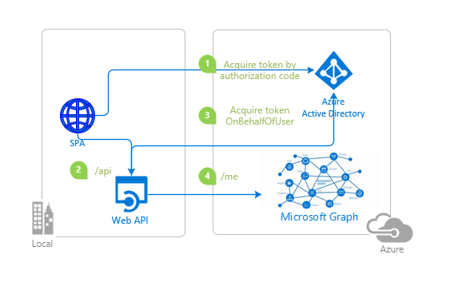

# Authenticate a user with Azure AD using msal.js and call an Azure AD protected Node.js Web Api using on-behalf of flow

* [Overview](#overview)
* [Scenario](#scenario)
* [Contents](#contents)
* [Prerequisites](#prerequisites)
* [Setup the sample](#setup-the-sample)
* [Explore the sample](#explore-the-sample)
* [Troubleshooting](#troubleshooting)
* [About the code](#about-the-code)
* [Contributing](#contributing)
* [Learn More](#learn-more)

## Overview

This sample demonstrates a React single-page application (SPA) which lets a user authenticate with their Azure AD tenant and obtains an [access token](https://aka.ms/access-tokens) to call a Node.js web API, protected by [passport-azure-ad](https://github.com/AzureAD/passport-azure-ad). The web API then proceeds to obtain another access token for [Microsoft Graph API](https://developer.microsoft.com/graph) using the [OAuth 2.0 on-behalf-of flow](https://docs.microsoft.com/azure/active-directory/develop/v2-oauth2-on-behalf-of-flow). The web API's call to Microsoft Graph is made using the [Microsoft Graph SDK](https://docs.microsoft.com/graph/sdks/sdks-overview)

> :information_source: To learn how to integrate a JavaScript React application with Azure AD, consider going through the recorded session: [Deep dive on using MSAL.js to integrate React single-page applications with Azure Active Directory](https://www.youtube.com/watch?v=7oPSL5wWeS0)

## Scenario

1. The client app uses **MSAL React** to sign-in a user and obtain a **JWT** [Access Token](https://aka.ms/access-tokens) from **Azure AD** for the **API**.
1. The access token is used as a *bearer token* to authorize the user to call the Node.js **API** protected by **Azure AD**.
1. This access token is also used by the Node.js API to obtain another Access token to call the MS Graph API **on user's behalf** using the [OAuth 2.0 on-behalf-of flow](https://docs.microsoft.com/azure/active-directory/develop/v2-oauth2-on-behalf-of-flow).
1. The Node.js **API** uses the [Microsoft Graph SDK](https://docs.microsoft.com/graph/sdks/sdks-overview) to call MS Graph



## Contents

| File/folder       | Description                                |
|-------------------|--------------------------------------------|
| `AppCreationScripts/` | Contains Powershell scripts to automate app registration. |
| `SPA/src/authConfig.js`   | Contains configuration parameters for the SPA.   |
| `API/authConfig.json`| Contains authentication parameters for the API. |
| `API/auth/onBehalfOfClient.js`| Contains logic to acquire an access token for Graph API using OBO flow. |

## Prerequisites

* [Node.js](https://nodejs.org/en/download/) must be installed to run this sample.
* [Visual Studio Code](https://code.visualstudio.com/download) is recommended for running and editing this sample.
* [VS Code Azure Tools](https://marketplace.visualstudio.com/items?itemName=ms-vscode.vscode-node-azure-pack) extension is recommended for interacting with Azure through VS Code Interface.
* A modern web browser.
* An **Azure AD** tenant. For more information, see: [How to get an Azure AD tenant](https://docs.microsoft.com/azure/active-directory/develop/test-setup-environment#get-a-test-tenant)
* A user account in your **Azure AD** tenant.

>This sample will not work with a **personal Microsoft account**. If you're signed in to the [Azure portal](https://portal.azure.com) with a personal Microsoft account and have not created a user account in your directory before, you will need to create one before proceeding.

## Setup the sample

### Step 1: Clone or download this repository

From your shell or command line:

```console
git clone https://github.com/Azure-Samples/ms-identity-javascript-react-tutorial.git
```

or download and extract the repository *.zip* file.

> :warning: To avoid path length limitations on Windows, we recommend cloning into a directory near the root of your drive.

### Step 2: Install project dependencies

```console
    cd 6-AdvancedScenarios\1-call-api-obo\API
    npm install
```

```console
    cd 6-AdvancedScenarios\1-call-api-obo\SPA
    npm install
```

### Step 3: Register the sample application(s) in your tenant

There are two projects in this sample. Each needs to be separately registered in your Azure AD tenant. To register these projects, you can:

* follow the steps below for manually register your apps
* or use PowerShell scripts that:
  * **automatically** creates the Azure AD applications and related objects (passwords, permissions, dependencies) for you.
  * modify the projects' configuration files.

<details>
   <summary>Expand this section if you want to use this automation:</summary>
> :warning: If you have never used **Microsoft Graph PowerShell** before, we recommend you go through the [App Creation Scripts Guide](./AppCreationScripts/AppCreationScripts.md) once to ensure that your environment is prepared correctly for this step.

1. On Windows, run PowerShell as **Administrator** and navigate to the root of the cloned directory
1. In PowerShell run:

    ```PowerShell
    Set-ExecutionPolicy -ExecutionPolicy RemoteSigned -Scope Process -Force
    ```

1. Run the script to create your Azure AD application and configure the code of the sample application accordingly.
1. For interactive process -in PowerShell, run:

    ```PowerShell
    cd .\AppCreationScripts\
    .\Configure.ps1 -TenantId "[Optional] - your tenant id" -AzureEnvironmentName "[Optional] - Azure environment, defaults to 'Global'"
    ```

> Other ways of running the scripts are described in [App Creation Scripts guide](./AppCreationScripts/AppCreationScripts.md). The scripts also provide a guide to automated application registration, configuration and removal which can help in your CI/CD scenarios.

</details>

#### Choose the Azure AD tenant where you want to create your applications

To manually register the apps, as a first step you'll need to:

1. Sign in to the [Azure portal](https://portal.azure.com).
1. If your account is present in more than one Azure AD tenant, select your profile at the top right corner in the menu on top of the page, and then **switch directory** to change your portal session to the desired Azure AD tenant.

#### Register the service app (msal-node-api)

1. Navigate to the [Azure portal](https://portal.azure.com) and select the **Azure Active Directory** service.
1. Select the **App Registrations** blade on the left, then select **New registration**.
1. In the **Register an application page** that appears, enter your application's registration information:
    1. In the **Name** section, enter a meaningful application name that will be displayed to users of the app, for example `msal-node-api`.
    1. Under **Supported account types**, select **Accounts in this organizational directory only**
    1. Select **Register** to create the application.
1. In the **Overview** blade, find and note the **Application (client) ID**. You use this value in your app's configuration file(s) later in your code.
1. In the app's registration screen, select the **Certificates & secrets** blade in the left to open the page where you can generate secrets and upload certificates.
1. In the **Client secrets** section, select **New client secret**:
    1. Type a key description (for instance `app secret`).
    1. Select one of the available key durations (**6 months**, **12 months** or **Custom**) as per your security posture.
    1. The generated key value will be displayed when you select the **Add** button. Copy and save the generated value for use in later steps.
    1. You'll need this key later in your code's configuration files. This key value will not be displayed again, and is not retrievable by any other means, so make sure to note it from the Azure portal before navigating to any other screen or blade.
1. Since this app signs-in users, we will now proceed to select **delegated permissions**, which is is required by apps signing-in users.
    1. In the app's registration screen, select the **API permissions** blade in the left to open the page where we add access to the APIs that your application needs:
    1. Select the **Add a permission** button and then:
    1. Ensure that the **Microsoft APIs** tab is selected.
    1. In the *Commonly used Microsoft APIs* section, select **Microsoft Graph**
    1. In the **Delegated permissions** section, select **User.Read**, **offline_access** in the list. Use the search box if necessary.
    1. Select the **Add permissions** button at the bottom.
1. In the app's registration screen, select the **Expose an API** blade to the left to open the page where you can publish the permission as an API for which client applications can obtain [access tokens](https://aka.ms/access-tokens) for. The first thing that we need to do is to declare the unique [resource](https://docs.microsoft.com/azure/active-directory/develop/v2-oauth2-auth-code-flow) URI that the clients will be using to obtain access tokens for this API. To declare an resource URI(Application ID URI), follow the following steps:
    1. Select **Set** next to the **Application ID URI** to generate a URI that is unique for this app.
    1. For this sample, accept the proposed Application ID URI (`api://{clientId}`) by selecting **Save**.
        > :information_source: Read more about Application ID URI at [Validation differences by supported account types (signInAudience)](https://docs.microsoft.com/azure/active-directory/develop/supported-accounts-validation).

##### Publish Delegated Permissions

1. All APIs must publish a minimum of one [scope](https://docs.microsoft.com/azure/active-directory/develop/v2-oauth2-auth-code-flow#request-an-authorization-code), also called [Delegated Permission](https://docs.microsoft.com/azure/active-directory/develop/v2-permissions-and-consent#permission-types), for the client apps to obtain an access token for a *user* successfully. To publish a scope, follow these steps:
1. Select **Add a scope** button open the **Add a scope** screen and Enter the values as indicated below:
    1. For **Scope name**, use `access_graph_on_behalf_of_user`.
    1. Select **Admins and users** options for **Who can consent?**.
    1. For **Admin consent display name** type in *Access Microsoft Graph as the signed-in user*.
    1. For **Admin consent description** type in *Allow the app to access Microsoft Graph Api as the signed-in user*.
    1. For **User consent display name** type in *Access Microsoft Graph on your behalf*.
    1. For **User consent description** type in *Allow the Microsoft Graph APi on your behalf.*.
    1. Keep **State** as **Enabled**.
    1. Select the **Add scope** button on the bottom to save this scope.
1. Select the **Manifest** blade on the left.
    1. Set `accessTokenAcceptedVersion` property to **2**.
    1. Select on **Save**.

> :information_source:  Follow [the principle of least privilege when publishing permissions](https://learn.microsoft.com/security/zero-trust/develop/protected-api-example) for a web API.

##### Configure Optional Claims

1. Still on the same app registration, select the **Token configuration** blade to the left.
1. Select **Add optional claim**:
   1. Select **optional claim type**, then choose **Access**.
      1. Select the optional claim **idtyp**.
      > Indicates token type. This claim is the most accurate way for an API to determine if a token is an app token or an app+user token. This is not issued in tokens issued to users.
   1. Select **Add** to save your changes.
1. Still on the same app registration, select the **Manifest** blade to the left.
   1. Set the **optionalClaims** property as shown below to request client capabilities claim *xms_cc*:

   ```json
        "optionalClaims": {
            "accessToken": [
                {
                    "additionalProperties": [],
                    "essential": false,
                    "name": "xms_cc",
                    "source": null
                }
            ],
            "idToken": [],
            "saml2Token": []
        }
    ```

##### Configure the service app (msal-node-api) to use your app registration

Open the project in your IDE (like Visual Studio or Visual Studio Code) to configure the code.

> In the steps below, "ClientID" is the same as "Application ID" or "AppId".

1. Open the `API\authConfig.js` file.
2. Find the key `Enter_the_Application_Id_Here` and replace the existing value with the application ID (clientId) of `msal-node-api` app copied from the Azure portal.
3. Find the key `Enter_the_Tenant_Id_Here` and replace the existing value with your Azure AD tenant/directory ID.
4. Find the key `Enter_the_Client_Secret_Here` and replace the existing value with the generated secret that you saved during the creation of `msal-node-api` copied from the Azure portal.

#### Register the client app (msal-react-spa)

1. Navigate to the [Azure portal](https://portal.azure.com) and select the **Azure Active Directory** service.
1. Select the **App Registrations** blade on the left, then select **New registration**.
1. In the **Register an application page** that appears, enter your application's registration information:
    1. In the **Name** section, enter a meaningful application name that will be displayed to users of the app, for example `msal-react-spa`.
    1. Under **Supported account types**, select **Accounts in this organizational directory only**
    1. Select **Register** to create the application.
1. In the **Overview** blade, find and note the **Application (client) ID**. You use this value in your app's configuration file(s) later in your code.
1. In the app's registration screen, select the **Authentication** blade to the left.
1. If you don't have a platform added, select **Add a platform** and select the **Single-page application** option.
    1. In the **Redirect URI** section enter the following redirect URIs:
        1. `http://localhost:3000/`
        1. `http://localhost:3000/redirect`
    1. Click **Save** to save your changes.
1. Since this app signs-in users, we will now proceed to select **delegated permissions**, which is is required by apps signing-in users.
    1. In the app's registration screen, select the **API permissions** blade in the left to open the page where we add access to the APIs that your application needs:
    1. Select the **Add a permission** button and then:
    1. Ensure that the **My APIs** tab is selected.
    1. In the list of APIs, select the API `msal-node-api`.
    1. In the **Delegated permissions** section, select **access_graph_on_behalf_of_user** in the list. Use the search box if necessary.
    1. Select the **Add permissions** button at the bottom.

##### Configure Optional Claims

1. Still on the same app registration, select the **Token configuration** blade to the left.
1. Select **Add optional claim**:
    1. Select **optional claim type**, then choose **Access**.
    1. Select the optional claim **acct**.
    > Provides user's account status in tenant. If the user is a **member** of the tenant, the value is *0*. If they're a **guest**, the value is *1*.
    1. Select **Add** to save your changes.

##### Configure the client app (msal-react-spa) to use your app registration

Open the project in your IDE (like Visual Studio or Visual Studio Code) to configure the code.

> In the steps below, "ClientID" is the same as "Application ID" or "AppId".

1. Open the `SPA\src\authConfig.js` file.
1. Find the key `Enter_the_Application_Id_Here` and replace the existing value with the application ID (clientId) of `msal-react-spa` app copied from the Azure portal.
1. Find the key `Enter_the_Tenant_Id_Here` and replace the existing value with your Azure AD tenant/directory ID.
1. Find the key `Enter_the_Web_Api_Application_Id_Here` and replace the existing value with the application ID (clientId) of `msal-node-api` app copied from the Azure portal.

#### Configure Known Client Applications for service (msal-node-api)

For a middle-tier web API (`msal-node-api`) to be able to call a downstream web API, the middle tier app needs to be granted the required permissions as well. However, since the middle-tier cannot interact with the signed-in user, it needs to be explicitly bound to the client app in its **Azure AD** registration. This binding merges the permissions required by both the client and the middle-tier web API and presents it to the end user in a single consent dialog. The user then consent to this combined set of permissions. To achieve this, you need to add the **Application Id** of the client app to the `knownClientApplications` property in the **manifest** of the web API. Here's how:

1. In the [Azure portal](https://portal.azure.com), navigate to your `msal-node-api` app registration, and select the **Manifest** blade.
1. In the manifest editor, change the `knownClientApplications: []` line so that the array contains the Client ID of the client application (`msal-react-spa`) as an element of the array.

For instance:

```json
    "knownClientApplications": ["ca8dca8d-f828-4f08-82f5-325e1a1c6428"],
```

1. **Save** the changes to the manifest.

### Step 4: Running the sample

```console
    cd 6-AdvancedScenarios\1-call-api-obo\API
    npm start
```

```console
    cd 6-AdvancedScenarios\1-call-api-obo\SPA
    npm start
```

## Explore the sample

1. Open your browser and navigate to `http://localhost:3000`.
1. Click the **sign-in** button on the top right corner.
1. Once you authenticate, Select the **Profile** button on the navigation bar.

> :information_source: Did the sample not work for you as expected? Then please reach out to us using the [GitHub Issues](../../../../issues) page.

## We'd love your feedback!

Were we successful in addressing your learning objective? Consider taking a moment to [share your experience with us](https://forms.office.com/Pages/ResponsePage.aspx?id=v4j5cvGGr0GRqy180BHbR73pcsbpbxNJuZCMKN0lURpUMlRHSkc5U1NLUkxFNEtVN0dEOTFNQkdTWiQlQCN0PWcu).

## Troubleshooting

<details>
	<summary>Expand for troubleshooting info</summary>

> * Use [Stack Overflow](http://stackoverflow.com/questions/tagged/msal) to get support from the community. Ask your questions on Stack Overflow first and browse existing issues to see if someone has asked your question before.
Ask your questions on Stack Overflow first and browse existing issues to see if someone has asked your question before.
Make sure that your questions or comments are tagged with [`azure-active-directory` `node` `ms-identity` `adal` `msal-js` `msal-react` `react`].

To provide feedback on or suggest features for Azure Active Directory, visit [User Voice page](https://feedback.azure.com/d365community/forum/79b1327d-d925-ec11-b6e6-000d3a4f06a4).
</details>

## About the code

### Gaining consent for the web API

The middle-tier application adds the client to the `knownClientApplications` list in its manifest, and then the client app can trigger a combined consent flow for both itself and the middle-tier application. On the Microsoft identity platform, this is done using the `/.default` scope. When triggering a consent screen using known client applications and `/.default`, the consent screen will show permissions for both the client to the middle-tier API, and also request whatever permissions are required by the middle-tier API. The user provides consent for both applications, and then the OBO flow works.

> :information_source: **KnownClientApplications** is an attribute in **application manifest**. It is used for bundling consent if you have a solution that contains two (or more) parts: a client app and a custom web API. If you enter the `appID` (clientID) of the client app into this array, the user will have to consent only once to the client app. Azure AD will know that consenting to the client means implicitly consenting to the web API. It will automatically provision service principals for both the client and web API at the same time. Both the client and the web API app must be registered in the same tenant.

### Acquire an access token with the OBO flow

To get the access token for Graph API using the OBO flow, the middle-tier web API will initialize a **ConfidentialClientApplication** to exchange the access token using the **acquireTokenOnBehalfOf** API to get a new access token for the down-stream resource in the case Graph API. This is shown in [onBehalfOfClient.js](./API/auth/onBehalfOfClient.js):

```javascript
const getOboToken = async (oboAssertion) => {
    const oboRequest = {
        oboAssertion: oboAssertion,
        scopes: config.resources.downstreamAPI.scopes,
    };

    try {
        const response = await cca.acquireTokenOnBehalfOf(oboRequest);
        return response.accessToken;
    } catch (error) {
        throw error;
    }
};
```

### Calling the Microsoft Graph API

After receiving the access token for Graph, we will initialize the [Graph SDK client](https://github.com/microsoftgraph/msgraph-sdk-javascript) with an [authProvider function](https://github.com/microsoftgraph/msgraph-sdk-javascript/blob/dev/docs/CreatingClientInstance.md#2-create-with-options). In this case, the user has to provide their implementation for getting and refreshing accessToken. A callback will be passed into this authProvider function; an access token or error needs to be passed into that callback as shown in [graphClient.js](./API/utils/graphClient.js) file.

```javascript
const getGraphClient = (accessToken) => {
    // Initialize Graph client
    const client = graph.Client.init({
        // Use the provided access token to authenticate requests
        authProvider: (done) => {
            done(null, accessToken);
        },
    });

    return client;
};
```

### Handle Continuous Access Evaluation (CAE) challenges from Microsoft Graph

Continuous access evaluation (CAE) enables applications to do just-in time token validation, for instance enforcing user session revocation in the case of password change/reset but there are other benefits. For details, see [Continuous access evaluation](https://docs.microsoft.com/azure/active-directory/conditional-access/concept-continuous-access-evaluation).

Microsoft Graph is now CAE-enabled. This means that it can ask its client apps for more claims when conditional access policies require it. Your can enable your application to be ready to consume CAE-enabled APIs by:

1. Declaring that the client app is capable of handling [claims challenges](https://aka.ms/claimschallenge).
2. Processing the claim challenge when they are thrown by MS Graph Api.

#### Declare the CAE capability in the configuration

Apps using MSAL can declare CAE-capability by adding the `clientCapabilities` property in the configuration object. This is shown in [authConfig.js](./SPA/src/authConfig.js):

```javascript
    const msalConfig = {
        auth: {
            clientId: 'Enter_the_Application_Id_Here', 
            authority: 'https://login.microsoftonline.com/Enter_the_Tenant_Info_Here',
            redirectUri: "/", 
            postLogoutRedirectUri: "/",
            navigateToLoginRequestUrl: true, 
            clientCapabilities: ["CP1"] // this lets the resource owner know that this client is capable of handling claims challenge.
        }
    }

    const msalInstance = new PublicClientApplication(msalConfig);
```

Note that both the SPA and the web API projects need to declare this, since the web API in this sample also obtains tokens via the **on-behalf-of** flow (see [onBehalfOfClient.js](./API/auth/onBehalfOfClient.js)).

#### Processing the CAE challenge from Microsoft Graph

Once the middle-tier web API (msal-node-api) app receives the CAE claims challenge from Microsoft Graph, it needs to process the challenge and redirect the user back to Azure AD for re-authorization. However, since the middle-tier web API does not have UI to carry out this, it needs to propagate the error to the client app (msal-react-spa) instead, where it can be handled. This is shown in [profileController.js](./API/controllers/profileController.js):

```javascript
exports.getProfile = async (req, res, next) => {
    if (isAppOnlyToken(req.authInfo)) {
        return next(new Error('This route requires a user token'));
    }

    const userToken = req.get('authorization');
    const [bearer, tokenValue] = userToken.split(' ');

    if (hasRequiredDelegatedPermissions(req.authInfo, authConfig.protectedRoutes.profile.delegatedPermissions.scopes)) {
        try {
            const accessToken = await getOboToken(tokenValue);

            const graphResponse = await getGraphClient(accessToken)
                .api('/me')
                .responseType(ResponseType.RAW)
                .get();

            if (graphResponse.status === 401) {
                if (graphResponse.headers.get('WWW-Authenticate')) {

                    if (isClientCapableOfClaimsChallenge(req.authInfo)) {
                        /**
                         * Append the WWW-Authenticate header from the Microsoft Graph response to the response to 
                         * the client app. To learn more, visit: https://learn.microsoft.com/azure/active-directory/develop/app-resilience-continuous-access-evaluation
                         */
                        return res.status(401)
                            .set('WWW-Authenticate', graphResponse.headers.get('WWW-Authenticate').toString())
                            .json({ errorMessage: 'Continuous access evaluation resulted in claims challenge' });
                    }

                    return res.status(401).json({ errorMessage: 'Continuous access evaluation resulted in claims challenge but the client is not capable. Please enable client capabilities and try again' });
                }

                throw new Error('Unauthorized');
            }

            const graphData = await graphResponse.json();
            res.status(200).json(graphData);
        } catch (error) {
            if (error instanceof msal.InteractionRequiredAuthError) {
                if (error.claims) {
                    const claimsChallenge = generateClaimsChallenge(error.claims);

                    return res.status(401)
                        .set(claimsChallenge.headers[0], claimsChallenge.headers[1])
                        .json({ errorMessage: error.errorMessage });
                }

                return res.status(401).json(error);
            }

            next(error);
        }
    } else {
        next(new Error('User does not have the required permissions'));
    }
};

```

On the client side, we use MSAL's `acquireToken` API and provide the claims challenge as a parameter in the token request (see  [Profile.jsx](./SPA/src/pages/Profile.jsx)). To retrieve the claims challenge from the API response, refer to the [fetch.js](./SPA/src/fetch.js), where we handle the response with the `handleClaimsChallenge` method:

```javascript
export const callApiWithToken = async (accessToken, apiEndpoint, account) => {
    const headers = new Headers();
    const bearer = `Bearer ${accessToken}`;

    headers.append("Authorization", bearer);

    const options = {
        method: "GET",
        headers: headers
    };

    const response = await fetch(apiEndpoint, options);
    return handleClaimsChallenge(response, apiEndpoint, account);
}

export const handleClaimsChallenge = async (response, apiEndpoint, account) => {
    if (response.status === 200) {
        return response.json();
    } else if (response.status === 401) {
        if (response.headers.get('WWW-Authenticate')) {
            const authenticateHeader = response.headers.get('WWW-Authenticate');
            const claimsChallenge = parseChallenges(authenticateHeader);

            /**
             * This method stores the claim challenge to the session storage in the browser to be used when acquiring a token.
             * To ensure that we are fetching the correct claim from the storage, we are using the clientId
             * of the application and oid (user’s object id) as the key identifier of the claim with schema
             * cc.<clientId>.<oid>.<resource.hostname>
             */
            addClaimsToStorage(
                `cc.${msalConfig.auth.clientId}.${account.idTokenClaims.oid}.${new URL(apiEndpoint).hostname}`,
                claimsChallenge.claims,
            );

            throw new Error(`claims_challenge_occurred`);
        }

        throw new Error(`Unauthorized: ${response.status}`);
    } else {
        throw new Error(`Something went wrong with the request: ${response.status}`);
    }
};
```

## Contributing

If you'd like to contribute to this sample, see [CONTRIBUTING.MD](/CONTRIBUTING.md).

This project has adopted the [Microsoft Open Source Code of Conduct](https://opensource.microsoft.com/codeofconduct/). For more information, see the [Code of Conduct FAQ](https://opensource.microsoft.com/codeofconduct/faq/) or contact [opencode@microsoft.com](mailto:opencode@microsoft.com) with any additional questions or comments.

## Learn More

* [Microsoft identity platform (Azure Active Directory for developers)](https://docs.microsoft.com/azure/active-directory/develop/)
* [Azure AD code samples](https://docs.microsoft.com/azure/active-directory/develop/sample-v2-code)
* [Overview of Microsoft Authentication Library (MSAL)](https://docs.microsoft.com/azure/active-directory/develop/msal-overview)
* [Register an application with the Microsoft identity platform](https://docs.microsoft.com/azure/active-directory/develop/quickstart-register-app)
* [Configure a client application to access web APIs](https://docs.microsoft.com/azure/active-directory/develop/quickstart-configure-app-access-web-apis)
* [Understanding Azure AD application consent experiences](https://docs.microsoft.com/azure/active-directory/develop/application-consent-experience)
* [Understand user and admin consent](https://docs.microsoft.com/azure/active-directory/develop/howto-convert-app-to-be-multi-tenant#understand-user-and-admin-consent)
* [Application and service principal objects in Azure Active Directory](https://docs.microsoft.com/azure/active-directory/develop/app-objects-and-service-principals)
* [Authentication Scenarios for Azure AD](https://docs.microsoft.com/azure/active-directory/develop/authentication-flows-app-scenarios)
* [Building Zero Trust ready apps](https://aka.ms/ztdevsession)
* [National Clouds](https://docs.microsoft.com/azure/active-directory/develop/authentication-national-cloud#app-registration-endpoints)
* [Initialize client applications using MSAL.js](https://docs.microsoft.com/azure/active-directory/develop/msal-js-initializing-client-applications)
* [Single sign-on with MSAL.js](https://docs.microsoft.com/azure/active-directory/develop/msal-js-sso)
* [Handle MSAL.js exceptions and errors](https://docs.microsoft.com/azure/active-directory/develop/msal-handling-exceptions?tabs=javascript)
* [Logging in MSAL.js applications](https://docs.microsoft.com/azure/active-directory/develop/msal-logging?tabs=javascript)
* [Pass custom state in authentication requests using MSAL.js](https://docs.microsoft.com/azure/active-directory/develop/msal-js-pass-custom-state-authentication-request)
* [Prompt behavior in MSAL.js interactive requests](https://docs.microsoft.com/azure/active-directory/develop/msal-js-prompt-behavior)
* [Use MSAL.js to work with Azure AD B2C](https://docs.microsoft.com/azure/active-directory/develop/msal-b2c-overview)
* [Validating Access Tokens](https://docs.microsoft.com/azure/active-directory/develop/access-tokens#validating-tokens)
* [User and application tokens](https://docs.microsoft.com/azure/active-directory/develop/access-tokens#user-and-application-tokens)
* [Validation differences by supported account types](https://docs.microsoft.com/azure/active-directory/develop/supported-accounts-validation)
* [How to manually validate a JWT access token using the Microsoft identity platform](https://github.com/Azure-Samples/active-directory-dotnet-webapi-manual-jwt-validation/blob/master/README.md)
