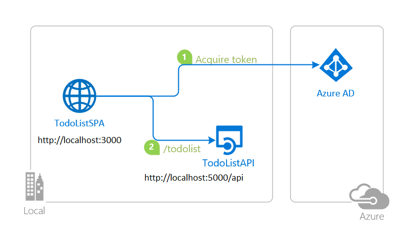
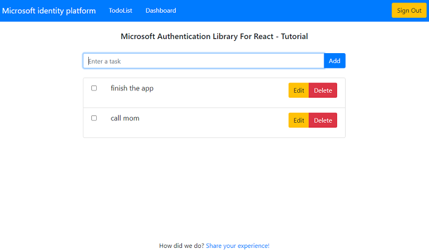

# IMPORTANT: PLEASE READ

# This sample corresponds to an implementation of PoP without server nonce that is no longer recommended. If you start new projects don’t use this sample. The recommended approach will be documented in the future


# React single-page application calling Node.js & Express web API using Proof of Possession

 1. [Overview](#overview)
 1. [Scenario](#scenario)
 1. [Contents](#contents)
 1. [Prerequisites](#prerequisites)
 1. [Setup](#setup)
 1. [Registration](#registration)
 1. [Running the sample](#running-the-sample)
 1. [Explore the sample](#explore-the-sample)
 1. [About the code](#about-the-code)
 1. [More information](#more-information)
 1. [Community Help and Support](#community-help-and-support)
 1. [Contributing](#contributing)

## Overview

This sample demonstrates a React SPA calling a Node.js & Express web API that is secured using [Azure Active Directory](https://docs.microsoft.com/azure/active-directory/fundamentals/active-directory-whatis) (Azure AD). The SPA project is secured with the [Microsoft Authentication Library for React](https://github.com/AzureAD/microsoft-authentication-library-for-js/tree/dev/lib/msal-react) (MSAL React), while the web API is secured with [passport-azure-ad](https://github.com/AzureAD/passport-azure-ad).

This sample demonstrates the [Proof of Possession](https://github.com/AzureAD/microsoft-authentication-library-for-js/blob/dev/lib/msal-browser/docs/access-token-proof-of-possession.md) (PoP) authentication scheme. This authentication scheme cryptographically binds the access tokens to the browser and client application from which they are requested, meaning they cannot be used from a different application or device. This effectively prevents **token replay** attacks. The resource server that accepts the PoP token (i.e. a web API) needs to be able to decipher the incoming request for the PoP authentication scheme to work properly.

## Scenario

1. The client React SPA uses **MSAL React** to sign-in and obtain a JWT access token from **Azure AD** for the web API.
1. The client React SPA wraps the access token in a secure *envelope* and stamps it with its signature using **MSAL React**.
1. The access token then is used with *PoP* authentication scheme to authorize the user to call the web API protected by **Azure AD**.
1. The web API decrypts the secure envelope to obtain the access token.
1. Once the access token is validated, the web API responds with the protected resource.



## Contents

| File/folder                         | Description                                                |
|-------------------------------------|------------------------------------------------------------|
| `SPA/src/authConfig.js`             | Authentication parameters for SPA project reside here.     |
| `SPA/src/index.js`                  | MSAL React is initialized here.                            |
| `SPA/src/fetch.js`                  | Contains token acquisition and API call utilities.         |
| `API/authConfig.json`               | Authentication parameters for API project reside here.     |
| `API/app.js`                        | Application entry. passport-azure-ad is initialized here.  |
| `API/utils/validateToken.js`        | Contains utility methods for validating PoP tokens.        |

## Prerequisites

- An **Azure AD** tenant. For more information see: [How to get an Azure AD tenant](https://docs.microsoft.com/azure/active-directory/develop/quickstart-create-new-tenant)
- A user account in your **Azure AD** tenant.

## Setup

### Step 1. Clone or download this repository

```console
    git clone https://github.com/Azure-Samples/ms-identity-javascript-react-tutorial.git
```

or download and extract the repository .zip file.

> :warning: To avoid path length limitations on Windows, we recommend cloning into a directory near the root of your drive.

### Step 2. Install Node.js & Express web API dependencies

```console
    cd ms-identity-javascript-react-tutorial
    cd 6-AdvancedScenarios/2-call-api-pop/API
    npm install
```

### Step 3. Install React SPA dependencies

```console
    cd ../
    cd SPA
    npm install
```

### Register the sample application(s) with your Azure Active Directory tenant

There are two projects in this sample. Each needs to be separately registered in your Azure AD tenant. To register these projects, you can:

- follow the steps below for manually register your apps
- or use PowerShell scripts that:
  - **automatically** creates the Azure AD applications and related objects (passwords, permissions, dependencies) for you.
  - modify the projects' configuration files.

<details>
  <summary>Expand this section if you want to use this automation:</summary>

> :warning: If you have never used **Azure AD Powershell** before, we recommend you go through the [App Creation Scripts](./AppCreationScripts/AppCreationScripts.md) once to ensure that your environment is prepared correctly for this step.

1. On Windows, run PowerShell as **Administrator** and navigate to the root of the cloned directory
1. If you have never used Azure AD Powershell before, we recommend you go through the [App Creation Scripts](./AppCreationScripts/AppCreationScripts.md) once to ensure that your environment is prepared correctly for this step.
1. In PowerShell run:

   ```PowerShell
   Set-ExecutionPolicy -ExecutionPolicy RemoteSigned -Scope Process -Force
   ```

1. Run the script to create your Azure AD application and configure the code of the sample application accordingly.
1. In PowerShell run:

   ```PowerShell
   cd .\AppCreationScripts\
   .\Configure.ps1
   ```

   > Other ways of running the scripts are described in [App Creation Scripts](./AppCreationScripts/AppCreationScripts.md)
   > The scripts also provide a guide to automated application registration, configuration and removal which can help in your CI/CD scenarios.

</details>

### Choose the Azure AD tenant where you want to create your applications

As a first step you'll need to:

1. Sign in to the [Azure portal](https://portal.azure.com).
1. If your account is present in more than one Azure AD tenant, select your profile at the top right corner in the menu on top of the page, and then **switch directory** to change your portal session to the desired Azure AD tenant.

### Register the service app (msal-node-api)

1. Navigate to the [Azure portal](https://portal.azure.com) and select the **Azure AD** service.
1. Select the **App Registrations** blade on the left, then select **New registration**.
1. In the **Register an application page** that appears, enter your application's registration information:
   - In the **Name** section, enter a meaningful application name that will be displayed to users of the app, for example `msal-node-api`.
   - Under **Supported account types**, select **Accounts in this organizational directory only**.
1. Select **Register** to create the application.
1. In the app's registration screen, find and note the **Application (client) ID**. You use this value in your app's configuration file(s) later in your code.
1. Select **Save** to save your changes.
1. In the app's registration screen, select the **Expose an API** blade to the left to open the page where you can declare the parameters to expose this app as an API for which client applications can obtain [access tokens](https://docs.microsoft.com/azure/active-directory/develop/access-tokens) for.
The first thing that we need to do is to declare the unique [resource](https://docs.microsoft.com/azure/active-directory/develop/v2-oauth2-auth-code-flow) URI that the clients will be using to obtain access tokens for this Api. To declare an resource URI, follow the following steps:
   - Select `Set` next to the **Application ID URI** to generate a URI that is unique for this app.
   - For this sample, accept the proposed Application ID URI (`api://{clientId}`) by selecting **Save**.
1. All APIs have to publish a minimum of one [scope](https://docs.microsoft.com/azure/active-directory/develop/v2-oauth2-auth-code-flow#request-an-authorization-code) for the client's to obtain an access token successfully. To publish a scope, follow the following steps:
   - Select **Add a scope** button open the **Add a scope** screen and Enter the values as indicated below:
        - For **Scope name**, use `access_as_user`.
        - Select **Admins and users** options for **Who can consent?**.
        - For **Admin consent display name** type `Access msal-node-api`.
        - For **Admin consent description** type `Allows the app to access msal-node-api as the signed-in user.`
        - For **User consent display name** type `Access msal-node-api`.
        - For **User consent description** type `Allow the application to access msal-node-api on your behalf.`
        - Keep **State** as **Enabled**.
        - Select the **Add scope** button on the bottom to save this scope.

#### Configure the service app (msal-node-api) to use your app registration

Open the project in your IDE (like Visual Studio or Visual Studio Code) to configure the code.

> In the steps below, "ClientID" is the same as "Application ID" or "AppId".

1. Open the `API\authConfig.json` file.
1. Find the string `Enter_the_Application_Id_Here` and replace the existing value with the application ID (clientId) of `msal-node-api` app copied from the Azure portal.
1. Find the string `Enter_the_Tenant_Info_Here` and replace the existing value with your Azure AD tenant ID.

### Register the client app (msal-react-spa)

1. Navigate to the [Azure portal](https://portal.azure.com) and select the **Azure AD** service.
1. Select the **App Registrations** blade on the left, then select **New registration**.
1. In the **Register an application page** that appears, enter your application's registration information:
   - In the **Name** section, enter a meaningful application name that will be displayed to users of the app, for example `msal-react-spa`.
   - Under **Supported account types**, select **Accounts in this organizational directory only**.
   - In the **Redirect URI (optional)** section, select **Single-page application** in the combo-box and enter the following redirect URI: `http://localhost:3000/`.
1. Select **Register** to create the application.
1. In the app's registration screen, find and note the **Application (client) ID**. You use this value in your app's configuration file(s) later in your code.
1. Select **Save** to save your changes.
1. In the app's registration screen, select the **API permissions** blade in the left to open the page where we add access to the APIs that your application needs.
   - Select the **Add a permission** button and then,
   - Ensure that the **My APIs** tab is selected.
   - In the list of APIs, select the API `msal-node-api`.
   - In the **Delegated permissions** section, select the **Access 'msal-node-api'** in the list. Use the search box if necessary.
   - Select the **Add permissions** button at the bottom.

#### Configure the client app (msal-react-spa) to use your app registration

Open the project in your IDE (like Visual Studio or Visual Studio Code) to configure the code.

> In the steps below, "ClientID" is the same as "Application ID" or "AppId".

1. Open the `SPA\src\authConfig.js` file.
1. Find the string `Enter_the_Application_Id_Here` and replace the existing value with the application ID (clientId) of `msal-react-spa` app copied from the Azure portal.
1. Find the string `Enter_the_Tenant_Info_Here` and replace the existing value with your Azure AD tenant ID.
1. Find the string `Enter_the_Web_Api_Scope_here` and replace the existing value with the scope value you saved earlier (e.g., `api://{Client_Id_of_Web_Api}/access_as_user`.

## Running the sample

Using a command line interface such as VS Code integrated terminal, locate the application directory. Then:  

```console
    cd SPA
    npm start
```

In a separate console window, execute the following commands:

```console
    cd ..
    cd API
    npm start
```

## Explore the sample

1. Open your browser and navigate to `http://localhost:3000`.
2. Sign-in using the button on the top-right corner.
3. Select the **TodoList** button on the navigation bar to access your todo list.



> :information_source: Did the sample not work for you as expected? Then please reach out to us using the [GitHub Issues](../../../../issues) page.

## We'd love your feedback!

Were we successful in addressing your learning objective? Consider taking a moment to [share your experience with us](https://forms.office.com/Pages/ResponsePage.aspx?id=v4j5cvGGr0GRqy180BHbR73pcsbpbxNJuZCMKN0lURpUMlRHSkc5U1NLUkxFNEtVN0dEOTFNQkdTWiQlQCN0PWcu).

## About the code

### Acquiring PoP tokens

In [fetch.js](./SPA/src/fetch.js), an async method is implemented to acquire tokens. The method first constructs a PoP token request, using the parameters provided. It then attempts to silently acquire a valid access token from the cache, or if that fails, using the popup window prompt. Once an access token is obtained, MSAL cryptographically signs the it with the browser and client app's signature.

Important to notice that PoP token is bound to the HTTP method and full endpoint URL that the PoP token will be used for (e.g. accessing a protected resource). See below the `method` and `string` parameters.

```javascript
const getToken = async (method, query) => {
    const account = msalInstance.getActiveAccount();

    if (!account) {
        throw Error("No active account! Verify a user has been signed in and setActiveAccount has been called.");
    }

    const tokenRequest = {
        scopes: [...protectedResources.apiTodoList.scopes],
        authenticationScheme: AuthenticationScheme.POP,
        resourceRequestMethod: method,
        resourceRequestUri: query ? protectedResources.apiTodoList.endpoint + query : protectedResources.apiTodoList.endpoint,
    }

    try {
        const response = await msalInstance.acquireTokenSilent({
            account: account,
            ...tokenRequest
        });
    
        return response.accessToken;
    } catch (error) {
        if (InteractionRequiredAuthError.isInteractionRequiredError(error.errorCode)) {
            const response = await this.authService.acquireTokenPopup(tokenRequest);
            return response.accessToken;
        }
    }
}
```

### Calling web API using PoP scheme

In [fetch.js](./SPA/src/fetch.js), `getTasks()` method returns a promise, which then you can use in your components (see [TodoList.jsx](./SPA/src/pages/TodoList.jsx)).

```javascript
export const getTasks = async () => {
    const accessToken = await getToken("GET");

    const headers = new Headers();
    const pop = `PoP ${accessToken}`;

    headers.append("Authorization", pop);

    const options = {
        method: "GET",
        headers: headers
    };

    return fetch(protectedResources.apiTodoList.endpoint, options)
        .then(response => response.json())
        .catch(error => console.log(error));
}
```

### Validating PoP tokens

In [validateToken.js](./API/utils/validateToken.js), we first decode the token to grab the confirmation claim (`cnf`) that contains a JSON Web Key (JWK). Then, we parse this key, and use it to verify the signature of the token. Once this is done, we can verify the claims section of the token, importantly, the `method`, `host` and `path` claims. If the PoP token is valid, we pass the access token it envelops back to the **Authorization** header of the request as a `bearer` token and call the next middleware in the route, where it gets validated by the [passport-azure-ad](https://github.com/AzureAD/passport-azure-ad) authentication middleware.

```javascript
const validatePoP = async (req, res, next) => {
    // the access token the user sent
    const userToken = req.get('authorization').split(' ')[1];
    const decodedToken = jwtDecode(userToken, { complete: true });
    
    try {
        parsedToken = await parseJwk(decodedToken.payload.cnf.jwk, "RS256");

        try {
            verifiedToken = await jwtVerify(userToken, parsedToken);
            
            if (JSON.stringify(verifiedToken.payload) === JSON.stringify(decodedToken.payload)) {
                
                const checkMethod = verifiedToken.payload.m === req.method ? true : false;
                const checkHost = verifiedToken.payload.u.includes(req.hostname) ? true : false;
                const checkPath = verifiedToken.payload.p.includes(`${req.baseUrl}${req.path}`) ? true : false;

                if (checkMethod && checkHost && checkPath) {
                    req.headers.authorization = "Bearer " + verifiedToken.payload.at;
                    return next();
                } else {
                    return res.status(401).json({message: "Invalid token claims"});
                }
            }
        } catch (error) {
            console.log(error)
            res.status(401).json(error);
        }
    } catch (error) {
       console.log(error)
       res.status(401).json(error); 
    }
}
```

## More information

- [Microsoft identity platform (Azure Active Directory for developers)](https://docs.microsoft.com/azure/active-directory/develop/)
- [Overview of Microsoft Authentication Library (MSAL)](https://docs.microsoft.com/azure/active-directory/develop/msal-overview)
- [Quickstart: Register an application with the Microsoft identity platform](https://docs.microsoft.com/azure/active-directory/develop/quickstart-register-app)
- [Quickstart: Configure a client application to access web APIs](https://docs.microsoft.com/azure/active-directory/develop/quickstart-configure-app-access-web-apis)
- [Understanding Azure AD application consent experiences](https://docs.microsoft.com/azure/active-directory/develop/application-consent-experience)
- [Understand user and admin consent](https://docs.microsoft.com/azure/active-directory/develop/howto-convert-app-to-be-multi-tenant#understand-user-and-admin-consent)
- [Application and service principal objects in Azure Active Directory](https://docs.microsoft.com/azure/active-directory/develop/app-objects-and-service-principals)
- [National Clouds](https://docs.microsoft.com/azure/active-directory/develop/authentication-national-cloud#app-registration-endpoints)
- [MSAL code samples](https://docs.microsoft.com/azure/active-directory/develop/sample-v2-code)

For more information about how OAuth 2.0 protocols work in this scenario and other scenarios, see [Authentication Scenarios for Azure AD](https://docs.microsoft.com/azure/active-directory/develop/authentication-flows-app-scenarios).

## Community Help and Support

Use [Stack Overflow](http://stackoverflow.com/questions/tagged/msal) to get support from the community.
Ask your questions on Stack Overflow first and browse existing issues to see if someone has asked your question before.
Make sure that your questions or comments are tagged with [`azure-active-directory` `node` `ms-identity` `adal` `msal`].

If you find a bug in the sample, raise the issue on [GitHub Issues](../../../../issues).

To provide feedback on or suggest features for Azure Active Directory, visit [User Voice page](https://feedback.azure.com/forums/169401-azure-active-directory).

## Contributing

If you'd like to contribute to this sample, see [CONTRIBUTING.MD](/CONTRIBUTING.md).

This project has adopted the [Microsoft Open Source Code of Conduct](https://opensource.microsoft.com/codeofconduct/). For more information, see the [Code of Conduct FAQ](https://opensource.microsoft.com/codeofconduct/faq/) or contact [opencode@microsoft.com](mailto:opencode@microsoft.com) with any additional questions or comments.