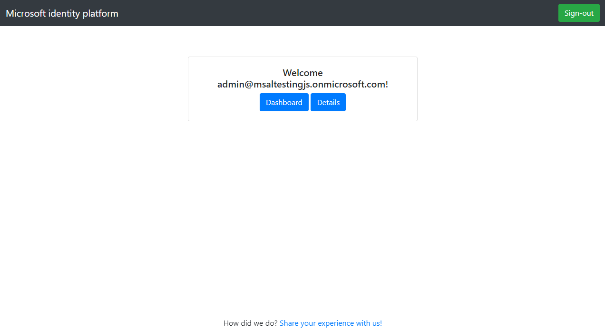
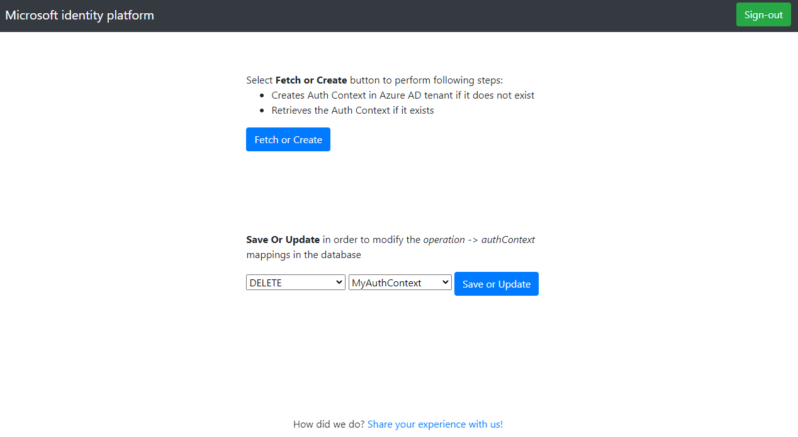
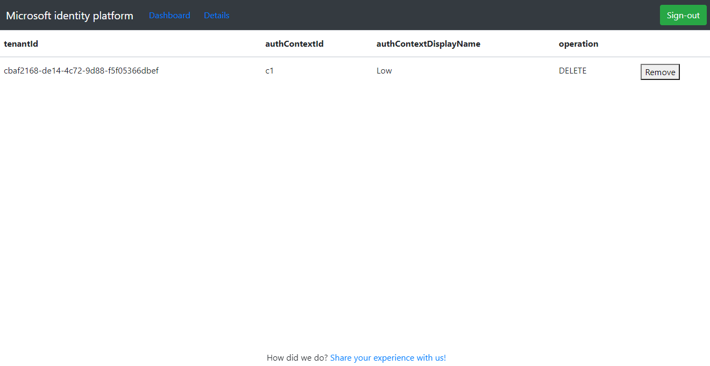
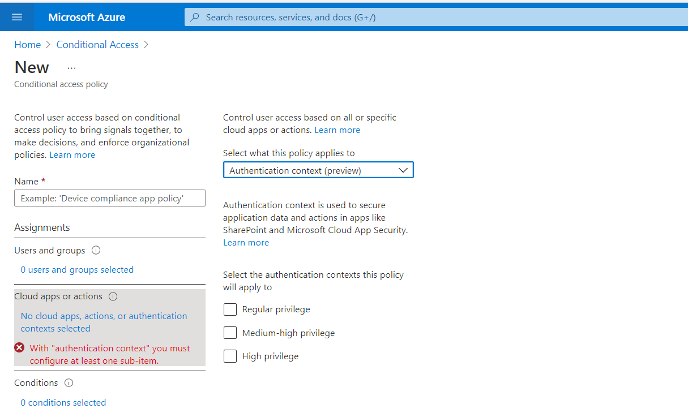

# React single-page application calling Express web API using Conditional Access auth context to perform step-up authentication

 1. [Overview](#overview)
 1. [Scenario](#scenario)
 1. [Contents](#contents)
 1. [Prerequisites](#prerequisites)
 1. [Setup](#setup)
 1. [Registration](#registration)
 1. [Running the sample](#running-the-sample)
 1. [Explore the sample](#explore-the-sample)
 1. [About the code](#about-the-code)
 1. [More information](#more-information)
 1. [Community Help and Support](#community-help-and-support)
 1. [Contributing](#contributing)

## Overview

This sample demonstrates how to use the Conditional Access [Authentication Context](https://docs.microsoft.com/azure/active-directory/develop/developer-guide-conditional-access-authentication-context) feature to achieve granular access control and demand a higher bar of authentication for certain sensitive operations (e.g. HTTP DELETE requests) on an Express.js [protected web API](https://docs.microsoft.com/azure/active-directory/develop/scenario-protected-web-api-overview) called by a client React single-page application (SPA).

The web API is protected using [passport-azure-ad](https://github.com/AzureAD/passport-azure-ad), while the admin panel on the web API is implemented using [microsoft-identity-express](https://github.com/Azure-Samples/microsoft-identity-express) to acquire access tokens and [Microsoft Graph JavaScript SDK](https://github.com/microsoftgraph/msgraph-sdk-javascript) for querying Microsoft Graph. For storing data, the [Azure Cosmos DB API for MongoDB](https://docs.microsoft.com/azure/cosmos-db/mongodb/mongodb-introduction) is used. Finally, the client React SPA acquires access tokens using the [Microsoft Authentication Library for React](https://github.com/AzureAD/microsoft-authentication-library-for-js/tree/dev/lib/msal-react).

> :information_source: Check out the recorded session on this topic: [Use Conditional Access Auth Context in your app for step-up authentication](https://www.youtube.com/watch?v=_iO7CfoktTY&ab_channel=Microsoft365Community)

## Scenario

1. The client React SPA uses the **MSAL React** to sign-in and obtain a JWT access token from **Azure AD**.
1. The access token is used as a *bearer* token to authorize the user to call the Express web API protected by **Azure AD**.
1. For sensitive operations, the web API is configured to demand step-up authentication, like MFA, from the signed-in user.


## Contents

| File/folder                         | Description                                                                           |
|-------------------------------------|---------------------------------------------------------------------------------------|
| `SPA/src/authConfig.js`             | Authentication parameters for SPA project reside here.                                |
| `SPA/src/index.js`                  | MSAL React is initialized here.                                                       |
| `SPA/src/fetch.js`                  | Claims challenge for the client is handled here.                                      |
| `API/.env`                          | Authentication parameters for the web API project.                                    |
| `API/auth/routeGuard.js`           | Custom middleware protecting app routes                                               |
| `API/auth/claimsManager.js`        | Custom middleware handling checking for auth context and generating claims challenge. |
| `API/app.js`                        | passport-azure-ad is initialized here.                                                |

## Prerequisites

- An **Azure AD** tenant. For more information see: [How to get an Azure AD tenant](https://docs.microsoft.com/azure/active-directory/develop/quickstart-create-new-tenant)
- A user account in your **Azure AD** tenant. This sample will not work with a **personal Microsoft account**. Therefore, if you signed in to the [Azure portal](https://portal.azure.com) with a personal account and have never created a user account in your directory before, you need to do that now.
- [Azure AD premium P1](https://azure.microsoft.com/pricing/details/active-directory/) is required to work with **Conditional Access** policies.
- An [Azure CosmosDB API for MongoDB](https://docs.microsoft.com/azure/cosmos-db/mongodb/mongodb-introduction) instance is required to. See how to create here one [here](https://docs.microsoft.com/azure/cosmos-db/sql/create-cosmosdb-resources-portal#create-an-azure-cosmos-db-account).

## Setup

### Step 1: Clone or download this repository

From your shell or command line:

```console
git clone https://github.com/Azure-Samples/ms-identity-javascript-react-tutorial.git
```

or download and extract the repository .zip file.

> :warning: To avoid path length limitations on Windows, we recommend cloning into a directory near the root of your drive.

### Step 2. Install Express web API dependencies

```console
    cd ms-identity-javascript-react-tutorial
    cd 6-AdvancedScenarios/3-call-api-acrs/API
    npm install
```

### Step 3. Install React SPA dependencies

```console
    cd ../
    cd SPA
    npm install
```

### Create an Azure Cosmos DB for MongoDB instance

> :information_source: See the tutorial on [Quickstart: Azure Cosmos DB MongoDB API for JavaScript with MongoDB driver](https://docs.microsoft.com/azure/cosmos-db/mongodb/quickstart-javascript?tabs=azure-portal%2Cwindows). Below we summarize the required steps.

1. From the Azure portal menu or the **Home** page, select **Create a resource**.
1. On the New page, search for and select **Azure Cosmos DB**.
1. On the **Select API option** page, select the **Azure Cosmos DB API for MongoDB** option.
1. In the Create Azure Cosmos DB Account page, enter the basic settings for the new Azure Cosmos account (Subscription, Resource Group, Account Name etc.).
1. Once you are done, select **Review + create** and your MongoDB instance will be created.
1. Navigate to your newly created **Azure CosmosDB** resource, and select the **Connection String** blade to the left.
1. Copy and note down the **primary connection string**, which you will use later in sample configuration parameters.

### Register the sample application(s) with your Azure Active Directory tenant

There are two projects in this sample. Each needs to be separately registered in your Azure AD tenant. To register these projects, you can:

- follow the steps below for manually register your apps
- or use PowerShell scripts that:
  - **automatically** creates the Azure AD applications and related objects (passwords, permissions, dependencies) for you.
  - modify the projects' configuration files.

<details>
  <summary>Expand this section if you want to use this automation:</summary>

> :warning: If you have never used **Azure AD Powershell** before, we recommend you go through the [App Creation Scripts](./AppCreationScripts/AppCreationScripts.md) once to ensure that your environment is prepared correctly for this step.

1. On Windows, run PowerShell as **Administrator** and navigate to the root of the cloned directory
1. If you have never used Azure AD Powershell before, we recommend you go through the [App Creation Scripts](./AppCreationScripts/AppCreationScripts.md) once to ensure that your environment is prepared correctly for this step.
1. In PowerShell run:

   ```PowerShell
   Set-ExecutionPolicy -ExecutionPolicy RemoteSigned -Scope Process -Force
   ```

1. Run the script to create your Azure AD application and configure the code of the sample application accordingly.
1. In PowerShell run:

   ```PowerShell
   cd .\AppCreationScripts\
   .\Configure.ps1
   ```

   > Other ways of running the scripts are described in [App Creation Scripts](./AppCreationScripts/AppCreationScripts.md)
   > The scripts also provide a guide to automated application registration, configuration and removal which can help in your CI/CD scenarios.

</details>

### Choose the Azure AD tenant where you want to create your applications

As a first step you'll need to:

1. Sign in to the [Azure portal](https://portal.azure.com).
1. If your account is present in more than one Azure AD tenant, select your profile at the top right corner in the menu on top of the page, and then **switch directory** to change your portal session to the desired Azure AD tenant.

### Register the service app (msal-node-api-acrs)

1. Navigate to the [Azure portal](https://portal.azure.com) and select the **Azure AD** service.
1. Select the **App Registrations** blade on the left, then select **New registration**.
1. In the **Register an application page** that appears, enter your application's registration information:
   - In the **Name** section, enter a meaningful application name that will be displayed to users of the app, for example `msal-node-api-acrs`.
   - Under **Supported account types**, select **Accounts in this organizational directory only**.
   - In the **Redirect URI (optional)** section, select **Web** in the combo-box and enter the following redirect URI: `http://localhost:5000/admin`.
     > Note that there are more than one redirect URIs used in this sample. You'll need to add them from the **Authentication** tab later after the app has been created successfully.
1. Select **Register** to create the application.
1. In the app's registration screen, find and note the **Application (client) ID**. You use this value in your app's configuration file(s) later in your code.
1. In the app's registration screen, select **Authentication** in the menu.
   - If you don't have a platform added, select **Add a platform** and select the **Web** option.
   - In the **Redirect URIs** section, enter the following redirect URIs.
      - `http://localhost:5000/admin/redirect`
1. Select **Save** to save your changes.
1. In the app's registration screen, select the **Certificates & secrets** blade in the left to open the page where we can generate secrets and upload certificates.
1. In the **Client secrets** section, select **New client secret**:
   - Type a key description (for instance `app secret`),
   - Select one of the available key durations (**6 months**, **12 months** or **Custom**) as per your security posture.
   - The generated key value will be displayed when you select the **Add** button. Copy and save the generated value for use in later steps.
   - You'll need this key later in your code's configuration files. This key value will not be displayed again, and is not retrievable by any other means, so make sure to note it from the Azure portal before navigating to any other screen or blade.
1. In the app's registration screen, select the **API permissions** blade in the left to open the page where we add access to the APIs that your application needs.
   - Select the **Add a permission** button and then,
   - Ensure that the **Microsoft APIs** tab is selected.
   - In the *Commonly used Microsoft APIs* section, select **Microsoft Graph**
   - In the **Delegated permissions** section, select the **Policy.Read.ConditionalAccess**, **Policy.ReadWrite.ConditionalAccess** in the list. Use the search box if necessary. `Note: The Graph permission, **Policy.ReadWrite.ConditionalAccess** is required for creating new auth context records by this sample. In production, the permission, **Policy.Read.ConditionalAccess** should be sufficient to read existing values and thus is recommended.`
   - Select the **Add permissions** button at the bottom.
   - Select **Grant admin consent for (your tenant)**.
1. In the app's registration screen, select the **Expose an API** blade to the left to open the page where you can declare the parameters to expose this app as an API for which client applications can obtain [access tokens](https://docs.microsoft.com/azure/active-directory/develop/access-tokens) for.
The first thing that we need to do is to declare the unique [resource](https://docs.microsoft.com/azure/active-directory/develop/v2-oauth2-auth-code-flow) URI that the clients will be using to obtain access tokens for this Api. To declare an resource URI, follow the following steps:
   - Select `Set` next to the **Application ID URI** to generate a URI that is unique for this app.
   - For this sample, accept the proposed Application ID URI (`api://{clientId}`) by selecting **Save**.
1. All APIs have to publish a minimum of one [scope](https://docs.microsoft.com/azure/active-directory/develop/v2-oauth2-auth-code-flow#request-an-authorization-code) for the client's to obtain an access token successfully. To publish a scope, follow the following steps:
   - Select **Add a scope** button open the **Add a scope** screen and Enter the values as indicated below:
        - For **Scope name**, use `access_as_user`.
        - Select **Admins and users** options for **Who can consent?**.
        - For **Admin consent display name** type `Access msal-node-api-acrs`.
        - For **Admin consent description** type `Allows the app to access msal-node-api-acrs as the signed-in user.`
        - For **User consent display name** type `Access msal-node-api-acrs`.
        - For **User consent description** type `Allow the application to access msal-node-api-acrs on your behalf.`
        - Keep **State** as **Enabled**.
        - Select the **Add scope** button on the bottom to save this scope.
1. Select the `Manifest` blade on the left.
   - Set `accessTokenAcceptedVersion` property to **2**.
   - Set the `optionalClaims` property as shown below to request client capabilities claim `xms_cc`:

    ```json
    "optionalClaims": 
    {
      "accessToken": [
        {
          "additionalProperties": [],
          "essential": false,
          "name": "xms_cc",
          "source": null
        }
      ],
      "idToken": [],
      "saml2Token": []
    }
    ```

   - Click on **Save**.

#### Configure the service app (msal-node-api-acrs) to use your app registration

Open the project in your IDE (like Visual Studio or Visual Studio Code) to configure the code.

> In the steps below, "ClientID" is the same as "Application ID" or "AppId".

1. Open the `API\.env` file.
1. Find the string `Enter_the_Tenant_Info_Here` and replace the existing value with your Azure AD tenant ID.
1. Find the string `Enter_the_Application_Id_Here` and replace the existing value with the application ID (clientId) of `msal-node-api-acrs` app copied from the Azure portal.
1. Find the string `Enter_the_Client_Secret_Here` and replace the existing value with the client secret you recorded earlier.
1. Find the string `Enter_Database_Connection_String_Here` and replace the existing value with the connection string of your Azure CosmosDB instance.
1. Find the string `ENTER_YOUR_SECRET_HERE` and replace the existing value with a secret that will be used when encrypting your app's session using the [express-session](https://www.npmjs.com/package/express-session) package.

### Register the client app (msal-react-spa-acrs)

1. Navigate to the [Azure portal](https://portal.azure.com) and select the **Azure AD** service.
1. Select the **App Registrations** blade on the left, then select **New registration**.
1. In the **Register an application page** that appears, enter your application's registration information:
   - In the **Name** section, enter a meaningful application name that will be displayed to users of the app, for example `msal-react-spa-acrs`.
   - Under **Supported account types**, select **Accounts in this organizational directory only**.
   - In the **Redirect URI** section, select **Single-page application** in the combo-box and enter the following redirect URI(s):
        - `http://localhost:3000/`
        - `http://localhost:3000/redirect`
1. Select **Register** to create the application.
1. In the app's registration screen, find and note the **Application (client) ID**. You use this value in your app's configuration file(s) later in your code.
1. In the app's registration screen, select the **API permissions** blade in the left to open the page where we add access to the APIs that your application needs.
   - Select the **Add a permission** button and then,
   - Ensure that the **My APIs** tab is selected.
   - In the list of APIs, select the API `msal-node-api-acrs`.
   - In the **Delegated permissions** section, select the **Access 'msal-node-api-acrs'** in the list. Use the search box if necessary.
   - Select the **Add permissions** button at the bottom.

#### Configure the client app (msal-react-spa-acrs) to use your app registration

Open the project in your IDE (like Visual Studio or Visual Studio Code) to configure the code.

> In the steps below, "ClientID" is the same as "Application ID" or "AppId".

1. Open the `SPA/src/authConfig.js` file.
1. Find the string `Enter_the_Application_Id_Here` and replace it with the application ID (clientId) of `msal-react-spa-acrs` app copied from the Azure portal.
1. Find the string `Enter_the_Tenant_Info_Here` and replace it with your Azure AD tenant ID.
1. Find the string `Enter_the_Web_Api_Scope_here` and replace it with the scope of `msal-node-api-acrs` that you've exposed earlier, e.g. `api://API_CLIENT_ID/access_as_user`.

## Running the sample

Start the web API first:

```console
    cd API
    npm start
```

In a separate terminal, type

```console
    cd SPA
    npm start
```

## Explore the sample

1. We'd first replicate the experience of an admin configuring the auth contexts. For that, browse to `http://localhost:5000/admin` and sign-in using a tenant admin account. Click on the **Dashboard** link on the menu.



2. As a first step, you will ensure that a set of auth contexts is already available in this tenant. Click the **Create or Fetch** button to check if they exist. If they don't, the code will create three example auth context entries for you. These three entires are named **Require strong authentication**, **Require compliant devices** and **Require trusted locations**.

> :information_source: The Graph permission **Policy.ReadWrite.ConditionalAccess** is required for creating new records. In production, the permission **Policy.Read.ConditionalAccess** should be sufficient to read existing values and thus is recommended.



Select an operation in the web API and an auth context value to apply. Then select **Save or Update**. This updates this mapping in the local app's database. We advise you use the same auth context value for operations if possible, as this ensures that the user is redirected to Azure AD just once to perform the step-up authN.

> :warning: When changing auth context mappings, have the user sign-out and sign-back in for the changes to take effect.

3. Go to **Details** page to get details of data saved on the web API side in its database. You can select **Delete** if you need to delete a mapping from the local database.



The web API is now ready to challenge users for step-up auth for the selected operations.

### Configure a conditional access policy to use auth context in Azure portal

1. Navigate to **Azure Active Directory** > **Security** > **Conditional Access**
1. Select **New policy** and go to **Cloud apps or actions**. In dropdown select **Authentication context**. The newly created auth context values will be listed for you to be used in this CA policy.



Select the value and create the policy as required. For example, you might want the user to satisfy a **MFA** challenge if the auth context value is **Require strong authentication**.

### Test in the client app

1. Browse `http://localhost:3000` and sign-in.
1. Select **TodoList** page and perform the operations.
    - If an operation was saved for a certain authContext and there is a CA policy configured and enabled, the user will be redirected to Azure AD and ask to perform the required step(s) like MFA.

> :information_source: Did the sample not work for you as expected? Then please reach out to us using the [GitHub Issues](../../../../issues) page.

### We'd love your feedback!

> :information_source: Consider taking a moment to share [your experience with us](https://forms.office.com/Pages/ResponsePage.aspx?id=v4j5cvGGr0GRqy180BHbR73pcsbpbxNJuZCMKN0lURpUMlRHSkc5U1NLUkxFNEtVN0dEOTFNQkdTWiQlQCN0PWcu)

## About the code

### Checking for client capabilities

The client capabilities claim (`xms_cc`) indicate whether a client application can satisfy the claims challenge generated by a conditional access policy. To obtain this claim in an access token, we enable the `clientCapabilities` configuration option in [authConfig.js](./SPA/src/authConfig.js):

```javascript
const msalConfig = {
    auth: {
        clientId: 'Enter_the_Application_Id_Here', 
        authority: 'https://login.microsoftonline.com/Enter_the_Tenant_Info_Here',
        redirectUri: "/redirect", 
        postLogoutRedirectUri: "/",
        navigateToLoginRequestUrl: true, 
        clientCapabilities: ["CP1"] // this lets the resource owner know that this client is capable of handling claims challenge.
    }
}

const msalInstance = new PublicClientApplication(msalConfig);
```

### Checking for auth context

In [app.js](./API/app.js), we add custom a [routeGuard](./API/auth/routeGuard.js) middleware to handle incoming requests web API's todolist endpoints:

```javascript
app.use('/api',
    passport.authenticate('oauth-bearer', { session: false }), // validate access tokens
    routeGuard, // check for auth context
    todolistRoutes
);
```

The `routeGuard` middleware checks the database for any auth context entries, and inspects the access token in the authorization header of the incoming request to see if it contains the necessary claims. If it does, it passes the request to the next middleware in chain. If it doesn't, the `checkForRequiredAuthContext` middleware takes over. This is shown in [routeGuard.js](./API/auth/routeGuard.js):

```javascript
const authContextGuard = (req, res, next) => {
    const acrs = AuthContext.getAuthContexts(); // get the current auth contexts from db

    // if there is no auth context in the db, let the request through
    if (acrs.length === 0) {
        return next();
    } else {
        const authContext = acrs.find(ac => ac.operation === req.method && ac.tenantId === req.authInfo.tid); 

        if (!!authContext) {
            // if found, check the request for the required claims
            return checkForRequiredAuthContext(req, res, next, authContext.authContextId);
        }

        next();
    }
}
```

In [claimsManager.js](./API/auth/claimsManager.js):

```javascript
const checkForRequiredAuthContext = (req, res, next, authContextId) => {
    if (!req.authInfo['acrs'] || !req.authInfo['acrs'].includes(authContextId)) {
        if (isClientCapableOfClaimsChallenge(req.authInfo)) {
            
            const claimsChallenge = generateClaimsChallenge(authContextId);

            return res.status(claimsChallenge.statusCode)
                .set(claimsChallenge.headers[0], claimsChallenge.headers[1])
                .json({error: claimsChallenge.message});

        } else {
            return res.status(403).json({ error: 'Client is not capable' });
        }
    } else {
        next();
    }
}

const isClientCapableOfClaimsChallenge = (accessTokenClaims) => {
    if (accessTokenClaims['xms_cc'] && accessTokenClaims['xms_cc'].includes('CP1')) {
        return true;
    }

    return false;
}
```

### Generating claims challenge

If there is an auth context entry in the database and the incoming request does not contain an access token with the necessary claims, the web API needs to create a **claims challenge** and send it to client application to allow the user to satisfy the challenge (for instance, perform multi-factor authentication). This is shown in [claimsManager.js](./API/auth/claimsManager.js):

```javascript
const generateClaimsChallenge = (authContextId) => {
    const clientId = process.env.CLIENT_ID;
    
    const statusCode = 401;
    
    // claims challenge object
    const challenge = { access_token: { acrs: { essential: true, value: authContextId }}};

    // base64 encode the challenge object
    const base64str = Buffer.from(JSON.stringify(challenge)).toString('base64');
    const headers = ["www-authenticate", "Bearer realm=\"\", authorization_uri=\"https://login.microsoftonline.com/common/oauth2/v2.0/authorize\", client_id=\"" + clientId + "\", error=\"insufficient_claims\", claims=\"" + base64str + "\", cc_type=\"authcontext\""];
    const message = "The presented access tokens had insufficient claims. Please request for claims designated in the www-authentication header and try again.";

    return {
        headers,
        statusCode,
        message
    }
}
```

### Handling claims challenge

Once the client app receives the claims challenge, it needs to present the user with a prompt for satisfying the challenge via Azure AD authorization endpoint. To do so, we use MSAL's `acquireTokenPopup()` API and provide the claims challenge as a parameter in the token request. This is shown in [fetch.js](./SPA/src/fetch.js), where we handle the response from a HTTP POST request the to web API with the `handleClaimsChallenge` method:

```javascript
export const postTask = async (task) => {
    const method = "POST"
    const accessToken = await getToken(protectedResources.apiTodoList.todoListEndpoint, protectedResources.apiTodoList.scopes, method);

    const headers = new Headers();
    const bearer = `Bearer ${accessToken}`;

    headers.append("Authorization", bearer);
    headers.append('Content-Type', 'application/json');

    const options = {
        method,
        headers: headers,
        body: JSON.stringify(task)
    };

    return fetch(protectedResources.apiTodoList.todoListEndpoint, options)
        .then((res) => handleResponse(res, protectedResources.apiTodoList.todoListEndpoint, options))
        .catch(error => console.log(error));
}

const handleResponse = async (response, endpoint, options, id = '') => {
    if (response.status === 200) {
        return response.json();
    } else if (response.status === 401) {
        if (response.headers.get('www-authenticate')) {
            return handleClaimsChallenge(response, endpoint, options, id);
        }

        throw new Error(`Unauthorized: ${response.status}`);
    } else {
        throw new Error(`Something went wrong with the request: ${response.status}`);
    }
}

const handleClaimsChallenge = async (response, endpoint, options, id = '') => {
    const account = msalInstance.getActiveAccount();

    const authenticateHeader = response.headers.get('www-authenticate');
    const claimsChallenge = parseChallenges(authenticateHeader);

    /**
     * Here we add the claims challenge to localStorage, using <cc.appId.userId.resource.method> scheme as key
     * This allows us to use the claim challenge string as a parameter in subsequent acquireTokenSilent calls
     * as MSAL will cache access tokens with different claims separately
     */
    addClaimsToStorage(
        `cc.${msalConfig.auth.clientId}.${account.idTokenClaims.oid}.${new URL(endpoint).hostname}.${options.method}`, 
        claimsChallenge.claims
    );

    try {
        const tokenResponse = await msalInstance.acquireTokenPopup({
            claims: window.atob(claimsChallenge.claims), // decode the base64 string
            scopes: protectedResources.apiTodoList.scopes,
            redirectUri: '/redirect',
        });

        if (tokenResponse.accessToken) {
            // call the API automatically with the new access token -this is purely for user experience.
            return callEndpoint(options, id);
        }

    } catch (error) {
        // catch if popups are blocked
        if (error instanceof BrowserAuthError &&
            (error.errorCode === "popup_window_error" || error.errorCode === "empty_window_error")) {

            const tokenResponse = await msalInstance.acquireTokenRedirect({
                claims: window.atob(claimsChallenge.claims),
                scopes: protectedResources.apiTodoList.scopes
            });

            if (tokenResponse.accessToken) {
                return callEndpoint(options, id);
            }

        }
    }
}
```

## More information

- [Developer's guide to Conditional Access authentication context](https://docs.microsoft.com/azure/active-directory/develop/developer-guide-conditional-access-authentication-context)
- [Claims challenges, claims requests, and client capabilities](https://docs.microsoft.com/azure/active-directory/develop/claims-challenge)
- [Microsoft identity platform (Azure Active Directory for developers)](https://docs.microsoft.com/azure/active-directory/develop/)
- [Overview of Microsoft Authentication Library (MSAL)](https://docs.microsoft.com/azure/active-directory/develop/msal-overview)
- [Quickstart: Register an application with the Microsoft identity platform (Preview)](https://docs.microsoft.com/azure/active-directory/develop/quickstart-register-app)
- [Quickstart: Configure a client application to access web APIs (Preview)](https://docs.microsoft.com/azure/active-directory/develop/quickstart-configure-app-access-web-apis)
- [Understanding Azure AD application consent experiences](https://docs.microsoft.com/azure/active-directory/develop/application-consent-experience)
- [Understand user and admin consent](https://docs.microsoft.com/azure/active-directory/develop/howto-convert-app-to-be-multi-tenant#understand-user-and-admin-consent)
- [Application and service principal objects in Azure Active Directory](https://docs.microsoft.com/azure/active-directory/develop/app-objects-and-service-principals)
- [National Clouds](https://docs.microsoft.com/azure/active-directory/develop/authentication-national-cloud#app-registration-endpoints)
- [MSAL code samples](https://docs.microsoft.com/azure/active-directory/develop/sample-v2-code)

For more information about how OAuth 2.0 protocols work in this scenario and other scenarios, see [Authentication Scenarios for Azure AD](https://docs.microsoft.com/azure/active-directory/develop/authentication-flows-app-scenarios).

## Community Help and Support

Use [Stack Overflow](http://stackoverflow.com/questions/tagged/msal) to get support from the community.
Ask your questions on Stack Overflow first and browse existing issues to see if someone has asked your question before.
Make sure that your questions or comments are tagged with [`azure-active-directory` `react` `ms-identity` `adal` `msal`].

If you find a bug in the sample, raise the issue on [GitHub Issues](../../../../issues).

To provide feedback on or suggest features for Azure Active Directory, visit [User Voice page](https://feedback.azure.com/forums/169401-azure-active-directory).

## Contributing

If you'd like to contribute to this sample, see [CONTRIBUTING.MD](/CONTRIBUTING.md).

This project has adopted the [Microsoft Open Source Code of Conduct](https://opensource.microsoft.com/codeofconduct/). For more information, see the [Code of Conduct FAQ](https://opensource.microsoft.com/codeofconduct/faq/) or contact [opencode@microsoft.com](mailto:opencode@microsoft.com) with any additional questions or comments.
