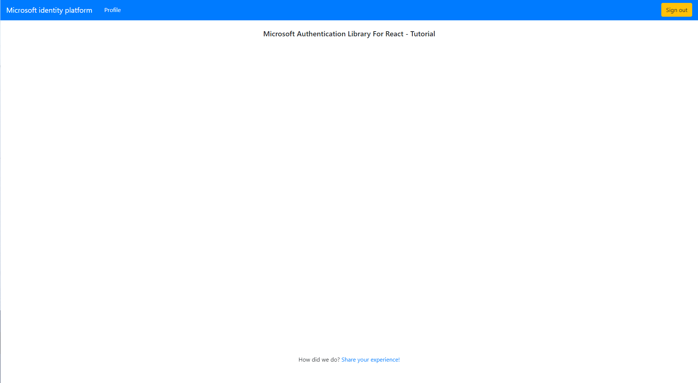

# Sign-in users interactively server-side (Node.js) and silently acquire a token for MS Graph from a React single-page app (SPA)

Table Of Contents

* [Scenario](#Scenario)
* [Prerequisites](#Prerequisites)
* [Setup the sample](#Setup-the-sample)
* [Explore the sample](#Explore-the-sample)
* [About the code](#about-the-code)
* [Troubleshooting](#Troubleshooting)
* [Contributing](#Contributing)
* [Learn More](#Learn-More)

## Scenario

This sample demonstrates how a React SPA can silently redeem an [authorization code](https://docs.microsoft.com/azure/active-directory/develop/v2-oauth2-auth-code-flow) for an [access token](https://aka.ms/access-tokens) for the **Microsoft Graph API** for a user who has already authenticated earlier in another Node.js application.

The Express web application will interactively authenticate a user using **MSAL-Node** and obtain both an [Access Token](https://aka.ms/access-tokens) and as well as an additional [Spa Authorization Code](https://github.com/AzureAD/microsoft-authentication-library-for-dotnet/wiki/SPA-Authorization-Code) using the **Hybrid SPA Code** flow.

This SPA authorization code is then transferred by the Node Express app to the React SPA app which then silently (without the need to re-authenticate the user) redeems it for another [access token](https://aka.ms/access-tokens) for **Microsoft Graph**.

The order of operations is as follows:

1. The Express web application uses [MSAL-Node](https://github.com/AzureAD/microsoft-authentication-library-for-js/tree/dev/lib/msal-node) to sign and obtain JWT [access token](https://aka.ms/access-tokens) from **Azure AD** as well as an additional SPA Authorization Code to be passed to a client-side single page application.

2. The SPA Authorization Code is passed to the React SPA to be exchanged for an access token client-side.

3. The access token is used as a *bearer token* to authorize the user to call the **Microsoft Graph API**

4. The **Microsoft Graph API** responds with the resource if user is authorized.


## Prerequisites

* [Node.js](https://nodejs.org/en/download/) must be installed to run this sample.
* [Visual Studio Code](https://code.visualstudio.com/download) is recommended for running and editing this sample.
* [VS Code Azure Tools](https://marketplace.visualstudio.com/items?itemName=ms-vscode.vscode-node-azure-pack) extension is recommended for interacting with Azure through VS Code Interface.
* A modern web browser. This sample uses **ES6** conventions and will not run on **Internet Explorer**.
* An **Azure AD** tenant. For more information, see: [How to get an Azure AD tenant](https://docs.microsoft.com/azure/active-directory/develop/test-setup-environment#get-a-test-tenant)
* A user account in your **Azure AD** tenant. This sample will not work with a **personal Microsoft account**.  If you're signed in to the [Azure portal](https://portal.azure.com) with a personal Microsoft account and have not created a user account in your directory before, you will need to create one before proceeding.

## Setup the sample

### Step 1: Clone or download this repository

From your shell or command line:

```console
    git clone https://github.com/Azure-Samples/ms-identity-javascript-react-tutorial.git
```

or download and extract the repository .zip file.

> :warning: To avoid path length limitations on Windows, we recommend cloning into a directory near the root of your drive.

### Step 2: Install project dependencies

  ```console
    cd 6-AdvancedScenarios\4-sign-in-hybrid\App
    npm install
  ```

### Step 3: Application Registration

There is one project in this sample. To register it, you can:

* follow the steps below for manually register your apps
* or use PowerShell scripts that:
  * **automatically** creates the Azure AD applications and related objects (passwords, permissions, dependencies) for you.
  * modify the projects' configuration files.

<details>
   <summary>Expand this section if you want to use this automation:</summary>

> **WARNING**: If you have never used **Azure AD Powershell** before, we recommend you go through the [App Creation Scripts guide](./AppCreationScripts/AppCreationScripts.md) once to ensure that your environment is prepared correctly for this step.

1. On Windows, run PowerShell as **Administrator** and navigate to the root of the cloned directory

1. In PowerShell run:

 ```PowerShell
 Set-ExecutionPolicy -ExecutionPolicy RemoteSigned -Scope Process -Force
 ```

1. Run the script to create your Azure AD application and configure the code of the sample application accordingly.
1. For interactive process - in PowerShell run:

 ```PowerShell
 cd .\AppCreationScripts\
 .\Configure.ps1 -TenantId "[Optional] - your tenant id" -Environment "[Optional] - Azure environment, defaults to 'Global'"
 ```

 > Other ways of running the scripts are described in [App Creation Scripts guide](./AppCreationScripts/AppCreationScripts.md)
 > The scripts also provide a guide to automated application registration, configuration and removal which can help in your CI/CD scenarios.

</details>

### Choose the Azure AD tenant where you want to create your applications

1. Sign in to the [Azure portal](https://portal.azure.com).
1. If your account is present in more than one Azure AD tenant, select your profile at the top right corner in the menu on top of the page, and then **switch directory** to change your portal session to the desired Azure AD tenant.

### Register the service app (msal-hybrid-spa)

1. Navigate to the [Azure portal](https://portal.azure.com) and select the **Azure AD** service.
1. Select the **App Registrations** blade on the left, then select **New registration**.
1. In the **Register an application page** that appears, enter your application's registration information:
   * In the **Name** section, enter a meaningful application name that will be displayed to users of the app, for example `msal-hybrid-spa`.
   * Under **Supported account types**, select **Accounts in this organizational directory only**.
   * In the **Redirect URI (optional)** section, select **Web** in the combo-box and enter the following redirect URI: `http://localhost:5000/redirect`.
1. Select **Register** to create the application.
1. In the app's registration screen, find and note the **Application (client) ID**. You use this value in your app's configuration file(s) later in your code.
1. In the app's registration screen, select **Authentication** blade.
   * If you don't have a platform added, select **Add a platform** and select the **Web** option.
   * In the **Redirect URIs** section, enter the following redirect URIs.
     * `http://localhost:5000/redirect`
   * Click on the **Add a platform** button in the **Platform configurations** section of the page.
     * Select the **Single-page application** button and enter `http://localhost:5000/blank` as the **Redirect URI** and click the **Configure** button.
1. Select **Save** to save your changes.
1. In the app's registration screen, select the **Certificates & secrets** blade in the left to open the page where you can generate secrets and upload certificates.
1. In the **Client secrets** section, select **New client secret**:
   * Type a key description (for instance `app secret`),
   * Select one of the available key durations (**6 months**, **12 months** or **Custom**) as per your security posture.
   * The generated key value will be displayed when you select the **Add** button. Copy and save the generated value for use in later steps.
   * You'll need this key later in your code's configuration files. This key value will not be displayed again, and is not retrievable by any other means, so make sure to note it from the Azure portal before navigating to any other screen or blade.
1. In the app's registration screen, select the **API permissions** blade in the left to open the page where we add access to the APIs that your application needs.
      * Select the **Add a permission** button and then:
      * Ensure that the **Microsoft APIs** tab is selected.
      * In the *Commonly used Microsoft APIs* section, select **Microsoft Graph**
      * In the **Delegated permissions** section, select the **User.Read** in the list. Use the search box if necessary.
      * Select the **Add permissions** button at the bottom.
1. Still on the same app registration, select the **Token configuration** blade to the left.
1. Select **Add optional claim**:
    * Select optional claim type, choose **ID**.
    * Select optional claim name, choose **sid**.
    * Select optional claim name, choose **login_hint**.
1. Select **Add** to save changes.

#### Configure the app (msal-hybrid-spa) to use your app registration

Open the project in your IDE (like Visual Studio or Visual Studio Code) to configure the code.

> In the steps below, "ClientID" is the same as "Application ID" or "AppId".

1. Open the `App/.env` file.
1. Find the key `Enter_the_Application_Id_Here` and replace the existing value with the application ID (clientId) of `msal-hybrid-spa` app copied from the Azure portal.
1. Find the key `Enter_the_Tenant_Info_Here` and replace the existing value with your Azure AD tenant ID.
1. Find the key `Enter_the_Client_Secret_Here` and replace the existing value with the key you saved during the creation of `msal-hybrid-spa` copied from the Azure portal.

In addition:

1. Open the `App/client/src/authConfig.js` file.
1. Find the string `Enter_the_Application_Id_Here` and replace the existing value with the application ID (clientId) of `msal-hybrid-spa` app copied
1. Find the string `Enter_the_Tenant_Info_Here` and replace the existing value with your Azure AD tenant ID.

### Step 4: Running the sample

For command line run the next commands:

* Run the app:

  ```console
    cd 6-AdvancedScenarios\4-sign-in-hybrid\App
    npm start
    ```

## Explore the sample

1. Open your browser and navigate to `http://localhost:5000`.
2. Sign-in using the button on the top-right corner.
3. Select the **Profile** button on the navigation bar. This will make a call to the Graph API.



> :information_source: Did the sample not work for you as expected? Then please reach out to us using the [GitHub Issues](../../../../issues) page.

## About the code

### MSAL Node confidential client

In this sample, the user is first authenticated to backend as shown in the [authController.js](./App/controllers/authController.js) file using the MSAL Node confidential client application.

```javascript
  const msal = require('@azure/msal-node');
  require('dotenv').config();

  const msalInstance = new msal.ConfidentialClientApplication({
      auth: {
          clientId: process.env.CLIENT_ID,
          authority: `https://login.microsoftonline.com/${process.env.TENANT_ID}`,
          clientSecret: process.env.CLIENT_SECRET
      },
      system: {
          loggerOptions: {
              loggerCallback: (loglevel, message, containsPii) => {
                  console.log(message);
              },
              piiLoggingEnabled: false,
              logLevel: msal.LogLevel.Verbose,
          }
      }
  });

```

Begin by generating an authorization code URL and redirect the app to it. See [authController.js](./App/controllers/authController.js):

```javascript
 const authCodeUrlParameters = {
        redirectUri: process.env.REDIRECT_URI,
        responseMode: "form_post",
    };

    msalInstance.getAuthCodeUrl(authCodeUrlParameters)
        .then((response) => {
            res.json(response);
        }).catch((error) => console.log(error))
```

Next, get the auth code from the request body, and invoke the `acquireTokenByCode` API by setting the `enableSpaAuthorizationCode` to true,  which will enable MSAL to acquire a second authorization code to be redeemed by your single-page application. Your application should parse this second authorization code, as well as any account hints (e.g. sid, login_hint, preferred_username), and return them such that they can be obtained client-side. See [authController.js](./App/controllers/authController.js):

```javascript
   const tokenRequest = {
            code: req.body.code,
            redirectUri: process.env.REDIRECT_URI,
            enableSpaAuthorizationCode: true
        };
    
    msalInstance.acquireTokenByCode(tokenRequest)
        .then((response) => {

            const { code } = response; //SPA authorization code
            const {
                sid, // Session ID claim, used for non-hybrid
                login_hint: loginHint, // New login_hint claim (used instead of sid or email)
                preferred_username: preferredUsername // Email
            } = response.idTokenClaims;


            req.session.code = code;
            req.session.loginHint = loginHint;
            req.session.sid = sid;
            req.session.referredUsername = preferredUsername;
            req.session.authenticated = true;

            const urlFrom = (urlObject) => String(Object.assign(new URL("http://localhost:5000"), urlObject))
            res.redirect(urlFrom({
                 protocol: 'http',
                 pathname: '/',
                 search: 'getCode=true'
            }))
        }).catch((err) => {
            console.log(err)
        })
```

### SPA Public clients

First, configure a new **PublicClientApplication** from MSAL.js in your single-page application. This is illustrated in [index.js](./App/client/src/index.js):

```javascript
export const msalInstance = new PublicClientApplication(msalConfig);

ReactDOM.render(
  <BrowserRouter>
    <App instance={msalInstance}/>
  </BrowserRouter>,
  document.getElementById('root')
);
```

Next, obtain the authorization code that was acquired server-side for the SPA, and pass it to `acquireTokenByCode`. The application should also obtain any account hints, as they will be needed for any interactive requests to ensure the same user is used for both requests. This is illustrated in [App.jsx](./App/client/src/App.jsx):

```javascript
 useEffect(() => {
    const fetchData = async () => {
      let apiData;
      let token;

      if (getCode && !data) {
        apiData = await callApiToGetSpaCode();
        const { code, loginHint, sid } = apiData;

        if (inProgress === "none") {
          try {
            token = await instance.acquireTokenByCode({
              code, //Spa Auth code
            });

            setdata(token);
          } catch (error) {
            if (error instanceof InteractionRequiredAuthError) {

              try {
                token = await instance.loginPopup({
                  loginHint, // prefer loginHint claim over sid
                });

                setdata(token);
              } catch (error) {
                console.log(error);
              }
            }
          }
        }
      }
    };

    fetchData();
  }, [instance, inProgress]);
```

## Troubleshooting

<details>
Use [Stack Overflow](http://stackoverflow.com/questions/tagged/msal) to get support from the community.
Ask your questions on Stack Overflow first and browse existing issues to see if someone has asked your question before.
Make sure that your questions or comments are tagged with [`azure-active-directory` `react` `ms-identity` `msal`].

If you find a bug in the sample, raise the issue on [GitHub Issues](../../../../issues).

To provide feedback on or suggest features for Azure Active Directory, visit [User Voice page](https://feedback.azure.com/forums/169401-azure-active-directory).

</details>

## Contributing

If you'd like to contribute to this sample, see [CONTRIBUTING.MD](/CONTRIBUTING.md).

This project has adopted the [Microsoft Open Source Code of Conduct](https://opensource.microsoft.com/codeofconduct/). For more information, see the [Code of Conduct FAQ](https://opensource.microsoft.com/codeofconduct/faq/) or contact [opencode@microsoft.com](mailto:opencode@microsoft.com) with any additional questions or comments.

## Learn More

* [Microsoft identity platform (Azure Active Directory for developers)](https://docs.microsoft.com/azure/active-directory/develop/)
* [Overview of Microsoft Authentication Library (MSAL)](https://docs.microsoft.com/azure/active-directory/develop/msal-overview)
* [Quickstart: Register an application with the Microsoft identity platform](https://docs.microsoft.com/azure/active-directory/develop/quickstart-register-app)
* [Quickstart: Configure a client application to access web APIs](https://docs.microsoft.com/azure/active-directory/develop/quickstart-configure-app-access-web-apis)
* [Initialize client applications using MSAL.js](https://docs.microsoft.com/azure/active-directory/develop/msal-js-initializing-client-applications)
* [Single sign-on with MSAL.js](https://docs.microsoft.com/azure/active-directory/develop/msal-js-sso)
* [Handle MSAL.js exceptions and errors](https://docs.microsoft.com/azure/active-directory/develop/msal-handling-exceptions?tabs=javascript)
* [Logging in MSAL.js applications](https://docs.microsoft.com/azure/active-directory/develop/msal-logging?tabs=javascript)
* [Pass custom state in authentication requests using MSAL.js](https://docs.microsoft.com/azure/active-directory/develop/msal-js-pass-custom-state-authentication-request)
* [Prompt behavior in MSAL.js interactive requests](https://docs.microsoft.com/azure/active-directory/develop/msal-js-prompt-behavior)

For more information about how OAuth 2.0 protocols work in this scenario and other scenarios, see [Authentication Scenarios for Azure AD](https://docs.microsoft.com/azure/active-directory/develop/authentication-flows-app-scenarios).
